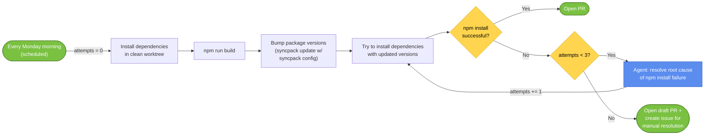

# Agentic Dependency Bump

Weekly automated workflow that bumps third-party npm dependencies, verifies `npm install`, and either opens a PR or loops an agent (up to 3 attempts) to resolve the root cause of an install failure before falling back to a draft PR plus a tracking issue for manual resolution.

See the workflow definition in [`.turbo-spec/workflows/dep-bump.yml`](../.turbo-spec/workflows/dep-bump.yml).

