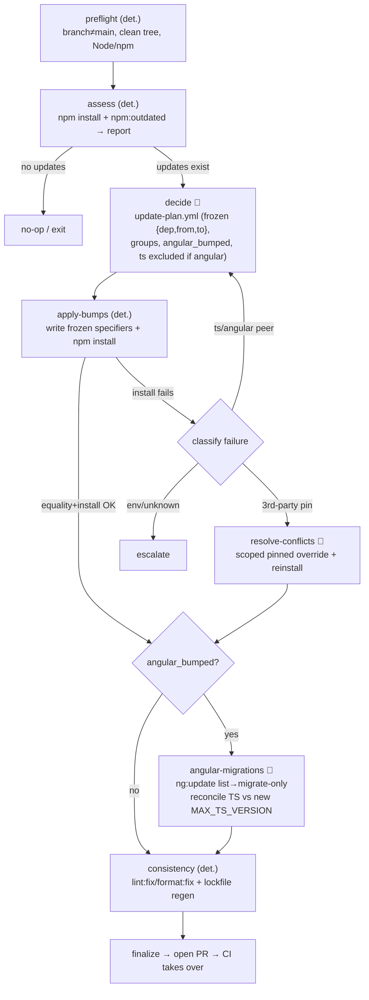

# Solution Concept — Dependency Update Workflow (Turbo-Spec)

> **Status**: Design concept (phase 1). Not committed as a runbook replacement yet.
> **Scope**: Transform the beginning of
> [`docs/runbooks/dependency-updates-agent.md`](../runbooks/dependency-updates-agent.md) into a
> [Turbo-Spec](https://github.com/porsche-code/turbo-spec) blueprint composed of **AI-agent stages**,
> **deterministic steps**, and **quality gates**.
> **Author aid**: Produced via brainstorming; reviewed with a critical rubber-duck pass against the original runbook.

## 1. Goal & scope

Replace the manual, interactive weekly npm dependency-update runbook with an autonomous Turbo-Spec workflow. This
concept covers **only the beginning of the runbook** — enough to **identify version bumps, apply them, resolve
install-level issues, and open a PR** — then hand correctness verification to **CI running on that PR**.

### In scope (runbook steps 1–6, 8, 9)

- **1** Install baseline
- **2** Detect outdated
- **3** Apply Angular framework migrations (conditional)
- **4** Apply updates (replacing the interactive `syncpack update --interactive` TUI)
- **5** Refresh lockfile & verify install
- **6** Resolve peer-dependency (`ERESOLVE`) conflicts via `overrides`
- **8** Keep version ranges consistent (`syncpack lint`/`format`)
- **9** Regenerate the lockfile cleanly

### Explicitly out of scope for phase 1

- **7** Prune stale `overrides` (deferred; see §7 risk note)
- **10** StackBlitz starter-template sync
- **11** Local CI-equivalent build/test (correctness is delegated to CI)
- **12** `npm audit` review
- Playwright update (npm pin + Docker image + VRT)

### Correctness model

Phase 1 does **not** run builds or tests locally. After the workflow opens the PR, the repo's existing CI
(`.github/workflows/contribution.yml`) is the correctness gate. The workflow's own gates only guard **mechanical
invariants** (clean install, plan equality, held-back protection, syncpack consistency, TypeScript ceiling).

## 2. Turbo-Spec building blocks used

| Construct | Role in this design |
| --- | --- |
| **Deterministic stage** | Shell-only work (install, frozen-version writer, lockfile regen). |
| **AI-agent stage** | Judgment work (decide which bumps, resolve `ERESOLVE`, Angular migrations). |
| **`script_gate`** | Runs shell steps; exit `0`=pass, `1`=`failure_verdict`→`loop_back`, `>=2`=`environment_verdict`→`escalate`. |
| **`outcome_contract`** | Schema-validates a structured artifact a stage produced (the update-plan, the install-failure record). |
| **`condition`** | Branch a stage on a prior stage's structured output (e.g. `angular_bumped`). |
| **`outputs`** | Structured artifact files a stage emits for downstream branching. |
| **`on_fail`** | `loop_back` / `route_to_<stage>` / `escalate`, bounded by `max_retries`. |

## 3. The AI-vs-deterministic split

| Runbook concern | Nature | Placement |
| --- | --- | --- |
| Prerequisites (root, Node/npm, clean tree, branch) | deterministic | `preflight` |
| 1 install baseline | deterministic | `assess` |
| 2 detect outdated | deterministic | `assess` (→ report artifact) |
| Which bumps to apply / grouping / held-back / Angular scope | **judgment** | 🤖 `decide` (→ `update-plan.yml` with frozen target versions) |
| 4+5 apply bumps + reinstall | deterministic | `apply-bumps` (write frozen specifiers + install) |
| 6 resolve `ERESOLVE` | **judgment** | 🤖 `resolve-conflicts` (conditional) |
| 3 Angular migrations + TS ceiling reconcile | **judgment** | 🤖 `angular-migrations` (conditional) |
| 8+9 syncpack consistency + clean lockfile | deterministic | `consistency` |
| PR body + open PR | deterministic | `finalize` |
| build/test correctness | — | **CI on the opened PR** |

## 4. Key repository facts this design relies on

- `npm run npm:outdated` = `syncpack update --check --dependencies '!@porsche-design-system/**'` — **read-only**; exits
  **nonzero when updates exist** (so it must not be used as a pass/fail gate).
- `npm run npm:update` = `syncpack update --interactive …` — an **interactive TUI**; cannot be driven autonomously.
  This is why a `decide` agent replaces the human selection and a **deterministic writer** (applying the plan's frozen
  target versions) replaces the TUI.
- **syncpack `update` cannot target a specific version** (syncpack 15.3.2): it only bumps to registry *latest*, filtered
  by name via `--dependencies`. However `syncpack update --check` **prints the exact target specifier** it would apply
  (e.g. `@angular/build ^22.0.4 → ^22.0.5`, `ejs ^3.1.10 → ^6.0.1`, `@stackblitz/sdk 1.11.0 → 1.11.1`), preserving each
  dep's range operator. Those printed targets are what the workflow **freezes** at decide-time and writes at apply-time.
- `.syncpackrc.json` ignores held-back deps (`@porsche-design-system/**`, `@playwright/test`, `@stencil/core`), so
  `npm:outdated`/`npm:update` already skip them. The **Angular family** (`@angular/**`, `ng-packagr`, `zone.js`) and
  `typescript` are **not** ignored — their versions flow through syncpack; only Angular framework **migrations** are
  separate.
- `npm run npm:lint` = `syncpack lint`; `npm run npm:format` = `syncpack format --check` (with `:fix` variants).
- `MAX_TS_VERSION` lives in `packages/components-angular/node_modules/@angular/compiler-cli/src/typescript_support.js`
  and **depends on the installed Angular version** — only knowable after the new Angular is installed.
- `ng:update` is a script in `packages/components-angular/package.json` (no root script) → the Angular stage runs from
  `packages/components-angular`.

## 5. Stage-by-stage design

### 5.0 `preflight` — deterministic

Restores the runbook prerequisites that a blueprint must not silently drop.

- **Does**: assert repo root; assert `node`/`npm` match the root `package.json` `volta` field; assert `git status
  --porcelain` is empty; ensure the default branch (`main`) is up to date; create/switch to
  `chore/dependency-updates-<YYYY-MM-DD>`.
- **Gate** (`script_gate`): current branch is **not** `main` (enforces the "never push to main" hard rule);
  clean tree; correct Node/npm. Environment problems (wrong Node) → `escalate`.

### 5.1 `assess` — deterministic (runbook 1–2)

- **Does**: `npm install`, then `npm run npm:outdated`; parse the syncpack output into a machine-readable **outdated
  report** artifact — for each dependency: name, current range(s), the **exact target specifier** syncpack would apply
  (the `→` value, with its range operator, e.g. `^22.0.5`), dependency type, and source file locations/instance count.
  This target specifier is the value that gets **frozen** into the plan downstream.
- **Gates**:
  - `script_gate` on **`npm install`** only (a failed install is a real blocker). `npm:outdated`'s nonzero-on-updates
    exit is **data, not failure** — it feeds a branch condition, never the gate.
  - `outcome_contract` schema-validates the outdated report.
- **Branch**: `updates_exist == false` → **no-op / clean exit**. Otherwise → `decide`.

### 5.2 `decide` — 🤖 AI agent (replaces the interactive selection)

- **Does**: read the outdated report and reason about:
  - grouping related upgrades in **lockstep** (e.g. React + its `@types`, the whole `@angular/*` family);
  - excluding **held-back** deps;
  - whether the **Angular family** is being bumped (`angular_bumped`);
  - **TypeScript handling**: if `angular_bumped`, **exclude `typescript` from `apply-bumps`** and defer it to
    `angular-migrations` (the new `MAX_TS_VERSION` is only known after the new Angular installs — see §6).
- **Emits** (`outputs`): `update-plan.yml` — a list of `{dependency, from, to, group}` entries where **`to` is the
  frozen target specifier** captured from the outdated report (latest-at-decide-time, range operator preserved), plus
  flags `angular_bumped` and any deferred/excluded deps. The agent decides *which* deps and *grouping*; it does **not**
  re-choose target versions — they are frozen from the report.
- **Gates**:
  - `outcome_contract` — schema-validate `update-plan.yml`.
  - **Deterministic held-back-exclusion check** — the plan must not list any held-back dep. (Schema validity alone
    would not catch a held-back name.)

> **Apply semantics (Decision 2 — revised)**: the plan carries **explicit frozen target versions** (pinned
> latest-at-decide-time), not just an allow-list, and not "latest-at-apply". This guarantees the versions the agent
> vetted are exactly the versions applied and CI-tested, independent of registry timing. Targets that must be
> *capped/held* (e.g. `typescript` under Angular) are handled by **exclusion** here + specific application in
> `angular-migrations`.

### 5.3 `apply-bumps` — deterministic (runbook 4–5)

- **Does**: **deterministically write** each planned `to` specifier into every matching `package.json` instance across
  the workspace (a name→specifier transform driven by `update-plan.yml`; syncpack cannot target a version, so the write
  is done directly), then `npm install`. No registry re-query — the frozen plan is the sole source of truth.
- **Gates**:
  - **Equality gate** (`script_gate`): every planned dep equals its **frozen `to`** specifier across all instances;
    **held-back deps untouched**; nothing outside the plan moved. This makes "apply == vetted plan", "never bump
    held-back", and "no divergence from plan" *deterministic guarantees*.
  - **Install clean** (`script_gate`): `npm install` exits `0`.
- **On install failure**: emit a structured **install-failure record** (`outputs`) — `{ kind, packages }` where
  `kind ∈ { peer_conflict_ts_angular, peer_conflict_thirdparty, registry, postinstall, unknown }` — and route:
  - `peer_conflict_ts_angular` → **back to `decide`** (hold TS/Angular differently; do **not** add an override).
  - `peer_conflict_thirdparty` (conflict against an intentional pin) → **`resolve-conflicts`**.
  - `registry` / `postinstall` / `unknown` → **`escalate`**.

### 5.4 `resolve-conflicts` — 🤖 AI agent (conditional; runbook 6)

- **Condition**: reached only for `kind == peer_conflict_thirdparty`.
- **Does**: add a **scoped, pinned `overrides` entry** to the **root** `package.json` matching the parsed `ERESOLVE`
  package (follow existing `madge > typescript` / `minimatch@9` patterns); delete **both** `package-lock.json` and
  `node_modules`; reinstall.
- **Gates** (`script_gate`):
  - Only **root** `package.json` `overrides` changed; the new entry corresponds to the parsed conflict package; prefer
    a scoped override when a blanket one would cross majors.
  - Clean `npm install`.
  - **No forbidden flags/commands** in logs: `--legacy-peer-deps`, `--force`, `npm audit fix`.
- **Guardrail (Decision 1)**: adding overrides is allowed in phase 1 **with** these guardrails; **stale-override
  pruning (step 7) is deferred**. Every newly added override MUST be listed in the PR body (see `finalize`).

### 5.5 `angular-migrations` — 🤖 AI agent (conditional; runbook 3 + TS reconcile)

- **Condition**: `angular_bumped == true`. Runs **after** `apply-bumps`/`resolve-conflicts` (Angular *versions* are
  bumped by syncpack in `apply-bumps`; *migrations* run here, matching the runbook).
- **cwd**: `packages/components-angular`.
- **Does**:
  1. **Read-only listing**: `npm run ng:update` to enumerate available updates/migrations.
     **Gate**: proceed only for **minor/patch within the current major**; a major upgrade or non-trivial migration →
     `escalate` (runbook stop condition).
  2. **Apply migrations only**: `npm run ng:update -- @angular/core @angular/cli --migrate-only --from=<old>
     --to=<new>`.
  3. **Reconcile TypeScript**: read the **new** `MAX_TS_VERSION`; if the intended `typescript` target exceeds it,
     **hold `typescript` back this round** and reinstall; otherwise apply the compatible `typescript`.
- **Gate** (`script_gate`): installed `typescript` **≤** `MAX_TS_VERSION`; migrations produced no non-trivial source
  changes beyond what the codemods emit (else `escalate`).

### 5.6 `consistency` — deterministic (runbook 8–9)

- **Does**: `npm run npm:lint:fix` + `npm run npm:format:fix`; then `rm package-lock.json && npm install` (clean
  lockfile regen).
- **Gates** (`script_gate`):
  - `syncpack lint` clean **and** `syncpack format --check` clean.
  - All **8** `@next/swc-*` optional deps recorded in **`package-lock.json`**.
  - `typescript` **≤** `MAX_TS_VERSION` (safety net).
  - **No unplanned drift**: `syncpack fix` introduced no dependency change outside the approved plan.

### 5.7 `finalize` — deterministic (open PR; hand off to CI)

- **Does**: assemble a **PR-body artifact** and open a PR targeting `main`.
- **PR body MUST include**: grouped dependency bumps; Angular migration status; **overrides added** (with the
  conflict reason); an explicit note that **local build/tests/audit did NOT run in phase 1 — CI is the correctness
  gate**; the issue **closing keyword** when dispatched from an issue.
- **Then**: CI on the PR takes over as the correctness gate.

## 6. TypeScript / `MAX_TS_VERSION` handling (explicit)

The ceiling is enforced in three coordinated places to defeat the ordering trap (the authoritative ceiling only exists
after the new Angular is installed):

1. **`decide`** — if `angular_bumped`, **exclude `typescript` from `apply-bumps`** and record it as deferred.
2. **`angular-migrations`** — after the new Angular installs, read the authoritative new `MAX_TS_VERSION`; apply a
   compatible `typescript` or hold it back if it would exceed the ceiling; reinstall.
3. **Deterministic guard gate** — `consistency` (and the Angular stage) assert `installed typescript ≤ MAX_TS_VERSION`
   so a stray TS bump can never slip through.

## 7. Decisions & deferred risks

| Item | Decision | Note |
| --- | --- | --- |
| Interactive selection | Replaced by 🤖 `decide` → `update-plan.yml` | Interactive TUI can't run autonomously. |
| Apply semantics | **Explicit frozen versions** (pin latest-at-decide) via deterministic writer (Decision 2, revised) | Guarantees apply == vetted plan == CI-tested; independent of registry timing. |
| `ERESOLVE` handling | **Add overrides with guardrails** (Decision 1) | Only root, scoped+pinned, listed in PR body. |
| Step 7 (prune stale overrides) | **Deferred** | Overrides can only accumulate in phase 1; compensated by PR-body listing. Revisit in a later phase. |
| Step 11 (local build/test) | **Deferred to CI** | Trade-off: build-tool/Angular/TS/Vite/Rollup/Next/Tailwind bumps surface failures only on CI, risking slower PR round-trips. A future optional smoke gate for high-risk categories could reduce this. |
| Correctness gate | **CI on the opened PR** | The workflow gates only mechanical invariants. |

## 8. Hard rules and how they're enforced

| Runbook "never" | Enforcement |
| --- | --- |
| Push directly to `main` | `preflight` gate: branch ≠ `main`; `finalize` opens a PR. |
| Bump held-back deps | `decide` held-back check + `apply-bumps` equality gate (held-back untouched). |
| `--legacy-peer-deps` / `--force` | `resolve-conflicts` gate scans logs for forbidden flags. |
| `npm audit fix` | Same log scan; audit is out of scope for phase 1. |
| Hand-edit versions/lockfile | Versions written deterministically from the frozen plan (not by hand, not by an agent); lockfile via `npm install` only (equality + consistency gates). |

## 9. Open questions for the implementation plan

- Exact mechanism/format for parsing `syncpack update --check` output into the outdated report — capturing the exact
  `→` target specifier per dependency (structured output vs stdout parser + schema).
- Precise `on_fail`/routing verbs available in the target Turbo-Spec version for the `apply-bumps` failure
  classification (route-to-stage vs conditional next stage).
- Implementation of the deterministic writer that sets frozen specifiers across all `package.json` instances (node/jq
  transform vs a syncpack-assisted write) and of the equality gate (git diff vs specifier comparison).
- Which Turbo-Spec `orchestrator` type each stage maps to, and the concrete blueprint YAML.

---

_Next step: turn this concept into a Turbo-Spec blueprint + implementation plan (writing-plans). Nothing is committed
yet._
