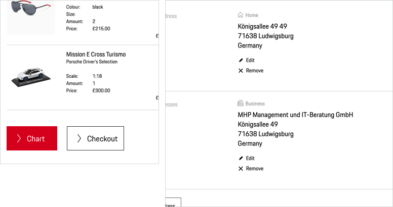

# Button Pure

In addition to Button Primary, Secondary or Tertiary, you can use Button Pure as a more subtle call to action. A Button Pure enables the user to execute an action (like "submit", "delete", "add" or "edit" for example) or to change the state of the application, which almost always happens on the same page. Whenever you want to provide navigational elements, stick to the [Link](#/components/navigation/link) or [Link Pure](#/components/navigation/link-pure) component instead.

---

## Sizes

Per default, the Button Pure is set in **copytext size** (small). If another size or hierarchy level is needed, the Button Pure is available in the following sizes, whereas the size of the icon changes accordingly:

| Button Pure size | Example |
|------|------|
| **X-Small** | <p-button-pure size="x-small">Button Pure</p-button-pure> |
| **Small** | <p-button-pure size="small">Button Pure</p-button-pure> |
| **Medium** | <p-button-pure size="medium">Button Pure</p-button-pure> |
| **Large** | <p-button-pure size="large">Button Pure</p-button-pure> |
| **X-Large** | <p-button-pure size="x-large">Button Pure</p-button-pure> |

--- 

## Variants

### Icon and Text

<p-button-pure size="large">Button Pure</p-button-pure>

This should be the variant of your choice whenever possible, as icons should preferably always be paired with text for better comprehensibility and accessibility.
The size of the icon container always equals the line height of the text it's combined with.

### Icon only

<p-button-pure size="large" hide-label="true">Button Pure</p-button-pure>

When it's enough to indicate an action with an icon only, the text label can be hidden but a minimum height of 40 px must be maintained. Yet, it's recommended to use this variant only in cases when the user is fully aware of the function due to an expressive and internationally comprehensible icon. 

### Icon, Text and Subline

!!! CODE EXAMPLE !!!

This should be the variant of your choice if the Button Pure must be supplemented by a subline. 
However, we recommend that you only use this variant in cases where the user requires additional information. 

The standard variant will be used on a monochrome background, whereas the highlight variant should be used 
on a polychrome background (e.g.on images) for better comprehensibility and accessibility.

---

## States

The Button Pure covers the following states:

* Default
* Hover
* Disabled
* Loading
* Focus

---

## Styling

### Icon

The default icon is an arrow right that should serve in most of all cases. It should be changed only if it is ensured that another symbol is more appropriate to support the text content, making it easier for the user to understand the function quickly. 

### Standard icons
To ensure a seamless UX in all Porsche web applications it is recommended to use standardized icons for the following cases:

| Interaction | Icon | Example |
|----|----|----|
| Close | <p-icon name="close" aria-label="Close"></p-icon> | Close a current page or window. |
| Cancel | <p-icon name="close" aria-label="Close"></p-icon> | Abandoning a process. |
| Delete | <p-icon name="delete" aria-label="Delete"></p-icon> | Delete/erase content, e.g. a list item. | 
| Edit | <p-icon name="edit" aria-label="Edit"></p-icon> | Edit content, e.g. in lists or shop checkout. | 	
| Add | <p-icon name="add" aria-label="Add"></p-icon> | Add content, e.g. a new item in a list. | 
| Mail / Send | <p-icon name="email" aria-label="E-Mail"></p-icon> | E-mail link, e-mail adress. | 
| Phone / Call | <p-icon name="phone" aria-label="Phone"></p-icon> | Phone call link, phone number. | 

### Text label
The text label within a button should always be short and also give a hint on the indicated action. It's recommended to include active verbs such as "add", "edit" or "delete". 

---

## Usage

### Button Pure groups

Multiple Buttons Pure can be combined to one Button Pure group that must be stacked left-aligned in order to guarantee scannability and legibility. It is recommended to not group more than 6 Buttons Pure in a row.

    <p-headline variant="headline-3" tag="h3" style="margin-bottom: 24px;">Examples</p-headline>
    

