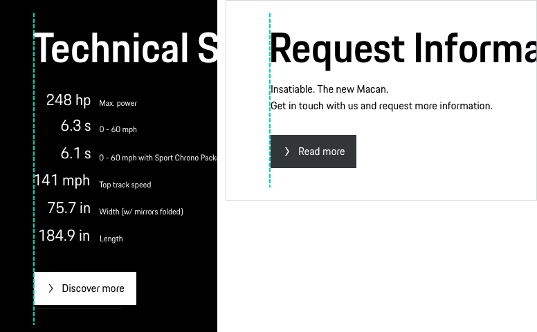

# Button

Buttons enable you to execute an action (like "submit", "delete", "add" or "edit") or to change the state of an application, which almost always happens on the same page. For an optimal user guidance and dedicated pursuit of business or sales goals, different types of Buttons (Primary, Secondary, Tertiary) can be used. Whenever you want to provide navigational elements, stick to the [Link](#/components/navigation/link) component instead.

---

## Types

### 1. Primary

<p-button variant="primary">Some label</p-button> 

The Button filled with the Porsche brand color. This type is only to be used for one or two first priority actions within a page in order to give the user optimal guidance.

### 2. Secondary

<p-button>Some label</p-button>

Default button with monochrome color fill. To be used for all other stand-alone Buttons that aren't high priority.

### 3. Tertiary

<p-button variant="tertiary">Some label</p-button>

An "outline only" version of the Porsche Button. In hierarchy it is always subordinated to the filled views and can be used in two different cases:

- In combination with a filled Button (Primary or Secondary), for example in popular pairings such as "submit" (Primary or Secondary) and "cancel" (Tertiary).
- Stand-alone, when the priority of the action is lower compared to all other Button actions within this page.

---

## Variants

### Icon and text

<p-button variant="primary">Some label</p-button> <p-button style="margin-left:16px;">Some label</p-button> <p-button variant="tertiary" style="margin-left:16px;">Some label</p-button>

This should be the variant of your choice whenever possible, as icons should preferably always be paired with text for better comprehensibility and accessibility. 
The length of the Button always adapts to the length of the text label. 

### Icon only

<p-button variant="primary" hide-label="true">Some label</p-button> <p-button hide-label="true" style="margin-left:16px;">Some label</p-button>
 <p-button variant="tertiary" hide-label="true" style="margin-left:16px;">Some label</p-button>

This variant contains an icon only with no further text information. It is highly recommended to use it only in cases where the user is fully aware of the button function. This can be ensured e.g. by using an expressive icon or by logical composition with other components.

---

## States

All Button types are available in the following states:

* Default
* Active
* Hover
* Disabled
* Loading
* Focus

---

## Styling

### Icon
The default icon is an arrow right that should serve in most cases. It should be changed only if it is ensured that another symbol is more appropriate to support the text content, making it easier for the user to understand the function quickly. 

### Standard icons
To ensure a seamless UX in all Porsche web applications it is recommended to use standardized icons for the following cases:

| Interaction | Icon | Example |
|----|----|----|
| Close | <p-icon name="close" aria-label="Close"></p-icon> | Close a current page or window. |
| Cancel | <p-icon name="close" aria-label="Close"></p-icon> | Abandoning a process. |
| Delete | <p-icon name="delete" aria-label="Delete"></p-icon> | Delete/erase content, e.g. a list item. | 
| Edit | <p-icon name="edit" aria-label="Edit"></p-icon> | Edit content, e.g. in lists or shop checkout. | 	
| Add | <p-icon name="add" aria-label="Add"></p-icon> | Add content, e.g. a new item in a list. | 

### Text label
The text label is always set in copytext size. It is recommended to always keep the label short and give the user a hint on the indicated action, for example by including active verbs such as "add", "edit" or "delete". 

---

## Usage

### Button position

By default the Button is to be positioned left-aligned within a page or module. In special cases, where it serves a better user guidance, the position can be changed.

### Button width

Even if there is no technical limit to the Button width, you should always make sure that the button remains legible, even more so in multiline state. It is recommended to use max. 100 characters per line (equals approx. 700 px button width).

### Multi-line Buttons

Though it's technically possible to use multiline text in Porsche Buttons, it's recommended to keep the Button label short and, therefore, avoid multiline Buttons. 

### Disabled states

All types of Button are available in disabled state. However, disabled states should be avoided whenever possible, as they always tend to disrupt the user and break the user flow. Keep in mind: "The best way [to] prevent user error is to make sure that the use cannot make errors in the first place (…)." (Donald A. Norman, 2002)

    <p-headline variant="headline-3" tag="h3" style="margin-bottom: 24px;">Examples</p-headline>
    

## Don'ts

### Mixed usage of Button variants

It is not recommended to use "icon and text" and "icon only" Button variants in direct combination. Always try to stick to a homogeneous usage of Button variants in favour of a seamless UX. 
  

