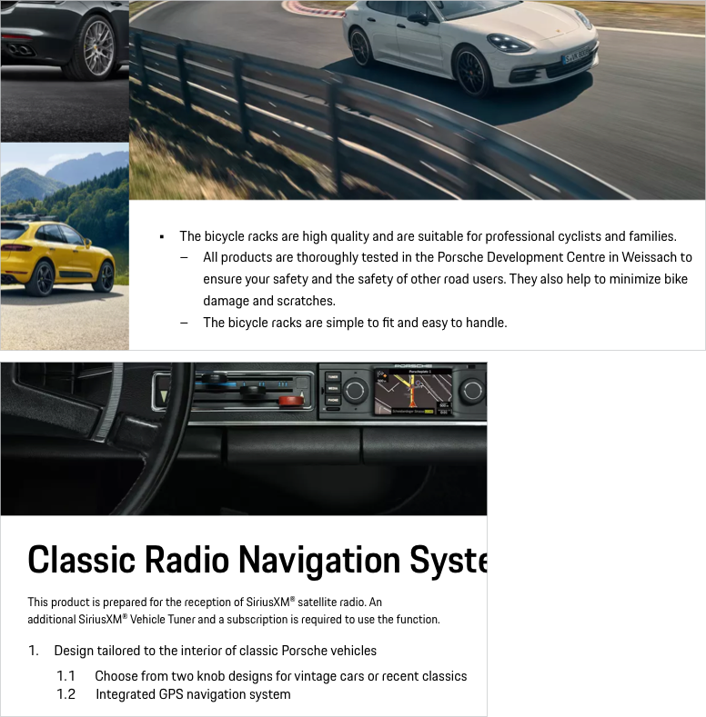

# Text List

A text list groups and organizes related content vertically in two hierarchical levels (level 1 and level 2 with indent). Generally, lists are supposed to be used for short pieces of information and should not exceed two levels hierarchy . For more complex data sets, consider the use of a data table.

---

## Variants

### Unordered List 

To show content with equal value.

<p-text-list>
  <p-text-list-item>First level - Lorem ipsum dolor sit amet</p-text-list-item>
  <p-text-list-item> Lorem ipsum dolor sit amet <a href="#">linked text</a> et, <b>bold text</b> &amp; <strong>strong text</strong>
    <p-text-list>
      <p-text-list-item>Second level - Lorem ipsum dolor sit amet</p-text-list-item>
      <p-text-list-item>Lorem ipsum</p-text-list-item>
    </p-text-list>
  </p-text-list-item>
  <p-text-list-item>First level - Lorem ipsum dolor sit amet</p-text-list-item>
</p-text-list>

### Ordered List 

With an implicated sequence.

<p-text-list list-type="ordered">
  <p-text-list-item>First level - Lorem ipsum dolor sit amet</p-text-list-item>
  <p-text-list-item> Lorem ipsum dolor sit amet <a href="#">linked text</a> et, <b>bold text</b> &amp; <strong>strong text</strong>
    <p-text-list list-type="ordered">
      <p-text-list-item>Second level - Lorem ipsum dolor sit amet</p-text-list-item>
      <p-text-list-item>Lorem ipsum</p-text-list-item>
    </p-text-list>
  </p-text-list-item>
  <p-text-list-item>First level - Lorem ipsum dolor sit amet</p-text-list-item>
</p-text-list>

---

## Usage

### Order
Arrange list items in a logical way, from  highest to lowest level. Split the content up into smaller and more specific categories and group them. 

### Writing style
It is recommended to stick to a homogeneous writing structure and style within one list. Avoid e.g. mixing active with passive voice or declarative with imperative sentences. 

### Capitalization
Use sentence-style capitalization for each list item: capitalize only the first letter of the item.

    <p-headline variant="headline-3" tag="h3" style="margin-bottom: 24px;">Examples</p-headline>
    

