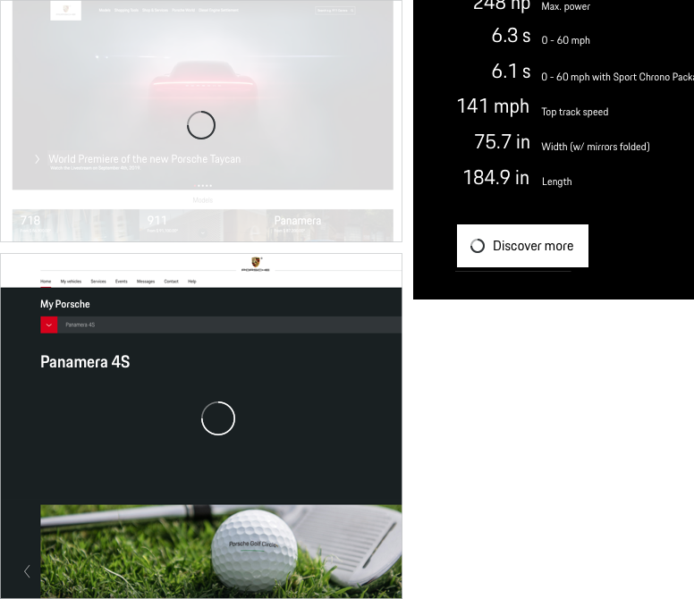

# Spinner

There are unavoidable moments when the user has to wait for more than 1 second (for example due to technical processing of information or requests). These  moments should be bridged with a good user feedback in order to not leave the user uncertain about what's currently happening - also to avoid a high bounce rate and to obtain a positive impression of your website or application.

For ongoing operations between 2-10 seconds, where the loading progress cannot be determined, use a **Spinner** (looped indicator) to inform the user about an ongoing operation. Use it either stand-alone (for example as page loader) or within components, such as in Buttons to indicate progress after clicking "save".

---

## Sizes

The spinner `medium` and `large` adjusts its size automatically based on the responsive breakpoint.

| Size                      | Example                            | Recommended…                  |
|---------------------------|-------------------------|-------------------------------------------------|
| **Small**           |   <p-spinner size="small"></p-spinner>    | …for in-component loaders and also for module or page loading in small breakpoints. |
| **Medium / Large**     |   <p-spinner size="medium"></p-spinner><p-spinner size="large"></p-spinner>  | …for module or page loading, optionally accompanied by a text label.     |

---

## Variants

### With text label

Including text can be helpful to improve clarity. Keep it simple by only explaining
**why** the user is waiting. Avoid using texts such as "Don't click again" to prevent
the user from clicking twice on a shopping button in order to not create an extra order.
A loading animation should always be a user-friendly helper, not a threat.

* For small sizes, you should use copytext.
* For larger Spinner sizes, you can use any additional size, depending on your needs and the available space.
* Text must always be placed beneath or on the right side of the loader.

---

## Usage

### Spinner position
Whenever used as an independent item within a page or module, the spinner should always be placed vertically and horizontally centered within the referring area. Within a dedicated component, the placement of the spinner is determined by the respective element it replaces or accompanies.

### Component blocking
If a spinner is triggered by an interaction within a component, it is recommended to disable the component while the spinner is visible.

### Screen blocking
Using a spinner for only parts of a screen or within dedicated components usually means that the user is able to cancel the operation, for example by clicking somewhere else. If the user is not supposed to start another activity, you should block the whole screen. This can be done using a full size block overlay for the whole screen and placing the loader on top.

* Light Theme: Blocking layer in Porsche Light, 90% opacity
* Dark Theme: Blocking layer in Porsche Dark, 90% opacity

---

    <p-headline variant="headline-3" tag="h3" style="margin-bottom: 24px;">Examples</p-headline>
    

---

## Don'ts

### Spinner overload
Using too much spinners at the same time time or using too much of them within a page or application in general can also create user frustration. This should be avoided by carefully considering where a loader makes sense and which loader type is the best.

### Delays of more than 10 seconds
A spinner offers feedback about a loading state, but not on how long it will take for the loading to be finished. Fostering the user to stare at a spinning wheel for more than 10 seconds will most likely make the users get impatient, wandering around on your website, abandon their current task, or, worst case, close your application. So if the result takes more than 10 seconds to appear, you should better provide a progress bar showing the estimated waiting time.