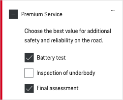
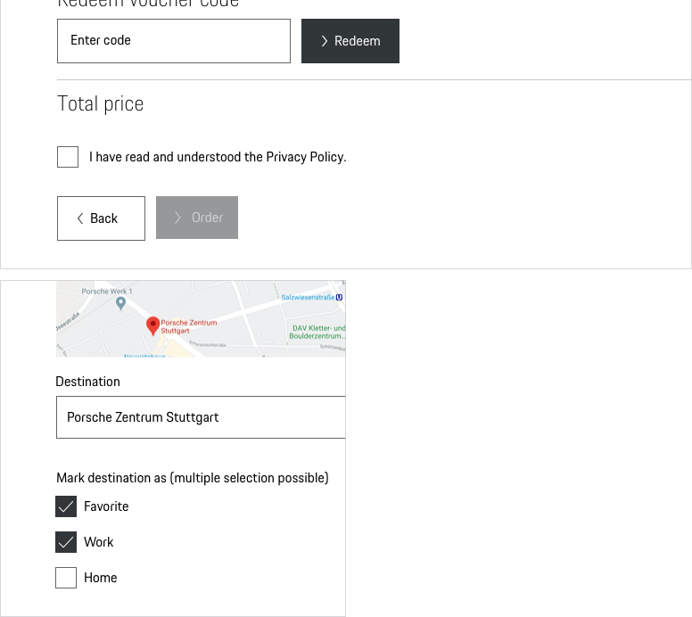
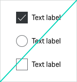
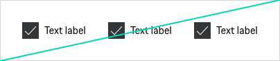

# Checkbox

Use a Checkbox for a list of options when you want to enable the user to select no, one or more options (This distinguishes the Checkbox from the radio button, where the user has only one choice). Checking one box doesn't uncheck other Checkboxes. By default Checkboxes are not selected.

---

## States

All Checkboxes are available in the following states:

* default
* checked
* disabled
* hover
* focus
* indeterminate

The indeterminate state is only a visual state and cannot be achieved by direct user interaction. The indeterminate state occurs if the checkbox contains a sublist of selections, some of which are selected, and some unselected.

* error
* success

---

## Styling

### Checkbox
The squared box is used as a typical Checkbox indicator and can have different states, depending on whether it's checked or not.

### Label
The label text (always in copytext) gives the user an information about the option that can be selected. Try to keep the label short and descriptive (one word or two)

### Validation and error
Contrary to Radio Buttons, each Checkbox item can have its own validation message.
Please find more information on providing extra information in the [Form pattern guideline](#/patterns/forms).

### Spacing
According to the "law of proximity" in Gestalt psychology ([Laws of UX](https://lawsofux.com/law-of-proximity)) objects that are near or proximate to each other tend to be grouped together.
Please find more information on providing extra information in the [Form pattern guideline](#/patterns/forms).

---

## Usage

### A stand-alone Checkbox
Is used for a single option that the user can turn on or off (e.g. in case of a confirmation of terms and conditions).

### Disabled State
All Checkboxes are available in disabled state. However, disabled states should be avoided whenever possible, as they always tend to disrupt the user and break the user flow. Keep in mind: "The best way [to] prevent user error is to make sure that the use cannot make errors in the first place (…)." (Donald A. Norman, 2002)

## Interaction
The whole Checkbox area is clickable.

    <p-headline variant="headline-3" tag="h3" style="margin-bottom: 24px;">Examples</p-headline>
    

---

## Don'ts

### Mixing with Radio Buttons

Never mix Radio Buttons and Checkboxes.

### Alignment

Preferably set checkboxes vertically left-aligned, as this supports scannability way better than a horizontal alignment.

---

## Related Components
* [Radio Button](#/components/form/radio-button)
* [Select](#/components/form/select)

