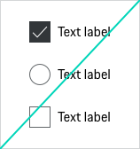

# Checkbox

Use a Checkboxe for a list of options that allow the user to make choices. The choice of one or several options (checked state) or no option (unchecked state). Each checkbox has a label and is independent of all other checkboxes in the list. Checking one box doesn't uncheck the others. By default checkboxes are not selected.

---

## Variants

### 1. Default
!!! EXAMPLE !!!

### 2. Checked
!!! EXAMPLE !!!

### 3. Indeterminate
The indeterminate state represents the mixed selection states of dependent checkboxes in a group. 
Once some of the dependent fields have been selected and subsequently deselected. 
This is only a visual state and cannot be achieved by direct user interaction. 

!!! EXAMPLE !!!

---

## States
 
All Checkboxes types are available in the following states:
 
* default 
* checked
* disabled 
* focus
* indeterminate 
* error 

---

## Content

The Checkbox can contain the following sub-components:

- **Headings**
!!! TBD !!!

- **Checkbox**
The indicator is used to show whether the checkbox is checked (“on”) or not (“off”).

- **Label**
Label text (≤ 20 characters) is used to inform users as to what information is requested for a Checkbox. Every Checkbox should have a label.
---

## Usage

Checkboxes have several usage patterns:

### Independent choices (zero or more)
A group of Checkboxes is used to select from a set of zero or more choices. (Unlike single-selection controls such as Radio Buttons, users can select any combination of options in a group of Checkboxes.)

### Dependent choices (one or more)
A group of Checkboxes can also be used to select from a set of one or more choices.  Error is displayed when none of the options are selected. A group of Checkboxes is used where at least one protocol must be selected. 

### A stand-alone Checkbox
Is used for a single option that the user can turn on or off.

### Disabled State
All Checkboxes are provided in disabled state. However, disabled states should be avoided whenever possible, as they always tend to disrupt the user and break the user flow. 

    <p-headline variant="headline-3" tag="h3" style="margin-bottom: 24px;">Examples</p-headline>
    

---

## Don'ts

- Please avoid the mix of radio buttons and checkboxes. These must be considered separately
- Set checkboxes best vertically instead of horizontally
- Checkboxes are always aligned left

---

## Related components 

### Radio Buttons

**Radio Buttons** are used when there is a list of two or more options that are **mutually exclusive** and the user must select exactly one choice. 
In other words, clicking a non-selected Radio Button will deselect whatever other button was previously selected in the list.

