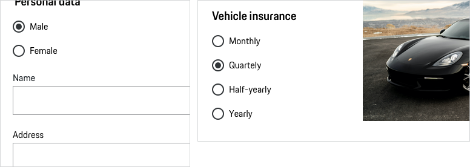
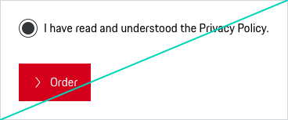

# Radio Button

Use a Radio Button to enable a user to select one value from a predefined list.
In a group of Radio Buttons one option should be selected by default, except for cases where a pre-selection can lead to wrong assumptions, i.e. "Male" or "Female".
In this case no option should be selected by default. The singular property of a Radio Button makes it distinct from a checkbox, which allows more than one (or no) item to be selected and for the unselected state to be restored. As soon as two options are mutually exclusive, a Radio Button is used.

---

## States
All Radio Buttons are available in the following states:
* default
* checked
* disabled
* hover
* focus
* error
* success

---

## Styling

### Radio Button
A circle is typically used to indicate a Radio Button selection.

### Label
The label text (always in copytext) gives the user an information about the option that can be selected. Try to keep the label short and descriptive (one word or two).

### Help text
Help text should be displayed openly and directly, also in order not to expect the user to make additional clicks. 
For further information we recommend to read the general [Form pattern guideline](#/patterns/forms).

### Validation and error
For a group of Radio Buttons the validation message is set at the end of the list. This means that the validation for a Radio Button behaves differently from the other form elements where the validation is set for each individual component.
For further information we recommend to read the general [Form pattern guideline](#/patterns/forms).

### Spacing
According to the "law of proximity" in Gestalt psychology ([Laws of UX](https://lawsofux.com/law-of-proximity)) objects that are near or proximate to each other tend to be grouped together.
For further information we recommend to read the general [Form pattern guideline](#/patterns/forms).

---

## Usage

### Items
We recommend using a Radio Button for a selection of 3-6 items. For a larger number of items (≥ 7) it is recommended to use a Select component instead. "If possible, use radio buttons rather than Selects. Radio buttons have lower cognitive load because they make all options permanently visible so that users can easily compare (…)." (Jakob Nielsen, 2004)

### Disabled states
All types of Radio Buttons are available in disabled state. However, disabled states should be avoided whenever possible, as they always tend to disrupt the user and break the user flow. Keep in mind: "The best way [to] prevent user error is to make sure that the use cannot make errors in the first place (…)." (Donald A. Norman, 2002)

## Interaction
The whole Radio Button area is clickable.

    <p-headline variant="headline-3" tag="h3" style="margin-bottom: 24px;">Examples</p-headline>
    

## Don'ts

### Alignment
Always align Radio Buttons with more than 2 items vertically left-aligned, as a horizontal alignment is more difficult to scan for the user and more difficult to see which label belongs to which radio.

### Single choice
Never use a Radio Button alone.

---

## Related Components

* [Checkbox](#/components/form/checkbox)
* [Select](#/components/form/select)
