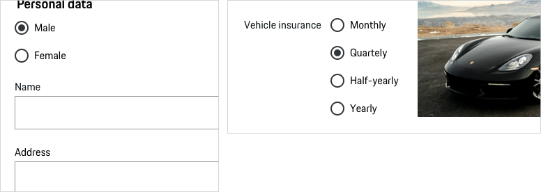

# Radio Button
 
Use a Radio Button to allows the user to choose/select only one of a predefined set of mutually exclusive options.
In a group of radio buttons should be selected one option by default. However, there is an exception if the pre-selection of an option can lead to wrong assumptions, i.e. "Male" or "Female". In this case no option should be selected by default.
.

---
 
## Variants
 
### 1. Default

<p-radio-button-wrapper label="Some label" hide-label="false"><input type="radio" name="some-name-1" value="no"></p-radio-button-wrapper>
 
### 2. Checked

<p-radio-button-wrapper label="Some label" hide-label="false"><input type="radio" name="some-name-1" value="yes"></p-radio-button-wrapper>
 
---
 
## States
All Radio Buttons are available in the following states:
* default
* checked
* disabled
* focus
* error
* success
 
---
 
## Content
 
The Radio Button can contain the following sub-components:

- **Radio Button**
The indicator is used to show whether the radio button is checked or not.
 
- **Label**
Label text (≤ 20 characters) is used to inform users as to what information is requested for a Radio Button. Every Radio Button should have a label.
 
---
 
## Usage
 
### Single-selection control
The singular property of a radio button makes it distinct from a checkbox, which allows more than one (or no) item to be selected and for the unselected state to be restored. As soon as two options are mutually exclusive, a radio button is used.

### Hint text
If needed, add a hint explaining this, for example, ‘Select one option’.

### Disabled states
All types of Radio Buttons are available in disabled state. However, disabled states should be avoided whenever possible, as they always tend to disrupt the user and break the user flow. Keep in mind: "The best way [to] prevent user error is to make sure that the use cannot make errors in the first place (…)." (Donald A. Norman, 2002)
 

    <p-headline variant="headline-3" tag="h3" style="margin-bottom: 24px;">Examples</p-headline>
    

 
## Don'ts
 
### Items
Use for a large number of items (≥ 7 items) a select component instead.
 

### Alignement
Don't align radio buttons horizontally as it is more difficult to scan.
 

### Single chioce
Avoid using a radio button as a single choice.
  

 
---
 
## Related Components
 
* [Text Field](#/web/components/form/text-field)
* [Textarea](#/web/components/form/textarea)
* [Checkbox](#/web/components/form/checkbox)
* [Select](#/web/components/form/select)

 