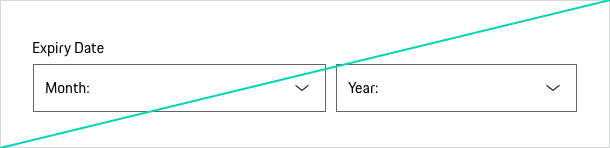
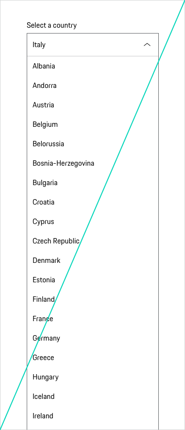

# Select

A Select is used to trigger an action based on the selected option, to choose one option from a list of items or to navigate the user to a new position.
Take the following aspects into consideration when deciding whether to use a Select or not:

* **The user's state of knowledge:** Do the users know their input without having to look at a list of the different options? If the answer is 'no' it might be better to use a component showing the options directly (such as Radio Buttons).  
* **Number of options:** Generally, a limit of 5-10 options is recommended. [Baymard Institute](https://baymard.com/blog/drop-down-usability) However, it depends on the individual context. If several options are offered it makes sense to offer an autocomplete.

---

## Variants

### Pure (without label)

The component Pure (without label) is only used if the context clearly describes what the component Pure is to be used for and no further explanation is required.

<p-select-wrapper label="Some label" hide-label="true"><select name="some-name">
    <option value="a">Option A</option>
    <option value="b">Option B</option>
    <option value="c">Option C</option>
  </select></p-select-wrapper>

### Placeholder

Placeholder text disappears when a user types in the input. If a user doesn’t enter a value and moves to another part of a form, the placeholder text reappears in the former text box. However, using placeholder text is not recommended since users can misinterpret it as already filled in content. Please find more information on providing extra information in the [Form pattern guideline](#/patterns/forms).

### Description text

Sometimes it’s helpful for the user to get further information on the input. This can be done by providing a description text displayed openly and directly outside the form field. Please find more information on providing extra information in the [Form pattern guideline](#/patterns/forms).

<p-select-wrapper label="Some label" description="Some description"><select name="some-name">
    <option value="a">Option A</option>
    <option value="b">Option B</option>
    <option value="c">Option C</option>
  </select></p-select-wrapper>

---

## States

The Select component is available in the following states:

* default
* disabled
* hover
* focus
* error
* success

---

## Styling

### Label
The label text (always in copytext) gives the user an information about the option that can be selected. Try to keep the label short and descriptive (a word or two).

### Width
The Select has no specific width. Depending on the layout you can set the width either depending on the length of the text or by adjusting it to the grid. Baymard Institute usability study showed that:  “If a field was too long or too short, the test subjects started to wonder if they had misunderstood the label (…).” [Baymard Institute](https://baymard.com/blog/form-field-usability-matching-user-expectations). The initial width of the sketch symbol is set to 272 px (corresponds to the grid width on viewport XS). For further information we recommend reading the [Form pattern guideline](#/patterns/forms).

### Validation and error
Validation text for a Select is placed right below the field box. This places the error next to the offending select,
so there is no confusion for the user as to what field failed validation. Effective error messaging can help the user to understand the problem and how to fix it. Please find more information on providing extra information in the [Form pattern guideline](#/patterns/forms).

### Spacing
According to the "law of proximity" in Gestalt psychology ([Laws of UX](https://lawsofux.com/law-of-proximity)) objects that are near or proximate to each other tend to be grouped together. Please find more information on providing extra information in the [Form pattern guideline](#/patterns/forms).

---

## Usage

### Sorting
It's recommended to use common sort order for menu items (frequency of use, alpha or numeric).

### Disabled state
All Selects are available in disabled state. However, disabled states should be avoided whenever possible, as they always tend to disrupt the user and break the user flow. Keep in mind: "The best way [to] prevent user error is to make sure that the use cannot make errors in the first place (…)." (Donald A. Norman, 2002)

## Interaction
The whole Select area is clickable. They can be removed by clicking outside the Select element or on the parent element.

   <p-headline variant="headline-3" tag="h3" style="margin-bottom: 24px;">Examples</p-headline>
   

## Don'ts

### Content
Avoid Select boxes for data that is highly familiar such as the day, month or year. Having to find these options in a long menu is tedious, breaks the previous guideline and can create even more work for users.

### Number of options in view
Very long Select boxes that require scrolling make it impossible for users to see all their choices in one glance. However this cannot always be avoided. Therefore make sure that when open there is only a maximum of 7 elements in the field of view without having to scroll.

### Text only
Never use images or symbols within a selection list.

---

## Related Components

* [Checkbox](#/components/form/checkbox)
* [Radio Button](#/components/form/radio-button)
