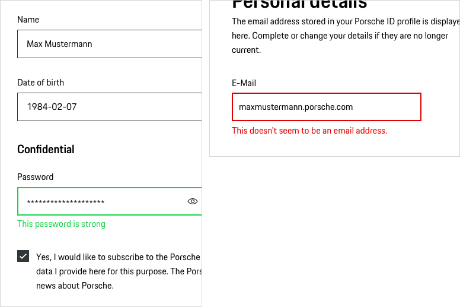

# Text Field

Use Text Fields in forms to help user enter text. Text Fields should always be accompanied by labels, helping the user to understand the type of input that is required.

---

## Variants

### Placeholder

Placeholder text disappears when a user types in the input. If a user doesn’t enter a value and moves to another part of a form, the placeholder text reappears in the former text box. However, using placeholder text is not recommended since users can misinterpret it as already filled in content. Please find more information on providing extra information in the [Form pattern guideline](#/patterns/forms).

<p-text-field-wrapper label="Some label"><input type="text" name="some-name" placeholder="Some placeholder text"></p-text-field-wrapper>

### Password

Password fields have the ability to hide/show the typed password.

<p-text-field-wrapper label="Some label"><input type="password" name="some-name" value="some password"></p-text-field-wrapper>

### Search

Search fields have the ability to activate the search function.  

<p-text-field-wrapper label="Some label"><input type="search" name="some-name"/></p-text-field-wrapper>

### Pure (without label)

The component Pure (without label) is only used if the context clearly describes what the component Pure is to be used for and no further explanation is required.

<p-text-field-wrapper label="Some label" hide-label="true"><input type="text" name="some-name"></p-text-field-wrapper>

### Description text

Sometimes it’s helpful for the user to get further information on the input. This can be done by providing a description text displayed openly and directly outside the form field. Please find more information on providing extra information in the [Form pattern guideline](#/patterns/forms).

<p-text-field-wrapper label="Some label" description="Some description"><input type="text" name="some-name" /></p-text-field-wrapper>

---

## States

All Text Fields types are available in the following states:

* default
* disabled
* hover
* focus
* error
* success

---

## Styling

### Label
The label text (always in copytext) gives the user an information about the option that can be selected. Try to keep the label short and descriptive (a word or two).

### Input area
Enables users to enter a single line text.

### Width
Text fields have no specific width. Depending on the layout you can set the width either depending on the length of the text or by adjusting it to the grid. Baymard Institute usability study showed that: “If a field was too long or too short, the test subjects started to wonder if they had misunderstood the label (…).” [Baymard Institute](https://baymard.com/blog/form-field-usability-matching-user-expectations) The initial width of the sketch symbol is set to 272 px (corresponds to the grid width on viewport XS). For further information we recommend to read the [Form pattern guideline](#/patterns/forms).

### Validation and error
Validation text for a field is placed right below the field box in order to make it clear for the user which text field the validation belongs to.
Please find more information on providing extra information in the [Form pattern guideline](#/patterns/forms).

### Spacing
According to the "law of proximity" in Gestalt psychology ([Laws of UX](https://lawsofux.com/law-of-proximity)) objects that are near or proximate to each other tend to be grouped together. Please find more information on providing extra information in the [Form pattern guideline](#/patterns/forms).

---

## Usage

### Mandatory and optional fields

Generally, it’s recommended to avoid optional fields in forms due to the fact that we should not give the user the feeling of having to give information that is not absolutely necessary. That being said, we would then have to label almost every (mandatory) form field with the well-known asterisk accompanied by a global explanation (“All fields marked with * ...“). In order to give the Porsche forms a more positive connotation and for the reason that users are more likely to provide voluntary information, we  recommend to mark only optional fields by adding “(optional)” next to the input label.

By doing so…
 * user feel less overwhelmed, as there are way less “(optional)” labels than there would be asterisks.
 * users do not have to read a global explanation (“All fields marked with * ...“).
 * the asterisk is obsolete or freely available for other purposes, e.g. footnotes.
 * forms not only seem to be more positive, but also look more cleaned up in general.

<p-text-field-wrapper label="Some label (optional)"><input type="text" name="some-name"></p-text-field-wrapper>

### Disabled state

All types of Text Field are available as disabled state. However, disabled states (e.g. read only) should be avoided whenever possible, as they always tend to disrupt the user and break the user flow. Keep in mind: “The best way [to] prevent user error is to make sure that the use cannot make errors in the first place (…).” (Donald A. Norman, 2002)

    <p-headline variant="headline-3" tag="h3" style="margin-bottom: 24px;">Examples</p-headline>
    

## Don'ts

### Long text inputs
Don't use the Text Field component if you need to allow users to enter longer text. In this case, you should use the Textarea component.

---

## Related Components

* [Textarea](#/components/form/textarea)
