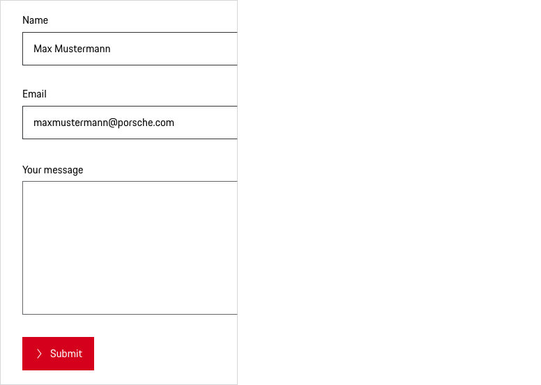

# Textarea
 
Use Textareas in forms to help people enter and select text. Textareas should be always accompanied by labels.
 
---
 
## Types
 
In order to provide an optimal user guidance within a page, different types of Textareas are 
available:
 
### 1. Default label
 
Use default label if the user is aware that these are only mandatory areas.

 
<p-textarea-wrapper label="Some label"><textarea name="some-name"></textarea></p-textarea-wrapper>
 
### 2. Required label
 
Use required label if the form has only a few mandatory areas and mark them with an asterisk next to the label and mention next the form that asterisks indicate required areas.
 
<p-textarea-wrapper label="Some label*"><textarea name="some-name"></textarea></p-textarea-wrapper>
 
### 3. Optional label
 
Use optional label if the form has only a few optional areas, mark them with "(optional)" next to the label.
 
<p-textarea-wrapper label="Some label (optional)"><textarea name="some-name"></textarea></p-textarea-wrapper>

### 4. Pure (without label)

Use Pure (without label) only for a dedicated use where the need for a stringing of fields is necessary.

<p-textarea-wrapper label="Some label" hide-label="true"><textarea name="some-name"></textarea></p-textarea-wrapper>
 
---
 
## Variantes
 
### 1. Placeholder
 
Placeholder text disappears when a user types in the input. If a user doesn’t enter a value and moves to another part of a form, the placeholder text reappears in the former text box. But we don't recommend to use placeholder text it since users can misinterpret it as final content.
 
<p-textarea-wrapper label="Some label"><textarea name="some-name" placeholder="Some placeholder text"></textarea></p-textarea-wrapper>

### 2. Read only
 
Use a read-only Textarea only if you want your input to be read only and not edited.
 
<p-textarea-wrapper label="Some label"><textarea name="some-name" readonly="readonly">Some value</textarea></p-textarea-wrapper>
 
---
 
## States
 
All Textareas types are available in the following states:
 
* default 
* disabled 
* read only
* focus
* error
* success

 
---
 
## Content
 
The Textarea may contain the following sub-components:
 
- **Label**
Label text (≤ 20 characters) is used to inform users as to what information is requested for a Textarea. Every Textarea should have a label.
- **Placeholder text**
Use placeholder text to give a concrete example of what you should write.
 
---
 
## Usage
 
### Width and height
 
Textarea don’t have a specific width and height, depending on the layout you can set the size either depending on the text length or by adjusting to grid.
 
 
### Disabled state
 
All types of Textarea are available as disabled state. However, disabled states (e.g. read only) should be avoided whenever possible, as they always tend to disrupt the user and break the user flow. Keep in mind: “The best way [to] prevent user error is to make sure that the use cannot make errors in the first place (…).” (Donald A. Norman, 2002)

 

    <p-headline variant="headline-3" tag="h3" style="margin-bottom: 24px;">Examples</p-headline>
    

## Don'ts

### Component
Don´t use a Textarea component if you want to allow users to enter short values that are not longer than a single line, such as a phone number or name. In this case, you should use the [text field](#/web/components/form/text-field#design) component.

### Number of Textareas
To ensure that we don´t overwhelm users, there should be no more than two Textareas on a page.

---
 
## Related Components
 
* [Text Field](#/web/components/form/text-field)
* [Checkbox](#/web/components/form/checkbox)
* [Radio Button](#/web/components/form/radio-button)
* [Select](#/web/components/form/select)

