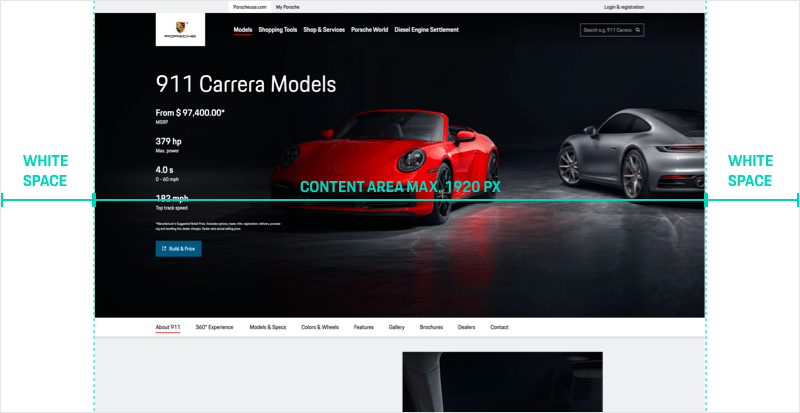

# Content Wrapper
When designing a web page you have different possibilities to layout your content or modules:
In the most cases you probably want to have a centered content area with a defined max-width and spacings ("basic safe zone") to the left and right of the viewport. 
But sometimes (e.g. in case of full-width images) you want the content stretched to the largest viewport without any spacing ("enhanced safe zone"). Or in case of the footer surface even stretched to the full width of even the largest screen width ("no safe zone").

Technically, all this can be done by using the Content Wrapper component which offers multiple possibilities 
(Safe zone variants) to define the **horizontal behaviour of your layout**. 

**With the help of the Content Wrapper component you can…**
- … define a spacing between content area and maximum viewport width.
- … center the content with equal spacing to the left and right side of the screen.
- … set the width for the content area either to the maximum viewport or full screen width.

## Safe zone variants

The Content Wrapper includes a safe zone that defines an equal margin to the left and right between the content area and the screen edges. 
Depending on your layout requirements you can choose between the following options for the safe zone, 
whereas each of them can be applied module-based to give you a maximum of flexibility for your page layouts:

### Basic

Depending on the screen width the "Basic" safe zone **includes a margin of 7% or 10% between 
content area and the left and right screen sides** (100% = full screen width):

| **Viewport** | **Margin** |
|--------------|------------|
| **XS-L (320-1759 px)** | 7% |
| **XL (1760 px or larger)** | 10% |

### Extended

The "Extended" safe zone includes no defined margin on the left and right of the content. 
The content itself has a maximum width of 1920 px. In viewport sizes from 1920 px onwards there 
is a growing white space outside the left and right edge.

### Fluid

The name speaks for itself: The variant "Fluid" includes no safe zone at all. So this is the variant of
your choice when you want your content to span to the full screen width, containing no margin or visual 
gap between content area and screen edges.

## Layout approach or: How to combine Content Wrapper with Grid, Flex or …

Both technically and aesthetically **the Content Wrapper can be combined with both Grid and Flex or with any custom content**. 
The principle of how to apply the Content Wrapper component is quite simple – just  think "from big to small" when defining the module layouts:

1. First of all, you define the **Content Wrapper** type for your layout part based on the safe zone variants described above.
2. **The content area of each layout part** can then itself be designed by using Grid and/or Flex or any custom way of content layouting, 
depending on the individual requirements of the module.

## Related components

- [Grid](#/components/layout/grid)
- [Flex](#/components/layout/flex)