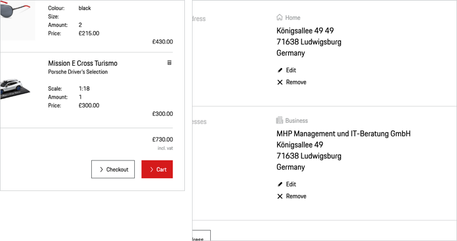

# Button Pure

## When to use
  • Use a Button Pure as a more subtle call to action (in addition to Button Primary, Secondary or Tertiary).   
  • Use a Button Pure to enable to execute an action (like "submit", "delete", "add" or "edit").   
  • Use a Button Pure to change the state of an application, which almost always happens on the same page. 

--- 

## Types

To ensure a seamless UX in all Porsche web applications it is recommended to use the Button Pure as follows

| Variant | Usage |
|----|----|
| Icon and text | This should be the variant of your choice whenever possible, as icons should preferably always be paired with text for better comprehensibility and accessibility. |
| Icon only| When it's enough to indicate an action with an icon only, the text label can be hidden but a minimum height of 40 px must be maintained. Yet, it's recommended to use this variant only in cases when the user is fully aware of the function due to an expressive and internationally comprehensible icon. |
| Icon, Text and Subline | This should be the variant of your choice if the Button Pure must be supplemented by a subline. However, we recommend that you only use this variant in cases where the user requires additional information. The standard variant will be used on a monochrome background, whereas the highlight variant should be used on a polychrome background (e.g. on images) for better comprehensibility and accessibility. |

# Icon alignment & stretch

To enable a wider usage different orders of icon and label are possible. Please only use under recommended circumstances

| Variant | Usage |
|----|----|
| Icon left | This is the default state and should be use when ever possible. |
| Icon right | On special occasions (e.g. step navigation, group of pure buttons, alignment of labels with headline). | 
| Stretch | It is recommended to use stretch only on  small viewports or areas, e.g. mobile views or sidebars. Please consider that the greater the distance between icon and label the less both will be perceived as a visual unit. |

## Usage

### Standard icons
The default icon is an arrow right that should serve in most cases. It should be changed only if it is ensured that another symbol is more appropriate to support the text content, making it easier for the user to understand the function quickly. For example:

| Interaction | Icon | Example |
|----|----|----|
| Close | <p-icon name="close" aria-label="Close"></p-icon> | Close a current page or window. |
| Cancel | <p-icon name="close" aria-label="Close"></p-icon> | Abandoning a process. |
| Delete | <p-icon name="delete" aria-label="Delete"></p-icon> | Delete/erase content, e.g. a list item. | 
| Edit | <p-icon name="edit" aria-label="Edit"></p-icon> | Edit content, e.g. in lists or shop checkout. | 	
| Add | <p-icon name="add" aria-label="Add"></p-icon> | Add content, e.g. a new item in a list. | 

### Text label
The text label is always set in copytext size. It is recommended to always keep the label short and give the user a hint on the indicated action, for example by including active verbs such as "add", "edit" or "delete". 

### Button Pure groups
Multiple Buttons Pure can be combined to one Button Pure group that must be stacked left-aligned in order to guarantee scannability and legibility. It is recommended to not group more than 6 Buttons Pure in a row.

    <p-headline variant="headline-3" tag="h3" style="margin-bottom: 24px;">Examples</p-headline>
    

