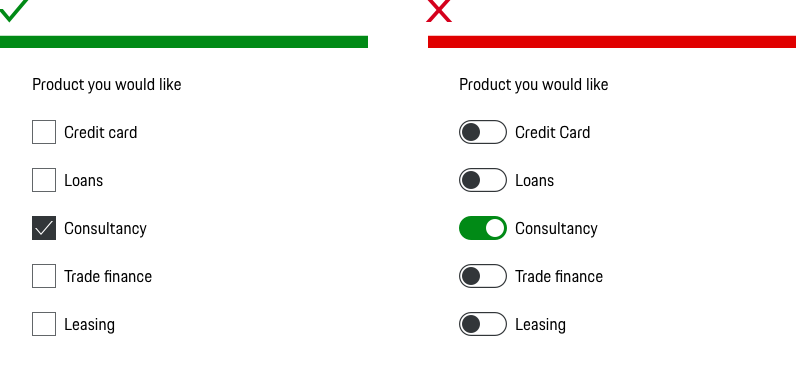
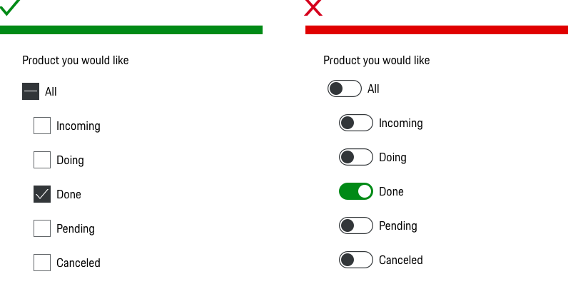

# Switch

## When to use

• Use a Switch if an instant response of applied settings is required without an explicit action.  
• Use a Switch to enable or disable a mode, feature, or function. If a setting requires a button press before it can take effect, you should use a [Checkbox](#/components/checkbox-wrapper) instead.  
• Use a Switch when user is toggling independent features or behaviors.

---

## Types

To ensure a seamless UX in all Porsche web applications it is recommended to use the Switch as follows

| Type | Usage |
|----|----|
| Left aligned | If the switch is used stand-alone, we recommend to use the switch aligned to the left (Switch vs. Label). |
| Right aligned | If the switch is used within a list (e.g. settings) we recommend to place the switch on the right side (Switch vs. Label). |

## Behavior

### Label

Remember that Switches are meant to be two mutually exclusive states. The Switch is accompanied by a straightforward and concise label (always in copytext) to make the component accessible. That microcopy is very important, as users should be able to see and understand the function behind the Switch. It’s better to avoid anything longer than two words, as you want that first glance to be all that’s needed to use the Switch. The Switch can be used also without a label but beware, only use this approach if the purpose of the control clearly made elsewhere. For example, if there is a group label or section header that allows the user to infer the description of the option.

### Stretching

Depending on the use case, the spacing between the switch and the label can be increased. However, the minimum spacing of 8 px should be observed.

### Action

Switches should never require users to press a button to apply the settings because a switch is a toggle button. When you require users to press a submit button, you confuse them because it’s not what they expect. You should only use switches on settings that need to take effect instantaneously. 

### Validation

We recommend to use only one validate for error. Success is already provided by the active switch and does not require any further validation. Use a validation only when necessary. E.g. to show error message or direct feedback of this control. Do not distract users with unimportant information. For page level feedback, use the [Banner](#/components/banner) notification.

### Helper text

Provide help only when help is truly required! For example, if it is important for the user to know what consequences his activation of the Switch will cause.

---

## Do's & Don'ts

### Multiple choice

Don’t use the slide Switch for multiple choice questions

### Intermediate state

Don’t use slide Switch when an intermediate state is required. [Use Checkbox instead!](#/components/checkbox-wrapper)

### Label

Don’t use only the label to describe the states of the Switch. A label next to the Switch must describe the affected property.

## Related Components

- [Checkbox](#/components/checkbox)
- [Button](#/components/button)