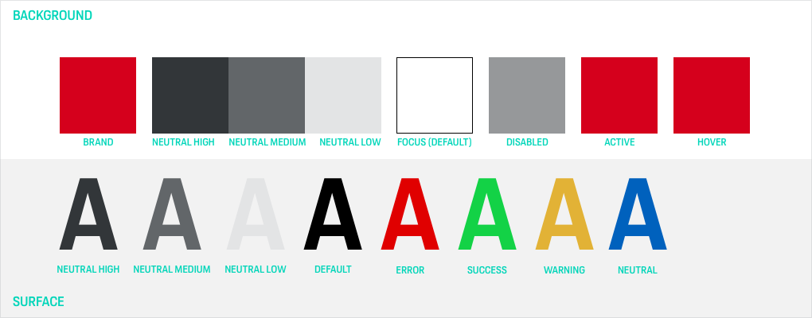
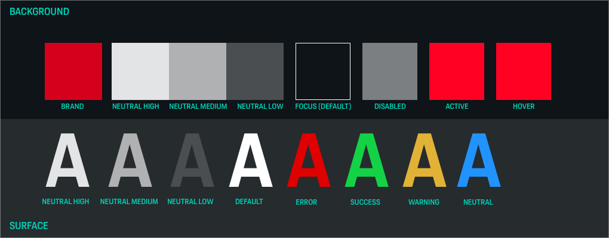
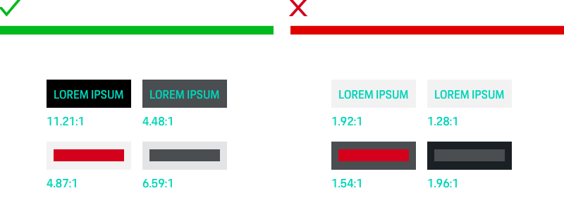

# Color

Together with other basic elements like typography, iconography or imagery, the
right use of colors gives every UI the specific Porsche feeling and is
therefore one of the most important tools to create a consistent visual
branding. Even more so when it comes to UX, color is to be used intentionally to create
patterns, set emphasis on important elements and, by doing so, provide visual
guidance and information.

The Porsche Design System color system provides two color themes that are based on the Porsche color palette and can be
used for different visual environments. Both themings are to be found in the Porsche Design System Sketch library.

---

## Porsche Design System color themes

When designing Porsche applications, the first decision to make is whether the content should be displayed in a merely light or dark environment.
That's when the Porsche Design System color themes come into play that come with a limited color set you should stick to for page backgrounds as well as for text and icons: 

- **The Porsche Light Theme should always be first choice.**
- The Porsche Dark Theme is only to be used for exceptional cases, e.g. if an application is to stand out from the rest of visual communication for strategic reasons or if the context of use is unsuitable for a bright shining display. 
  
All Porsche Design System components are optimized for both Light and Dark Theme. 

### Additional elements
For designing additional elements (such as tiles, dividers or other graphical elements) you have several options:

- Use the accessibility-safe colors provided for the theme (Neutral Contrast High and Neutral Contrast Medium), as they guarantee optimal contrast on the theming's backgrounds. This is highly recommended whenever you want to convey important information.
- Neutral Contrast Low is not accessibility-safe and, therefore, recommended to be used only for displaying "nice to have" or merely decorative elements that are not crucial for information perception. 

### Information level

In order to define the colors to be used within the screen the **information level** of the respective elements is crucial. 

- Play with darker/lighter grey shades to make an element stand out from the background or to set emphasize on it. 
- For large screen space make sure to only use the dedicated surface color for your theme (e.g. Surface). 
- Use the brand color only for highlighting single elements.

### Mixing themes
Within certain limits it's allowed to mix the Porsche color themes. For example you could integrate a limited Dark Theme area in your Light Theme
to visually distinguish it from the rest of the content. **Always make sure that the vast majority of the screen consists of the initially chosen theme.**
The color proportion scales for each theme might be a little helper in doing so.

### Color usage
All colors must always be used in 100% opacity.

### Focus
The `:focus` state helps you to navigate through all interactive elements via tab key. 
By default, the focused element has a 1px solid outline with a 1px offset, respectively 2px offset for components that come with a background-color or border. 
The color for the outline is defined by the currentColor value, which refers to the element's color. 
For example, a primary button will have a 1px solid brand color red outline with 2px offset as `:focus`. 
Additionally, the input controls which also reflect their validation state color.

---

## Porsche Light Theme 

### Brand color

|                                                                              	|                      	    | HEX     	| RGB           	| Usage                                     |
|-----------------------------------------------------------------------------	|---------------------------|----------	|----------------	|------------------------------------------ |
| <ColorBadge theme="light" color="brand"/> 	                                          | **Brand**         	| #D5001C 	| 213/0/28       	| CI color                     |

### Background colors

|                                                                         	|                      	    | HEX     	| RGB           	| Usage            |
|-------------------------------------------------------------------------	|---------------------------|----------	|----------------	|----------------- |
| <ColorBadge theme="light" color="background-default"/>  	                                    | **Background Default**        	| #FFFFFF 	| 255/255/255   	| Page background  |
| <ColorBadge theme="light" color="background-surface"/> 	                                    | **Background Surface**        	| #F2F2F2 	| 242/242/242     | Additional backgrounds, for example for tiles or contrasting content areas |
| <ColorBadge theme="light" color="background-shading"/>  | **Background Shading** | #0E1418 (opacity 0.9) | 14/20/24 (opacity 0.9) | Full-page overlays to make e.g. modal layers stand out from the background  | 

#### Background notification colors

|                                                                         	|                      	    | HEX     	| RGB           	| Usage            |
|-------------------------------------------------------------------------	|---------------------------|----------	|----------------	|----------------- |
| <ColorBadge theme="light" color="notification-error-soft"/> 	                          | **Background Error Soft**        	| #FAE6E6 	| 250/230/230   | Error Soft (only to be used for notification background) 	  | 
| <ColorBadge theme="light" color="notification-success-soft"/> 	                        | **Background Success Soft**        	| #E5F3E7 	| 229/243/231  	  | Success Soft (only to be used for notification background)  	  |
| <ColorBadge theme="light" color="notification-warning-soft"/> 	                        | **Background Warning Soft**       	| #FFF5E5 	| 255/245/229  	| Warning Soft (only to be used for notification background)	  |
| <ColorBadge theme="light" color="notification-neutral-soft"/> 	                        | **Background Neutral Soft**       	| #E5EFF8 	| 229/239/248  	| Neutral Soft (only to be used for notification background)	  | 

### Base color

|                                                                              	|                      	    | HEX     	| RGB           	| Usage                                     |
|-----------------------------------------------------------------------------	|---------------------------|----------	|----------------	|------------------------------------------ |
| <ColorBadge theme="light" color="default"/>    	                                      | **Default**        	| #000000 	| 0/0/0          	| Default text/icon color                   |

### Neutral colors
The neutral palette is to be used for all basic architectonic page elements such as tile backgrounds, dividers or other graphical elements.
The set consists of several grey shades that are based on a pre-defined mixing ratio of black in combination with a slightly touch of blue.

|                                                                         	|                                    | HEX      | RGB              | Usage           | Accessibility Level AA           |
|-------------------------------------------------------------------------	|------------------------------------|----------|------------------|-----------------|-----------------|
| <ColorBadge theme="light" color="neutral-contrast-high"/> 	            | **Neutral Contrast High**          | #323639 	| 50/54/57         | div. elements   | ✓   |
| <ColorBadge theme="light" color="neutral-contrast-medium"/> 	            | **Neutral Contrast Medium**        | #626669 	| 98/102/105         | div. elements   | ✓   |
| <ColorBadge theme="light" color="neutral-contrast-low"/> 	                | **Neutral Contrast Low**           | #E3E4E5 	| 227/228/229        | only for decorative elements   | -   |

### Notifications
Notification colors are to be used only to display warnings, error or status messages.
When using notification colors …

- … always make sure not to rely on color only when displaying status (for more information scroll down to *Accessibility*).
- … always check manually if the color contrast is sufficient depending on the Porsche color theme and, therefore, the background color in use.

|                                                                         	|                         	| HEX     	| RGB         	| Usage            |Accessibility Level AA          |
|-------------------------------------------------------------------------	|---------------------------|---------	|-------------	|-----------------| -----------------|
| <ColorBadge theme="light" color="notification-error"/> 	                          | **Error**          	| #E00000 	| 224/0/0   | Error notification 	  | ✓   |
| <ColorBadge theme="light" color="notification-success"/> 	                        | **Success**        	| #018A16 	| 1/138/22  	  | Success notification 	  | ✓   |
| <ColorBadge theme="light" color="notification-warning"/> 	                        | **Warning**        	| #FF9B00 	| 255/155/0  	| Warning notification (only to be used on default background)	  | - |
| <ColorBadge theme="light" color="notification-neutral"/> 	                        | **Neutral**        	| #0061BD 	| 0/97/189  	| Neutral notification	  | ✓  |

### States

|                                                         |                 | HEX     	| RGB         	| Usage          |
|---------------------------------------------------------|-----------------|-----------|---------------|----------------|
| <ColorBadge theme="light" color="state-hover"/> 	      | **Hover**       | #D5001C 	| 213/0/28      | Hover state    |
| <ColorBadge theme="light" color="state-active"/> 	      | **Active**      | #D5001C 	| 213/0/28      | Active state   |
| <ColorBadge theme="light" color="state-disabled"/>      | **Disabled**    | #96989A 	| 150/152/154   | Disabled state |

### Color proportions

---

### Porsche Dark Theme

### Brand color

|                                                                              	|                      	    | HEX     	| RGB           	| Usage                                     |
|-----------------------------------------------------------------------------	|---------------------------|----------	|----------------	|------------------------------------------ |
| <ColorBadge theme="dark" color="brand"/> 	                                          | **Brand**         	| #D5001C 	| 213/0/28       	| CI color                    |

### Background colors

|                                                                       	|                      	    | HEX     	| RGB           	| Usage            |
|-----------------------------------------------------------------------	|---------------------------|----------	|----------------	|----------------- |
| <ColorBadge theme="dark" color="background-default"/> 	                                    | **Background Default**        	| #0E1418 	| 14/20/24      	| Page background  |
| <ColorBadge theme="dark" color="background-surface"/>                                      | **Background Surface**        	| #262B2E 	| 38/43/46        | Additional backgrounds, for example for tiles or contrasting content areas |
| <ColorBadge theme="dark" color="background-shading"/>  | **Background Shading** | #0E1418 (opacity 0.9) | 14/20/24 (opacity 0.9) | Full-page overlays to make e.g. modal layers stand out from the background  | 

#### Background notification colors

|                                                                         	|                      	    | HEX     	| RGB           	| Usage            |
|-------------------------------------------------------------------------	|---------------------------|----------	|----------------	|----------------- |
| <ColorBadge theme="dark" color="notification-error-soft"/> 	                          | **Background Error Soft**        	| #FEC5C5 	| 254/197/197   | Error Soft (only to be used for notification background) 	  | 
| <ColorBadge theme="dark" color="notification-success-soft"/> 	                        | **Background Success Soft**        	| #BFEEC6 	| 191/238/198  	  | Success Soft (only to be used for notification background)  	  |
| <ColorBadge theme="dark" color="notification-warning-soft"/> 	                        | **Background Warning Soft**       	| #FFE6BF 	| 255/230/191 	| Warning Soft (only to be used for notification background)	  |
| <ColorBadge theme="dark" color="notification-neutral-soft"/> 	                        | **Background Neutral Soft**       	| #C7E4FF 	| 199/228/255 	| Neutral Soft (only to be used for notification background)	  | 

### Base color

|                                                                         	|                    	    | HEX     	| RGB           	| Usage                                   |
|-------------------------------------------------------------------------	|-------------------------|----------	|----------------	|---------------------------------------- |
| <ColorBadge theme="dark" color="default"/>  	                                    | **Default**      	| #FFFFFF 	| 255/255/255    	| Default text/icon color                 |

### Neutral colors
The neutral palette is to be used for all basic architectonic page elements such as tile backgrounds, dividers or other graphical elements.
The set consists of several grey shades that are based on a pre-defined mixing ratio of black in combination with a slightly touch of blue.

|                                                                         	|                                    | HEX      | RGB              | Usage           | Accessibility Level AA           |
|-------------------------------------------------------------------------	|------------------------------------|----------|------------------|-----------------|-----------------|
| <ColorBadge theme="dark" color="neutral-contrast-high"/> 	                | **Neutral Contrast High**          | #E3E4E5 	| 227/228/229      | div. elements   | ✓   |
| <ColorBadge theme="dark" color="neutral-contrast-medium"/> 	            | **Neutral Contrast Medium**        | #B0B1B2 	| 176/177/178      | div. elements   | ✓   |
| <ColorBadge theme="dark" color="neutral-contrast-low"/> 	                | **Neutral Contrast Low**           | #4A4E51 	| 74/78/81         | only for decorative elements | -   |

### Notifications
Notification colors are to be used only to display warnings, error or status messages.
When using notification colors …

- … always make sure not to rely on color only when displaying status (for more information scroll down to *Accessibility*).
- … always check manually if the color contrast is sufficient depending on the Porsche color theme and, therefore, the background color in use.

|                                                                         	|                         	| HEX     	| RGB         	| Usage            |Accessibility Level AA          |
|-------------------------------------------------------------------------	|---------------------------|---------	|-------------	|-----------------| -----------------|
| <ColorBadge theme="dark" color="notification-error"/> 	                                        | **Error**          	| #FC1717 	| 252/23/23   	  | Error notification | ✓   |
| <ColorBadge theme="dark" color="notification-success"/> 	                                      | **Success**        	| #01BA1D 	| 1/186/29  	  | Success notification |  ✓   |
| <ColorBadge theme="dark" color="notification-warning"/> 	                                    | **Warning**        	| #FF9B00 	| 255/155/0  	| Warning notification | ✓   |
| <ColorBadge theme="dark" color="notification-neutral"/> 	                                    | **Neutral**        	| #2193FF 	| 33/147/255  	| Neutral notification | ✓   |

### States
The focus color is only to be used to highlight components on focus enabling users navigating through the website via keyboard.

|                                                        |                 | HEX     	| RGB         	| Usage              |
|--------------------------------------------------------|-----------------|------------|---------------|----------------|
| <ColorBadge theme="dark" color="state-hover"/> 	     | **Hover**       | #FF0223	| 255/2/35      | Hover state    |
| <ColorBadge theme="dark" color="state-active"/> 	     | **Active**      | #FF0223 	| 255/2/35     | Active state   |
| <ColorBadge theme="dark" color="state-disabled"/>      | **Disabled**    | #7C7F81 	| 124/127/129   | Disabled state |

### Color proportions

--- 

## Porsche color principles

### Be consistent.
Once you’ve picked a **Porsche color theme** for you UI design you should stick with it within the application.
Ensure consistency by integrating audits in your workflow.

### Be accessible.
Always keep in mind that **not every user gets to experience colors the same way**
due to color blindness, visual impairment or simply because of the environment.
Therefore, you should always care about accessibility.

### Be purposeful.
Use color wisely and always **focus on supporting the user’s needs** and the purpose of the content within the UI.

### Be Porsche.
Generate a dedicated **Porsche feeling** within the UI by using the colors given
in the brand color palette. Avoid using shades or opacity values for the brand
colors.

Sticking to the [Porsche Brand Code](https://brandguide.porsche.com/elements/manual/view/id/548) this means:

- Generous (but also well-considered) use of white space to emphasize the brand’s exclusiveness and high-quality.
- Form follows function – and so does color.
- Use color to support a clean, precise design language. Stick to the essentials and avoid a non-functional decorative use of color.

---

## Accessibility

In order to make content accessible for a wide range of people and to improve the product’s usability in general, we stick to the common [WCAG 2.1 Standard](https://www.w3.org/WAI/standards-guidelines/wcag/new-in-21/) when designing Porsche web applications.

- Always ensure a sufficient contrast ratio. The combination of text and background color should pass the WCAG AA standard and have a contrast ratio of at least 4.5:1 for standard text size and 3:1 for larger text sizes.

- Combinations of other colored elements must pass the WCAG AA standard with a minimum 3:1 ratio, unless it's only a decorative element.

- Don’t rely on color only to convey information (for example when displaying status or error messages). This is of high importance especially in critical cases, e.g. when displaying safety-relevant vehicle data.

---

## Helpful tools and resources

### Sketch plugins
- [Stark](https://getstark.co)
- [Color Contrast Analyser](https://github.com/getflourish/Sketch-Color-Contrast-Analyser)
Both plugins help you to check the color contrast of two selected layers in Sketch, no matter if it's text or surface color.

### Web tools
- [Color Oracle](https://colororacle.org/) is a free color blindness simulator for both Windows and Mac, that gives you an impression on how your designs are perceived by visually impaired users.
-  With [Tanaguru Contrast Finder](http://contrast-finder.tanaguru.com/) you can easily check color contrasts on your desired level of accessibility.

---

## Do's & Don'ts
Always ensure a sufficient contrast ratio. The combination of text and background color should pass the WCAG AA standard.

