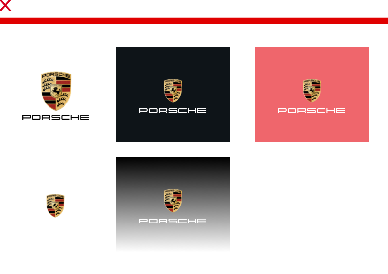

# Marque

<TableOfContents></TableOfContents>

## Sizes

Slight adjustments ensure that the Porsche marque is optimally perceived as equally as possible in the various image sizes.

| Size | Usage |
|------|--------|
| **Small** | Viewports with 1299 px width or lower |
| **Medium** | Viewports with 1300 pixel width or larger |

---

## Content

The two elements that make up the overall logo for the Porsche marque are the **word "Porsche" (logotype)** and the **Porsche Crest** as an image-based logo. The three-dimensional colored Porsche marque is used as a fixed unit, always including crest and logotype, across all media, and **may not be changed**. 

---

## Usage

- Within static digital applications, the Porsche Marque is **always used without shadow**. For moving images a separate Crest with shadow is available.
- The Porsche Marque may **only be used on a white background**.

--- 

## Do's & Don'ts

- The marque **may not be altered** in relation to its two elements or their size. The marque may never be used without the Porsche lettering, as the sender identification cannot be guaranteed.
- The Porsche marque **may not be used against coloured or busy backgrounds** (e.g. shading). As the Porsche crest has a high level of graphical complexity, excessive visual turmoil may be created.

