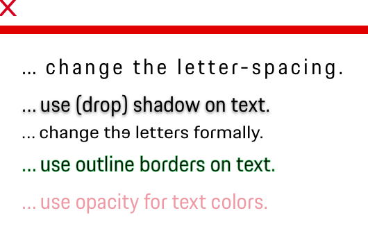

# Typography

<TableOfContents></TableOfContents>

## Principles

For Porsche web applications, good typography is…

### … functional.
Use typography to provide clear hierarchy, to organize content and to guide the user through the digital product journey.

### … clear.
Use typography to provide both efficiency and, from a more visual point of view, support for a clear and modern 
look and feel of the Porsche application.

### … readable.
Never use typography by the sake of itself or as "eye candy". It should always support the usability of 
a website by making text readable due to a good text color contrast and sufficient text sizes.

### … purposeful.
Use typography wisely and always keep an eye on the user's needs and the purpose of the content you want to communicate.

### … a matter of course.
Always use typography in a professional manner in order to support the exclusiveness and high-quality-standard of the brand.
This not only means to make use of the pre-defined type styles provided in the Porsche Design System, but also to follow the general rules
of good (micro) typography, such as using the right kind of apostrophes in the respective language. 

---

## Porsche Next

The special Porsche feeling and the high recognisability across different touchpoints is decisively shaped by the use of the corporate typeface Porsche Next, which has been exclusively designed for Porsche. Therefore it is the only typeface allowed to be used for Porsche in both print and digital media.

Formally, the impression of the Porsche Next is largely determined by the visual character of the "squircle", a combination of square and circle, which is reflected in the curves and circular shapes of the typeface.


### Download

You can download the [Porsche Next font here](https://cdn.ui.porsche.com/porsche-design-system/font/v1/Porsche_Next_WebOTF_Lat-Gr-Cyr.zip).

---

## Types

To ensure a seamless UX in all Porsche web applications it is recommended to use the Typography as follows

| Type | Usage |
|----|----|
| Copytext | The copytext (text small) are typically to be used for long-form writing. The copy text x-small is only recommended for additional, low-informative text such as disclaimers or captions. |
| Headline | The Porsche headline should only be used for first-level headlines whose function is to lead a page, section or content area. For Porsche headlines styles, only semibold weight is used to provide a good readability and making it as easy as possible to focus on the content sections of a page. |
| Additional text | For short text parts that are not explicitly a page or section headline, but need a bit more focus or should be displayed larger due to aesthetic purpose, you can stick to the additional sizes provided in the Porsche Design System. |


## Behavior

### Type scale
Additional text sizes can be defined based on the Porsche type scale system. 

<p-text size="x-small" tag="span" color="inherit" class="type-scale highlight">12</p-text>
<p-text tag="span" color="inherit" class="type-scale highlight">16</p-text>
<p-text size="inherit" tag="span" class="type-scale f-18">18</p-text>
<p-text size="inherit" tag="span" class="type-scale f-20">20</p-text>
<p-text size="inherit" tag="span" class="type-scale f-22">22</p-text>
<p-text size="medium" tag="span" color="inherit" class="type-scale highlight">24</p-text>
<p-text size="inherit" tag="span" class="type-scale f-28">28</p-text>
<p-text size="inherit" tag="span" class="type-scale f-30">30</p-text>
<p-text size="inherit" tag="span" class="type-scale f-32">32</p-text>
<p-text size="large" tag="span" color="inherit" class="type-scale highlight">36</p-text>
<p-text size="inherit" tag="span" class="type-scale f-42">42</p-text>
<p-text size="inherit" tag="span" class="type-scale f-44">44</p-text>
<p-text size="inherit" tag="span" class="type-scale f-48">48</p-text>
<p-text size="x-large" tag="span" color="inherit" class="type-scale highlight">52</p-text>
<p-text size="inherit" tag="span" class="type-scale f-60">60</p-text>
<p-text size="inherit" tag="span" class="type-scale f-62">62</p-text>
<p-text size="inherit" tag="span" class="type-scale f-72">72</p-text>
<p-text size="inherit" tag="span" class="type-scale f-84">84</p-text>


### Type Scale Calculator
  
<label for="px-unit">Enter a font-size in px unit based on Porsche Type Scale.</label>  
<input type="number" v-model="size" id="px-unit" />

```
{{this.typeScale(size +'px')}}
```

**Example Text**
<p-text size="inherit" :style="typeScale(size +'px', false)">The quick brown fox jumps over the lazy dog</p-text>


### Fallback fonts

If in some cases the `Porsche Next` web font can't be rendered by the browser (e.g. due to download errors or not containing needed unicode character) you have to provide fallback fonts which must be stacked like this: 
1. Porsche Next
2. Arial Narrow
3. Arial
4. Heiti SC
5. SimHei
6. sans-serif

### Latin, Greek & Coptic, Cyril

The `Porsche Next` web font contains all typeface characters required for Latin, Greek and Cyrillic languages.
Arabic, Pashtu, Persian and Urdu are not yet supported by the Porsche Design System but available as separate typeface packages on request.

#### Chinese / Japanese

For Chinese and Japanese charset the `Heiti SC` (iOS/macOS) and `SimHei` (Windows) pre-installed OS font must be used, sticking to the default Porsche font scaling system.

#### Korean

For Korean charset some pre-installed OS font shall be used, sticking to the default Porsche font scaling system.

---

## Usage

### Applying headline styles

Depending on your layout, you don't necessarily have to start with headline 1. Also, it is possible to skip headline sizes whenever it serves the information structure.
It is much more important to keep an eye on a homogeneous use of text sizes within one application.
Also, please note that the headline class namings don't necessarily refer to the HTML font tags. For example the style headline 1 can also technically be implemented as `<h2>`.

### Line height

For reasons of legibility, the line height should always be adjusted to the respective text size. The text styles provided work with a 4 px baseline unit that fits to the [8 px spacing system](components/spacing) in order to follow a harmonious overall vertical rhythm.

### Headline-subline combinations

A first-level headline can be supplemented by a corresponding subline. Sublines must be set in Regular using an "additional sizes" class with minimum 16px size.

| Headline size    | Subline size                                      |
|------------------|-------------------------------------------------  |
| 16-18 px         | 16 px                                             |
| 20-42 px         | Min. 2 sizes smaller (see Porsche type scale)     |
| 44 px or larger  | Min. 4 sizes smaller (see Porsche type scale)     |

Examples:


### Headline

The headline styles span from large title, that can be used optionally and only once per page, to headlines 1 to 5 that can be used multiple times.
In the exceptional case that the headline 1 to 5 does not meet the requirements, there is the possibility to generate a new size. Observe the correct line height and the semibold typeface.

### Weights

The Porsche Next is available in different font weights that enable to add emphasis and create a visual content hierarchy.
For digital applications, we recommend only to use semibold, regular and thin:

- **Porsche Next Semibold** for first-level headlines.
- **Porsche Next Bold** for copytext highlights.
- **Porsche Next Regular** for copytext, stand-alone text or sublines (in combination with first-level headlines).
- **Porsche Next Thin** for stand-alone text larger than 20px.

<p-text size="x-large" weight="thin">Porsche Next Thin</p-text>
<p-text size="x-large">Porsche Next Regular</p-text>
<p-headline variant="headline-1">Porsche Next Semibold</p-headline>
<p-text size="x-large" weight="bold">Porsche Next Bold</p-text>

### Alignment

Per default, the Porsche Next is always used left-aligned. In individual cases or certain components it can also be used centered,
but keep in mind to not exceed 3 text lines, as it is much harder to read. Right-aligned text is also possible in exceptional
cases, for example in tables where right-aligned numbers should support readability.

Please avoid…

- … using the font in block typesetting, as this does not correspond with the high-quality brand image.
- … mixing up different text alignments within one paragraph. Keep it straight and simple.

### Line length

The longer a text line gets, the harder it is for the user to jump from the end of the current line to the beginning of the next line. Therefore we should always aim at a line length that supports good readability.

For UI applications it is recommended to use [no more than 80 characters or glyphs per line](https://www.w3.org/TR/UNDERSTANDING-WCAG20/visual-audio-contrast-visual-presentation.html). This might differ a bit depending on the respective line height and viewport size and results in different pixel widths depending on the Porsche type class in use:

- Copytext X-Small (12 px): max. 400-450 px
- Copytext Small (16 px): max. 500-550 px
- Headlines and additional sizes (20-84 px): max. 700 up to max. 2700 px


### Multi-column text

Generally, text paragraphs should be set as single column. Multi-column text should never exceed 3 columns and is only allowed when it can be ensured that all text columns are in the visible viewport range ("above the fold"). The user should not have to scroll before being able
to read the full content.

### Paragraph spacing

The vertical spacing between copytext paragraphs should be at least 24px, which equals the space of one line of text in-between.


### Upper case
The usage of upper case text is possible, but should be handled with care, as upper case text is always a matter of readability.
Upper case text should only be used for:

- Exceptional, one-of-a-kind design cases like standing-out parts of a (graphical) composition or in sole design elements like a tag cloud.
- Special components for which readability is generally not critical (such as short tags).
- Proper names such as GTS or BOSE.


---

## Accessibility
As we stick to the common [WCAG 2.1 Standard](https://www.w3.org/WAI/standards-guidelines/wcag/new-in-21/),
you should always ensure a sufficient contrast ratio when designing with text. 
The combination of text and background color should pass the WCAG AA standard 
and have a contrast ratio of at least 4.5:1 for standard text size and 3:1 
for larger text sizes. 


Also, you should not rely on color only to convey information. 
When communicating element states with text (for example a password validation 
information in forms), make sure to always use additional text stylings to make it easy for visually impaired people to recognise
status information even if they can’t see the color – this is of even higher
importance the more critical the information is.

---

## Do's & Don'ts

### Text modifications

Please avoid to transform the Porsche Next manually (e.g. within Sketch or via CSS), as this would have a big and undesirable
impact on the origin character of the company typeface. This includes:

- No change of letter-spacing.
- No use of (drop) shadows on text.
- No formal change of letters (for example distortion).
- No use of outline borders on text.
- No use of opacity for text colors.
  


<style lang="scss" scoped>
  @import '~@porsche-design-system/utilities/scss';
  
  .type-scale {
    display: inline-block;
    margin-right: 1rem;
    
    &.highlight {
      color: $p-color-theme-light-notification-success;
    }
    
    &.f-18 {
      @include p-generate-type-scale(18px);
    }
    
    &.f-20 {
      @include p-generate-type-scale(20px);
    }
    
    &.f-22 {
      @include p-generate-type-scale(22px);
    }
    
    &.f-28 {
      @include p-generate-type-scale(28px);
    }
    
    &.f-30 {
      @include p-generate-type-scale(30px);
    }
    
    &.f-32 {
      @include p-generate-type-scale(32px);
    }
    
    &.f-42 {
      @include p-generate-type-scale(42px);
    }
    
    &.f-44 {
      @include p-generate-type-scale(44px);
    }
    
    &.f-48 {
      @include p-generate-type-scale(48px);
    }
    
    &.f-60 {
      @include p-generate-type-scale(60px);
    }
    
    &.f-62 {
      @include p-generate-type-scale(62px);
    }
    
    &.f-72 {
      @include p-generate-type-scale(72px);
    }
    
    &.f-84 {
      @include p-generate-type-scale(84px);
    }
  }
</style>

<script lang="ts">
import Vue from 'vue';
import Component from 'vue-class-component';
import { calculateLineHeight } from '@porsche-design-system/utilities';

@Component
export default class PlaygroundTypography extends Vue {
  public size: string = '16';
  public typeScale(fontSize: string, comment: boolean = true): string {
    const fittedLineHeightFactor = calculateLineHeight(fontSize);
    const fittedLineHeightPx = Math.round(fontSize.slice(0, -2) * fittedLineHeightFactor);
    const fontSizeRem = fontSize.slice(0, -2) / 16;
    
    if (comment) {
      return "font-size: "+ fontSizeRem +"rem; // "+ fontSize +"\nline-height: "+ fittedLineHeightFactor +"; // "+ fittedLineHeightPx +"px";
    }
    
    return "font-size: "+ fontSizeRem +"rem; line-height: "+ fittedLineHeightFactor +";";
  }
}
</script>
