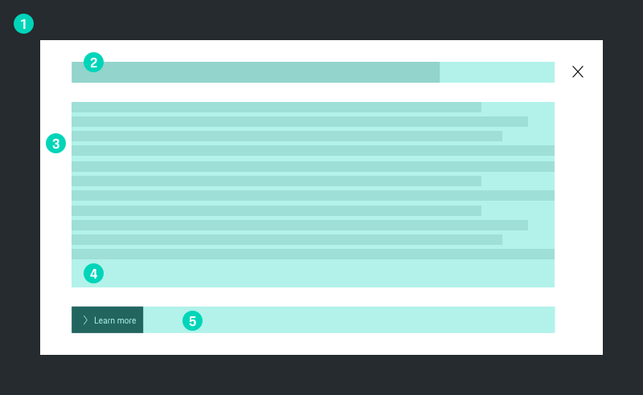
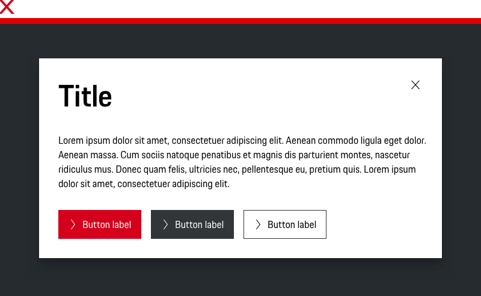

# Modal

A Modal Dialog is a temporary overlay that takes focus from the page and requires people to interact with it. It’s primarily used for confirming actions, such as asking people to make a choice. It should be used thoughtfully and sparingly.

---

## Types

### 1. Basic
By default, modals have a title and can be closed by clicking on the “x” in the upper right hand corner of the container.

  <p-modal heading="Some Heading" :open="isOpen(0)" v-on:close="closeModal(0)">
    <p-text>Some Content</p-text>
    <p-button @click="closeModal(0)">Close</p-button>
  </p-modal>

  !!! Update Code !!!

### 2. Without close icon

  <p-modal heading="Some Heading" disable-close-button :open="isOpen(5)" v-on:close="closeModal(5)">
    <p-text>Some Content</p-text>
  </p-modal>

    !!! Update Code !!!

### 3. Without title

  <p-modal :open="isOpen(4)" v-on:close="closeModal(4)">
    <p-text>Some Content</p-text>
  </p-modal>

    !!! Update Code !!!

### 4. Without title and close icon

  <p-modal disable-close-button :open="isOpen(6)" v-on:close="closeModal(6)">
    <p-text>Some Content</p-text>
  </p-modal>

    !!! Update Code !!!

---

## Modal Dialog DNA

A typical Modal Dialog in Porsche web applications is made up of five basic elements:

1. **Background Shading**  
  The background shading covers the underlying content while providing focus to the information being served in the Modal Dialog. 

2. **Title**  
  Reinforces context from the initial trigger on page while providing an overview of the modal.

3. **Container**  
  As implied, this is where the contents of the modal dialogue such as text, inputs and buttons are held.

4. **Content**  
  A concise description or simple action a user must address. If multiple steps are required, use a whole page instead.

5. **Footer**  
  Contains the primary action of the modal. All modals should have a CTA. These actions should speak to and reinforce completing the action they are being asked to complete.

---

## Usage

### Overlay
For the background overlay is used the background shading to provide the feeling of a third dimensional layer. 
This also eliminates distraction and helps the user focus on the modal content.

### Animation
The background overlay animates once a modal is launched to grab a user’s attention and retain their focus.

### Scrolling
Scrolling is available but we recommend to put modal content in a single view. If your modal has a lot of detail or a 
long list of items, consider a different solution, such as a form or a table.

### Attention
Modals are disruptive. Only use modals when you need the user’s full attention for the period of time the modal is displayed.

### Close !!! TBD !!!
Modals are not dismissed when clicking on the background overlay. This prevents losing information or data. 
Within a Model Dialog are multiple ways to dismiss a modal but a user needs to intentionally make that choice.

---

## Don'ts

### Don't use more than two buttons
There should be no more than 2 actions and no fewer than 1. Actions should always be located within an action bar at the bottom of the modal. 
Button order and positioning should follow our guidelines for [Buttons](#/patterns/buttons).

### Stacking modals
Modals shouldn’t launch other modals. Stacking modals makes it hard to dismiss them and confuses the user on their levels of importance.

### Multiple steps
Avoid multiple steps that require navigation within the modal dialog.

