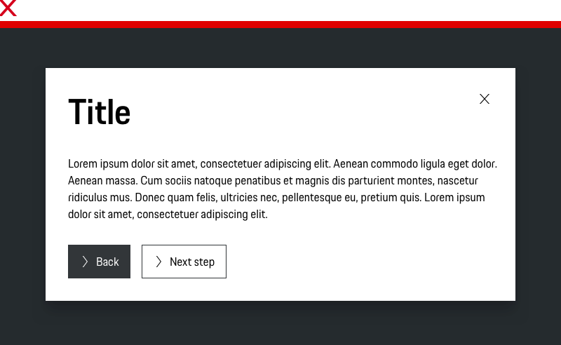

# Modal

## When to use

  • Use a Modal when you want to show additional information to the user without losing context of the parent page.  
  • Use a Modal Dialog where you need to ask for confirmation from the user before doing a lengthy or dangerous action.

---

## Types

To ensure a seamless UX in all Porsche web applications it is recommended to use the Modal as follows

| Variant | Usage |
|----|----|
| Basic | By default, Modals have a title and can be closed by clicking on the “x” in the upper right hand corner of the container. |
| Without close icon | The Modal without close “x” will dont close the modal without any interaction. |
| Without title | If the context is short and clear, the title can be skipped to avoid duplication. |
| Without title and close icon | For descriptive content and the need to close the Modal with a interaction. |

## Behavior

### Overlay
We use a shaded background overlay to provide to provide the feeling of a third dimensional layer. 
This also eliminates distraction and helps the user focus on the Modal content.

### Animation
The background overlay animates once a Modal is launched to grab a user’s attention and retain their focus.

### Close
Within a Modal are multiple ways to dismiss a Modal but a user needs to intentionally make that choice.

## Usage

### Attention
Modals are disruptive. Only use Modals when you need the user’s full attention for the period of time the Modal is displayed.

### Scrolling
Scrolling is available but we recommend to put Modal content in a single view. If your Modal has a lot of detail or a 
long list of items, consider a different solution, such as a form or a table.

---

## Do’s & Don’ts

### Don't use more than two buttons
There should be no more than 3 actions. Actions should always be located within an action bar at the bottom of the Modal. 
Button order and positioning should follow our guidelines for [Buttons](#/patterns/buttons).

### Stacking Modals
Modals shouldn’t launch other modals. Stacking Modals makes it hard to dismiss them and confuses the user on their levels of importance.

### Multiple steps
Avoid multiple steps that require navigation within the Modal.

