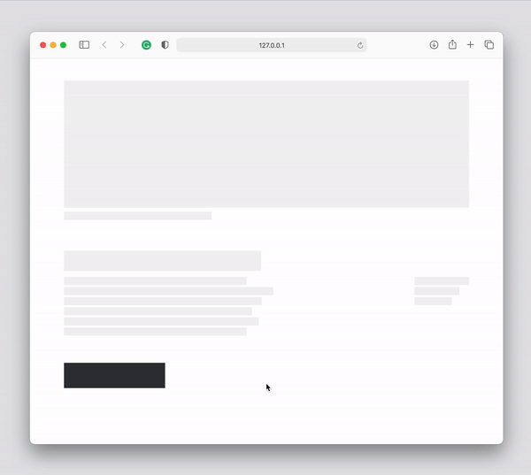
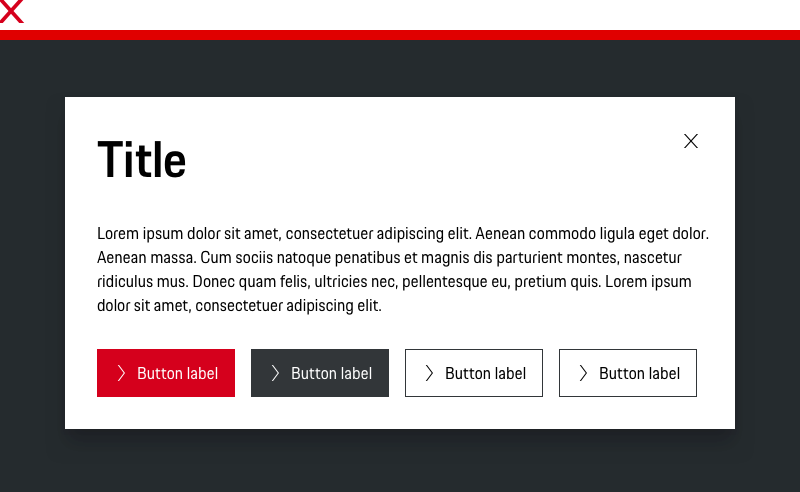
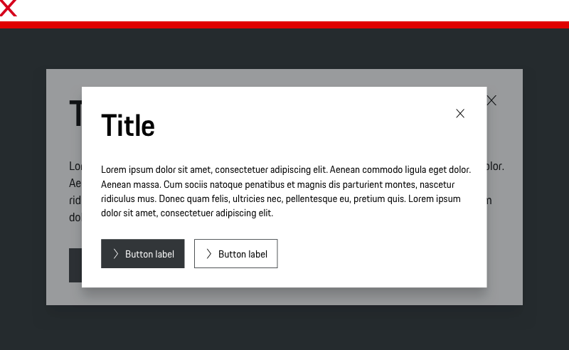

# Modal

<TableOfContents></TableOfContents>

## When to use

  • Use a Modal when you want to show additional information to the user without losing context of the parent page.  
  • Use a Modal when there are steps the user needs to do before the task can be completed.  
  • Use a Modal where you need to ask for confirmation from the user before doing a lengthy or dangerous action.  

---

## Types

To ensure a seamless UX in all Porsche web applications it is recommended to use the Modal as follows

| Type | Usage |
|----|----|
| Default Modal | Use a default modal for content that doesn’t require a complex task. |
| Fullscreen | Fullscreen modals group a series of tasks. Because they take up the entire screen, fullscreen modals are the only modals over which other modals can appear. Fullscreen should only be used on mobile. Due to the size of fullscreen on desktop, it is easy to lose context for the consumer. Furthermore, you lose helpful functionality like the backdrop click.

| Variant | Usage |
|----|----|
| Basic | By default, Modals have a title and can be closed by clicking on the “x” in the upper right hand corner of the container. |
| Without close icon | The Modal without close “x” will dont close the modal without any interaction. |
| Without title | If the context is short and clear, the title can be skipped to avoid duplication. |
| Without title and close icon | For descriptive content and the need to close the Modal with a interaction. |

## Behavior

### Overlay
We use a shaded background overlay to provide to provide the feeling of a third dimensional layer. 
This also eliminates distraction and helps the user focus on the Modal content.

### Animation
The background overlay animates once a Modal is launched to grab a user’s attention and retain their focus.

### Close
Within a Modal are multiple ways to dismiss a Modal but a user needs to intentionally make that choice.

### Back Button Behavior
Users tend to use the back button of the browser to close a modal. We recommend overwriting the native back button behavior of the browser to close the modal instead of directing the user to the previous page.

## Usage

### Attention
Modals are disruptive. Only use Modals when you need the user’s full attention for the period of time the Modal is displayed.

### Scrolling
Scrolling is available but we recommend to put Modal content in a single view. If your Modal has a lot of detail or a 
long list of items, consider a different solution, such as a form or a table.

### Size
The modal can be adjusted in width and can be used depending on the requirements. It is important that the minimum and maximum sizes are observed. In addition, the modal should be aligned with the grid.

### Line length
We recommend to use no more than 80 characters or glyphs per line. This might differ a bit depending on the respective line height and viewport size and results in different pixel widths depending on the Porsche type class in use. Please find more information in the [Typography guideline](components/typography).

### Loading Behavior (API Calls)
The task completion action should take place immediately and close the modal. If a duration is needed for the response we recommend closing the modal and use an overlay with loading spinner. Please consider for longer loading periods it makes sense to not block the user from using your product while waiting for the answer of the api call. For any sort of feedback relating to the request use the provided banner component.

---

## Do’s & Don’ts

### Don't use more than three buttons
There should be no more than three actions. Actions should always be located within an action bar at the bottom of the Modal. Button order and positioning should follow our guidelines for [Buttons](components/button/usage).

### Stacking Modals
Modals shouldn’t launch other modals. Stacking Modals makes it hard to dismiss them and confuses the user on their levels of importance.

