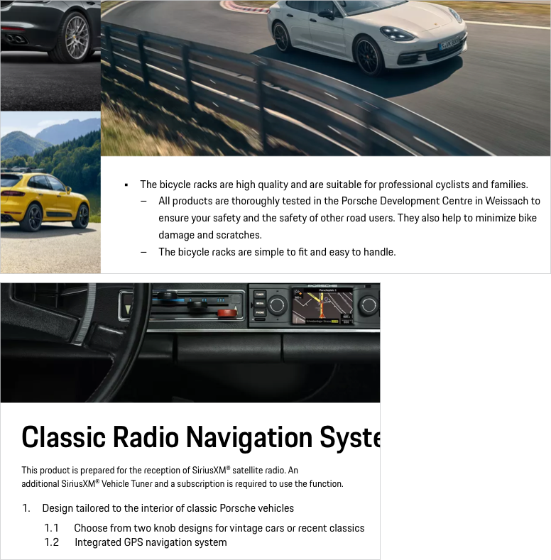

# Text List

A text list groups and organizes related content vertically in two hierarchical levels (level 1 and level 2 with indent). Generally lists are supposed to be used for short pieces of information and should not exceed two hierarchy levels. For more complex data you should consider the use of a data table.

---

## Types

### Unordered List 

Content with equal value is displayed in unordered lists. 
  
<p-text-list style="margin-top:32px;">
  <p-text-list-item>First level item 1</p-text-list-item>
  <p-text-list-item>First level item 2 
    <p-text-list>
      <p-text-list-item>Second level item 1</p-text-list-item>
      <p-text-list-item>Second level item 2</p-text-list-item>
    </p-text-list>
  </p-text-list-item>
  <p-text-list-item>First level item  3</p-text-list-item>
</p-text-list>

### Ordered List 

Sequenced content should be displayed in an ordered list:

<p-text-list list-type="ordered" style="margin-top:32px;">
  <p-text-list-item>First level item 1</p-text-list-item>
  <p-text-list-item>First level item 2
    <p-text-list list-type="ordered">
      <p-text-list-item>Second level item 1</p-text-list-item>
      <p-text-list-item>Second level item 2</p-text-list-item>
    </p-text-list>
  </p-text-list-item>
  <p-text-list-item>First level item 3</p-text-list-item>
</p-text-list>

---

## Styling

Per default, Text Lists are always displayed in copytext size (Text Small).

---

## Usage

### Order
Arrange list items in a logical way, e.g. from  highest to lowest level. If necessary (depending on the total length of the list) you should split the content into smaller and more specific categories and group them. 

### Writing style
It is recommended to stick to a homogeneous writing structure and style within one list. Avoid e.g. mixing active with passive voice or declarative with imperative sentences. 

### Capitalization
Use sentence-style capitalization for each list item. Capitalize only the first letter of the item.

    <p-headline variant="headline-3" tag="h3" style="margin-bottom: 24px;">Examples</p-headline>
    

