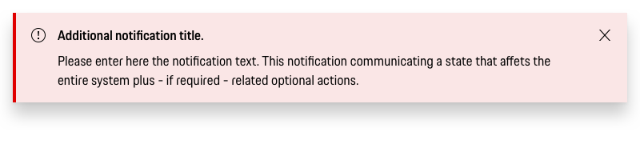
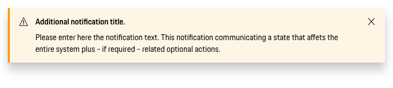
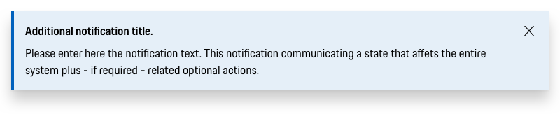
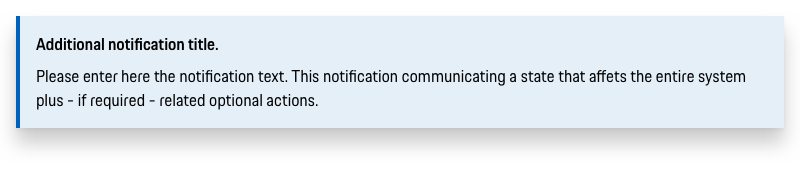

# Banner

Banner are used to provide action-based feedback messages or to convey informational and/or critical related notification.
Whenever you want to provide short, non-disruptive feedback or confirmation messages that communicate information to the user directly after taking an action,
stick to the **Toast component** (work in progress) instead.

---

## Types

### Error

Use error Banners to inform users something critical has happened and requires immediate attention.

### Warning

Use warning Banners when you want the user to take a specific action or to warn them that something is about to go wrong.

### Neutral

Use neutral Banners to make a general announcement.

---

## Variants

### Basic

By default, a Banner will dismiss when the user clicks the “x” close button.

### Persistent

Persistent Alerts are similar to the Feedback Banner but represent the highest level of importance.
These Banners are reserved for issues like compliance and system errors. As such, they are persistent until the issue is resolved.

---

## Styling

### Text
The Banner text (always in copytext) gives the user an information about the priority related notification.
Try to keep the feedback message short and descriptive.

### Width

The banner is always as width as the content and therefore stretches over all grid columns. 

---

## Usage

### Placement

On desktop the Banners are displayed at the top of the screen. By default, a banner is placed 
in the top center of the application, within the grid of the viewport. On mobile, all Banners 
are displayed at the bottom of the screen. 

## Don'ts

### Position

The Banner component is positioned absolute above the page content by default.

