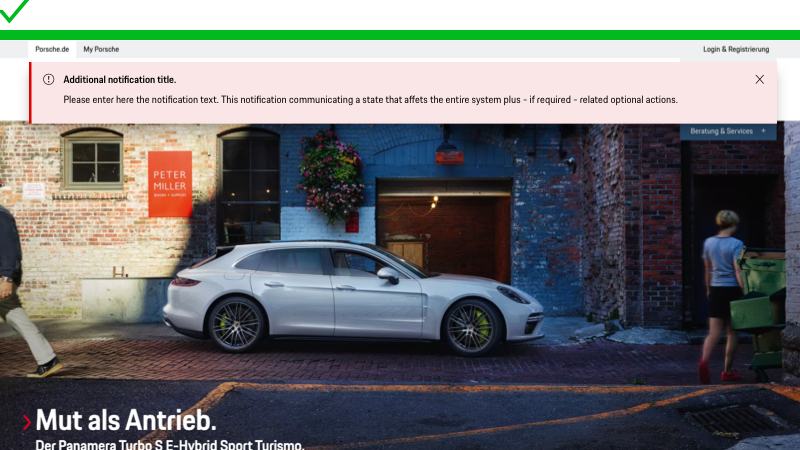
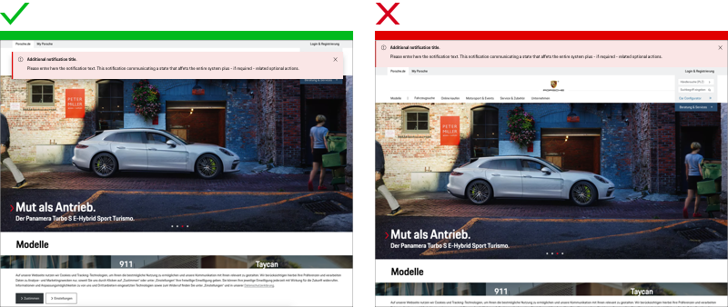

# Banner

## When to use

  • When you need to inform user about important changes or conditions in the interface.  
  • When immediate action by the current user is required.

---

## Types

To ensure a seamless UX in all Porsche web applications it is recommended to use the Banner as follows

| Type | Usage |
|----|----|
| Error | Use error Banners to inform users something critical has happened and requires immediate attention. |
| Warning| Use warning Banners when you want the user to take a specific action or to warn them that something is about to go wrong. |
| Neutral | Use neutral Banners to make a general announcement. | 

| Variant |  |
|----|----|
| Basic | By default, a Banner will dismiss when the user clicks the “x” close button. |
| Persistent | Persistent Alerts are similar to the Feedback Banner but represent the highest level of importance. These Banners are reserved for issues like compliance and system errors. As such, they are persistent until the issue is resolved. |

## Behavior

### Placement

On desktop the Banners are displayed at the top of the screen. By default, a Banner is placed 
in the top center of the application, within the grid of the viewport. On mobile, all Banners 
are displayed at the bottom of the screen. 

## Usage

### Text

The Banner text (always in copytext) gives the user an information about the priority related notification.
Try to keep the feedback message short and descriptive.

### Width

The Banner is always as width as the content and therefore stretches over all grid columns (based on the [Content Wrapper](components/content-wrapper)). 

---

## Do’s & Don’ts

### Position

The Banner component is positioned fixed above the page content by default.

