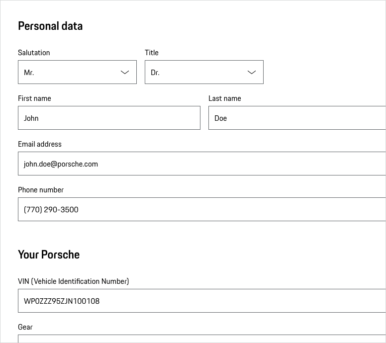

# Fieldset

<TableOfContents></TableOfContents>

## When to use

- When you need a container for visually-grouped form elements, e.g. form fields.

---

## Behavior

### Sections including form elements

We recommend for each fieldset the headline 4 (for the visible part _legend_) of the respective viewport. Please find
more information in the [Form pattern guideline](patterns/forms).

    <p-heading size="large" tag="h3" style="margin-bottom: 24px;">Examples</p-heading>
    

