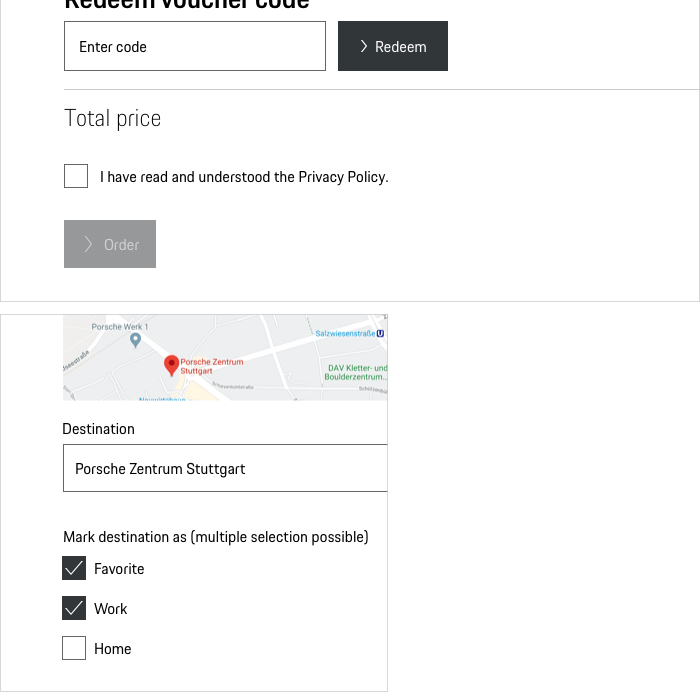
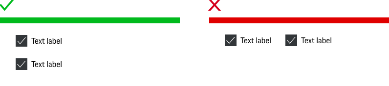

# Checkbox

<TableOfContents></TableOfContents>

## When to use
  • Use a Checkbox for a list of options when you want to enable the user to select no, one or more options.  
  • Use a Checkbox when an explicit action is required to apply settings. 

---

## Types

To ensure a seamless UX in all Porsche web applications it is recommended to use the Checkbox as follows

| Type | Usage |
|----|----|
| Default | The basic view of a Checkboxe is having no option selected. |
| Indeterminate | The indeterminate state is only a visual state and cannot be achieved by direct user interaction. |

## Behavior

### Indeterminate
Checkboxes can be nested when a parent and child relationship is needed. Users can either select an entire set of options or only a subset.
Checking the parent Checkbox automatically selects all of the nested children Checkboxes. Unchecking the parent Checkbox automatically deselects all of the children Checkboxes.

### Label
The label text (always in copytext) gives the user an information about the option that can be selected. Try to keep the label short and descriptive (one word or two)

### Validation and error
Contrary to Radio Buttons, each Checkbox item can have its own validation message.
Please find more information in the [Form pattern guideline](patterns/forms).

### A stand-alone Checkbox
Is used for a single option that the user can turn on or off (e.g. in case of a confirmation of terms and conditions).

    <p-headline variant="headline-3" tag="h3" style="margin-bottom: 24px;">Examples</p-headline>
    

---

## Do's & Don'ts

### Mixing with Radio Buttons

Never mix Radio Buttons and Checkboxes.

### Alignment

Preferably set Checkboxes vertically left-aligned, as this supports scannability way better than a horizontal alignment.

---

## Related Components
* [Radio Button](components/radio-button)
* [Select](components/select)