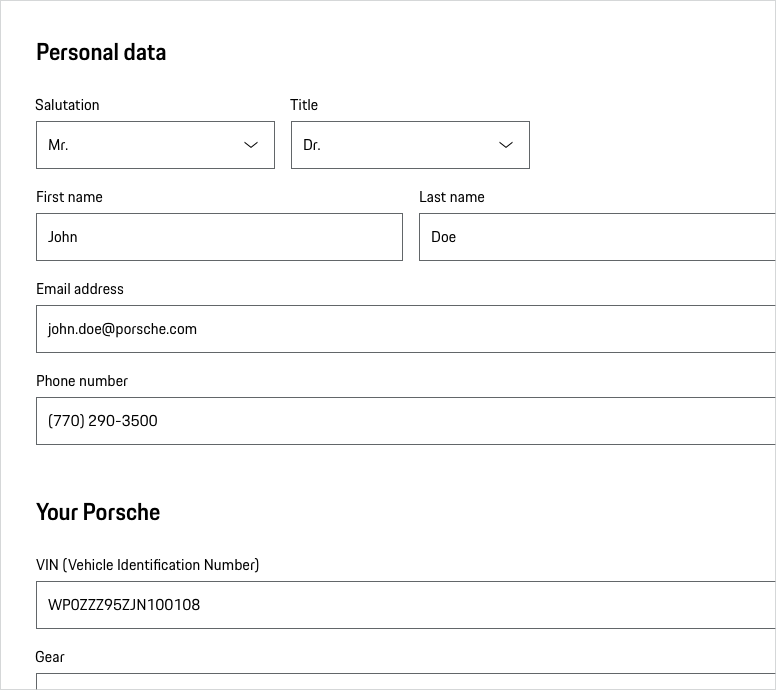

# Fieldset

The Fieldset component implements a container for visually-grouped form elements, e.g. form fields. 
Each fieldset should be initiated by a title that gives the user a short information on what data is required in this section.

---

## Styling

### Sections including form elements
We recommend for each fieldset the headline 4 of the respective viewport.
Please find more information in the [Form pattern guideline](#/patterns/forms).

    <p-headline variant="headline-3" tag="h3" style="margin-bottom: 24px;">Examples</p-headline>
    

