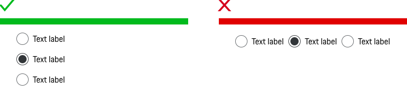

# Radio Button

<TableOfContents></TableOfContents>

## When to use
  • Use a Radio Button to enable a user to select one value from a predefined list.  
  • Use a Radio Button as soon as two options are mutually exclusive.  
  • Use a Radio Button when the user should see all available options.

---

## Behavior

### Label
The label text (always in copytext) gives the user an information about the option that can be selected. Try to keep the label short and descriptive (one word or two).

### Validation and error
For a group of Radio Buttons the validation message is set at the end of the list. This means that the validation for a Radio Button behaves differently from the other form elements where the validation is set for each individual component.
Please find more information in the [Form pattern guideline](patterns/forms).

### Items
We recommend using a Radio Button for a selection of 3-6 items. For a larger number of items (≥ 7) it is recommended to use a Select component instead. "If possible, use radio buttons rather than Selects. Radio buttons have lower cognitive load because they make all options permanently visible so that users can easily compare (…)." (Jakob Nielsen, 2004)

### Group
In a group of Radio Buttons one option should be selected by default, except for cases where a pre-selection can lead to wrong assumptions, i.e. "Male" or "Female".
In this case no option should be selected by default.

    <p-headline variant="headline-3" tag="h3" style="margin-bottom: 24px;">Examples</p-headline>
    

## Do's & Don'ts

### Alignment
Always align Radio Buttons with more than 2 items vertically left-aligned, as a horizontal alignment is more difficult to scan for the user and more difficult to see which label belongs to which radio.

### Single choice
Never use a Radio Button alone. In this case you should you the Checkbox instead.

---

## Related Components

* [Checkbox](components/checkbox)
* [Select](components/select)
