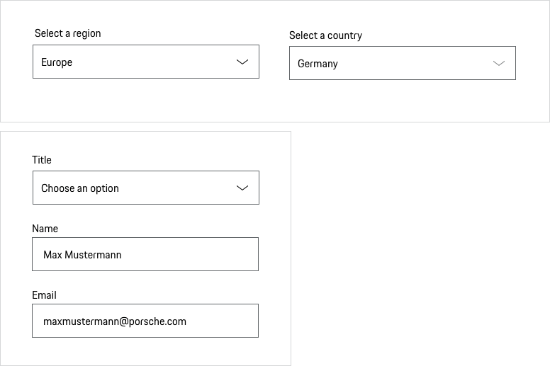

# Select

A Select is used to trigger an action based on the selected option, to choose one option from a list of items or to navigate the user to a new position.
Take the following aspects into consideration when deciding whether to use a Select or not:

* **The user's state of knowledge:** Do the users know their input without having to look at a list of the different options? If the answer is 'no' it might be better to use a component showing the options directly (such as Radio Buttons).  
* **Number of options:** Generally, a limit of 5-10 options is recommended. [Baymard Institute](https://baymard.com/blog/drop-down-usability) However, it depends on the individual context. If several options are offered it makes sense to offer an autocomplete.

---

## Variants

### Pure (without label)

The component Pure (without label) is only used if the context clearly describes what the component Pure is to be used for and no further explanation is required.

<p-select-wrapper label="Some label" hide-label="true"><select name="some-name">
    <option value="a">Option A</option>
    <option value="b">Option B</option>
    <option value="c">Option C</option>
  </select></p-select-wrapper>

### Placeholder

Placeholder text disappears when a user types in the input. If a user doesn’t enter a value and moves to another part of a form, the placeholder text reappears in the former text box. However, using placeholder text is not recommended since users can misinterpret it as already filled in content. Please find more information in the [Form pattern guideline](#/patterns/forms).

### Description text

Sometimes it’s helpful for the user to get further information on the input. This can be done by providing a description text displayed openly and directly outside the form field. Please find more information in the [Form pattern guideline](#/patterns/forms).

<p-select-wrapper label="Some label" description="Some description"><select name="some-name">
    <option value="a">Option A</option>
    <option value="b">Option B</option>
    <option value="c">Option C</option>
  </select></p-select-wrapper>

### With custom filter

For a large amount of select options (e.g. country/state select), we offer the custom filter to select easily and fast the desired of the available options. 

  <p-select-wrapper filter="true" label="Some label" :theme="theme">
      <select name="some-name">
        <option value="">Select a country</option>
        <option value="AF">Afghanistan</option>
        <option value="AX">Åland Islands</option>
        <option value="AL">Albania</option>
        <option value="DZ">Algeria</option>
        <option value="AS">American Samoa</option>
        <option value="AD">Andorra</option>
        <option value="AO">Angola</option>
        <option value="AI">Anguilla</option>
        <option value="AQ" disabled>Antarctica</option>
        <option value="AG">Antigua and Barbuda</option>
        <option value="AR">Argentina</option>
        <option value="AM">Armenia</option>
        <option value="AW">Aruba</option>
        <option value="AU">Australia</option>
        <option value="AT">Austria</option>
        <option value="AZ">Azerbaijan</option>
        <option value="BS">Bahamas</option>
        <option value="BH">Bahrain</option>
        <option value="BD">Bangladesh</option>
        <option value="BB">Barbados</option>
        <option value="BY">Belarus</option>
        <option value="BE">Belgium</option>
        <option value="BZ">Belize</option>
        <option value="BJ">Benin</option>
        <option value="BM">Bermuda</option>
        <option value="BT">Bhutan</option>
        <option value="BO">Bolivia, Plurinational State of</option>
        <option value="BQ">Bonaire, Sint Eustatius and Saba</option>
        <option value="BA">Bosnia and Herzegovina</option>
        <option value="BW">Botswana</option>
        <option value="BV">Bouvet Island</option>
        <option value="BR">Brazil</option>
        <option value="IO">British Indian Ocean Territory</option>
        <option value="BN">Brunei Darussalam</option>
        <option value="BG">Bulgaria</option>
        <option value="BF">Burkina Faso</option>
        <option value="BI">Burundi</option>
        <option value="KH">Cambodia</option>
        <option value="CM">Cameroon</option>
        <option value="CA">Canada</option>
        <option value="CV">Cape Verde</option>
        <option value="KY">Cayman Islands</option>
        <option value="CF">Central African Republic</option>
        <option value="TD">Chad</option>
        <option value="CL">Chile</option>
        <option value="CN">China</option>
        <option value="CX">Christmas Island</option>
        <option value="CC">Cocos (Keeling) Islands</option>
        <option value="CO">Colombia</option>
        <option value="KM">Comoros</option>
        <option value="CG">Congo</option>
        <option value="CD">Congo, the Democratic Republic of the</option>
        <option value="CK">Cook Islands</option>
        <option value="CR">Costa Rica</option>
        <option value="CI">Côte d'Ivoire</option>
        <option value="HR">Croatia</option>
        <option value="CU">Cuba</option>
        <option value="CW">Curaçao</option>
        <option value="CY">Cyprus</option>
        <option value="CZ">Czech Republic</option>
        <option value="DK">Denmark</option>
        <option value="DJ">Djibouti</option>
        <option value="DM">Dominica</option>
        <option value="DO">Dominican Republic</option>
        <option value="EC">Ecuador</option>
        <option value="EG">Egypt</option>
        <option value="SV">El Salvador</option>
        <option value="GQ">Equatorial Guinea</option>
        <option value="ER">Eritrea</option>
        <option value="EE">Estonia</option>
        <option value="ET">Ethiopia</option>
        <option value="FK">Falkland Islands (Malvinas)</option>
        <option value="FO">Faroe Islands</option>
        <option value="FJ">Fiji</option>
        <option value="FI">Finland</option>
        <option value="FR">France</option>
        <option value="GF">French Guiana</option>
        <option value="PF">French Polynesia</option>
        <option value="TF">French Southern Territories</option>
        <option value="GA">Gabon</option>
        <option value="GM">Gambia</option>
        <option value="GE">Georgia</option>
        <option value="DE">Germany</option>
        <option value="GH">Ghana</option>
        <option value="GI">Gibraltar</option>
        <option value="GR">Greece</option>
        <option value="GL">Greenland</option>
        <option value="GD">Grenada</option>
        <option value="GP">Guadeloupe</option>
        <option value="GU">Guam</option>
        <option value="GT">Guatemala</option>
        <option value="GG">Guernsey</option>
        <option value="GN">Guinea</option>
        <option value="GW">Guinea-Bissau</option>
        <option value="GY">Guyana</option>
        <option value="HT">Haiti</option>
        <option value="HM">Heard Island and McDonald Islands</option>
        <option value="VA">Holy See (Vatican City State)</option>
        <option value="HN">Honduras</option>
        <option value="HK">Hong Kong</option>
        <option value="HU">Hungary</option>
        <option value="IS">Iceland</option>
        <option value="IN">India</option>
        <option value="ID">Indonesia</option>
        <option value="IR">Iran, Islamic Republic of</option>
        <option value="IQ">Iraq</option>
        <option value="IE">Ireland</option>
        <option value="IM">Isle of Man</option>
        <option value="IL">Israel</option>
        <option value="IT">Italy</option>
        <option value="JM">Jamaica</option>
        <option value="JP">Japan</option>
        <option value="JE">Jersey</option>
        <option value="JO">Jordan</option>
        <option value="KZ">Kazakhstan</option>
        <option value="KE">Kenya</option>
        <option value="KI">Kiribati</option>
        <option value="KP">Korea, Democratic People's Republic of</option>
        <option value="KR">Korea, Republic of</option>
        <option value="KW">Kuwait</option>
        <option value="KG">Kyrgyzstan</option>
        <option value="LA">Lao People's Democratic Republic</option>
        <option value="LV">Latvia</option>
        <option value="LB">Lebanon</option>
        <option value="LS">Lesotho</option>
        <option value="LR">Liberia</option>
        <option value="LY">Libya</option>
        <option value="LI">Liechtenstein</option>
        <option value="LT">Lithuania</option>
        <option value="LU">Luxembourg</option>
        <option value="MO">Macao</option>
        <option value="MK">Macedonia, the former Yugoslav Republic of</option>
        <option value="MG">Madagascar</option>
        <option value="MW">Malawi</option>
        <option value="MY">Malaysia</option>
        <option value="MV">Maldives</option>
        <option value="ML">Mali</option>
        <option value="MT">Malta</option>
        <option value="MH">Marshall Islands</option>
        <option value="MQ">Martinique</option>
        <option value="MR">Mauritania</option>
        <option value="MU">Mauritius</option>
        <option value="YT">Mayotte</option>
        <option value="MX">Mexico</option>
        <option value="FM">Micronesia, Federated States of</option>
        <option value="MD">Moldova, Republic of</option>
        <option value="MC">Monaco</option>
        <option value="MN">Mongolia</option>
        <option value="ME">Montenegro</option>
        <option value="MS">Montserrat</option>
        <option value="MA">Morocco</option>
        <option value="MZ">Mozambique</option>
        <option value="MM">Myanmar</option>
        <option value="NA">Namibia</option>
        <option value="NR">Nauru</option>
        <option value="NP">Nepal</option>
        <option value="NL">Netherlands</option>
        <option value="NC">New Caledonia</option>
        <option value="NZ">New Zealand</option>
        <option value="NI">Nicaragua</option>
        <option value="NE">Niger</option>
        <option value="NG">Nigeria</option>
        <option value="NU">Niue</option>
        <option value="NF">Norfolk Island</option>
        <option value="MP">Northern Mariana Islands</option>
        <option value="NO">Norway</option>
        <option value="OM">Oman</option>
        <option value="PK">Pakistan</option>
        <option value="PW">Palau</option>
        <option value="PS">Palestinian Territory, Occupied</option>
        <option value="PA">Panama</option>
        <option value="PG">Papua New Guinea</option>
        <option value="PY">Paraguay</option>
        <option value="PE">Peru</option>
        <option value="PH">Philippines</option>
        <option value="PN">Pitcairn</option>
        <option value="PL">Poland</option>
        <option value="PT">Portugal</option>
        <option value="PR">Puerto Rico</option>
        <option value="QA">Qatar</option>
        <option value="RE">Réunion</option>
        <option value="RO">Romania</option>
        <option value="RU">Russian Federation</option>
        <option value="RW">Rwanda</option>
        <option value="BL">Saint Barthélemy</option>
        <option value="SH">Saint Helena, Ascension and Tristan da Cunha</option>
        <option value="KN">Saint Kitts and Nevis</option>
        <option value="LC">Saint Lucia</option>
        <option value="MF">Saint Martin (French part)</option>
        <option value="PM">Saint Pierre and Miquelon</option>
        <option value="VC">Saint Vincent and the Grenadines</option>
        <option value="WS">Samoa</option>
        <option value="SM">San Marino</option>
        <option value="ST">Sao Tome and Principe</option>
        <option value="SA">Saudi Arabia</option>
        <option value="SN">Senegal</option>
        <option value="RS">Serbia</option>
        <option value="SC">Seychelles</option>
        <option value="SL">Sierra Leone</option>
        <option value="SG">Singapore</option>
        <option value="SX">Sint Maarten (Dutch part)</option>
        <option value="SK">Slovakia</option>
        <option value="SI">Slovenia</option>
        <option value="SB">Solomon Islands</option>
        <option value="SO">Somalia</option>
        <option value="ZA">South Africa</option>
        <option value="GS">South Georgia and the South Sandwich Islands</option>
        <option value="SS">South Sudan</option>
        <option value="ES">Spain</option>
        <option value="LK">Sri Lanka</option>
        <option value="SD">Sudan</option>
        <option value="SR">Suriname</option>
        <option value="SJ">Svalbard and Jan Mayen</option>
        <option value="SZ">Swaziland</option>
        <option value="SE">Sweden</option>
        <option value="CH">Switzerland</option>
        <option value="SY">Syrian Arab Republic</option>
        <option value="TW">Taiwan, Province of China</option>
        <option value="TJ">Tajikistan</option>
        <option value="TZ">Tanzania, United Republic of</option>
        <option value="TH">Thailand</option>
        <option value="TL">Timor-Leste</option>
        <option value="TG">Togo</option>
        <option value="TK">Tokelau</option>
        <option value="TO">Tonga</option>
        <option value="TT">Trinidad and Tobago</option>
        <option value="TN">Tunisia</option>
        <option value="TR">Turkey</option>
        <option value="TM">Turkmenistan</option>
        <option value="TC">Turks and Caicos Islands</option>
        <option value="TV">Tuvalu</option>
        <option value="UG">Uganda</option>
        <option value="UA">Ukraine</option>
        <option value="AE">United Arab Emirates</option>
        <option value="GB">United Kingdom</option>
        <option value="US">United States</option>
        <option value="UM">United States Minor Outlying Islands</option>
        <option value="UY">Uruguay</option>
        <option value="UZ">Uzbekistan</option>
        <option value="VU">Vanuatu</option>
        <option value="VE">Venezuela, Bolivarian Republic of</option>
        <option value="VN">Viet Nam</option>
        <option value="VG">Virgin Islands, British</option>
        <option value="VI">Virgin Islands, U.S.</option>
        <option value="WF">Wallis and Futuna</option>
        <option value="EH">Western Sahara</option>
        <option value="YE">Yemen</option>
        <option value="ZM">Zambia</option>
        <option value="ZW">Zimbabwe</option>
      </select>
</p-select-wrapper>

---

## States

The Select component is available in the following states:

* default
* active
* disabled
* hover
* focus
* error
* success

---

## Styling

### Label
The label text (always in copytext) gives the user an information about the option that can be selected. Try to keep the label short and descriptive (one word or two).

### Width
The Select has no specific width. Depending on the layout you can set the width either depending on the length of the text or by adjusting it to the grid. Baymard Institute usability study showed that:  “If a field was too long or too short, the test subjects started to wonder if they had misunderstood the label (…).” [Baymard Institute](https://baymard.com/blog/form-field-usability-matching-user-expectations). The initial width of the sketch symbol is set to 272 px (corresponds to the grid width on viewport XS). Please find more information in the [Form pattern guideline](#/patterns/forms).

### Validation and error
Validation text for a Select is placed right below the field box. This places the error next to the offending select,
so there is no confusion for the user as to what field failed validation. Effective error messaging can help the user to understand the problem and how to fix it. Please find more information in the [Form pattern guideline](#/patterns/forms).

### Spacing
According to the "law of proximity" in Gestalt psychology ([Laws of UX](https://lawsofux.com/law-of-proximity)) objects that are near or proximate to each other tend to be grouped together. Please find more information in the [Form pattern guideline](#/patterns/forms).

---

## Usage

### Sorting
It's recommended to use common sort order for menu items (frequency of use, alpha or numeric).

### Disabled state
All Selects are available in disabled state. However, disabled states should be avoided whenever possible, as they always tend to disrupt the user and break the user flow. Keep in mind: "The best way [to] prevent user error is to make sure that the use cannot make errors in the first place (…)." (Donald A. Norman, 2002)

## Interaction
The whole Select area is clickable. They can be removed by clicking outside the Select element or on the parent element.

   <p-headline variant="headline-3" tag="h3" style="margin-bottom: 24px;">Examples</p-headline>
   

## Don'ts

### Content
Avoid Select boxes for data that is highly familiar such as the day, month or year. Having to find these options in a long menu is tedious, breaks the previous guideline and can create even more work for users.

### Number of options in view
Very long Select boxes that require scrolling make it impossible for users to see all their choices in one glance. However this cannot always be avoided. Therefore make sure that when open there is only a maximum of 7 elements in the field of view without having to scroll.

### Text only
Never use images or symbols within a selection list.

---

## Related Components

* [Checkbox](#/components/checkbox)
* [Radio Button](#/components/radio-button)
