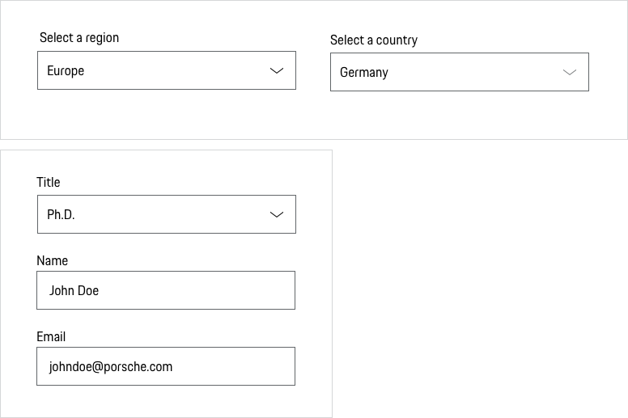
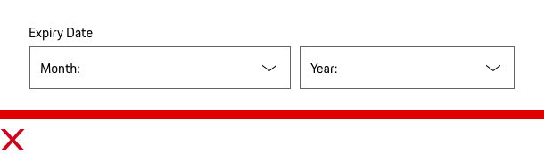
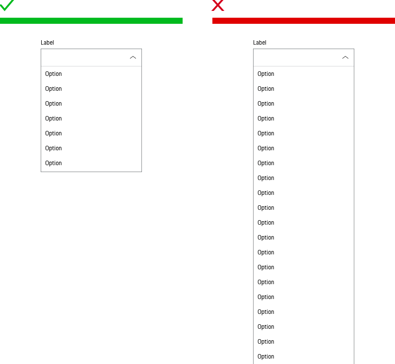

# Select

<TableOfContents></TableOfContents>

## When to use
  • Use a Select to trigger an action based on the selected option.  
  • Use a Select to choose and search one option from a list of items.  
  • Use a Select to navigate the user to a new position.  
  • Use a Select to recommending a default option for most users.

---

## Types

To ensure a seamless UX in all Porsche web applications it is recommended to use the Select as follows

| Type | Usage |
|----|----|
| Without label (Pure) | The component without label is only used if the context clearly describes what the component is to be used for and no further explanation is required. |
| Description text | Sometimes it’s helpful for the user to get further information on the input. This can be done by providing a description text displayed openly and directly outside the form field. |
| With custom filter | For a large amount of select options (e.g. country/state select), we offer the custom filter to select easily and fast the desired of the available options. |

| Variant |  |
|----|----|
| Without preselection (mandatory field) | Use this, if you don't know or if you need to make sure the user makes a conscious choice. |
| With preselection (mandatory field) | Use this, if you have a reason to believe one of the options is most likely (this can be based on most popular / probable option, or on data you know about the user) or you know the default or current option. |
| Without preselection (optional field) | Use this, to make it possible to go back to empty default (e.g. in case of an incorrect selection). |

## Behavior

### Label
The label text (always in copytext) gives the user an information about the option that can be selected. Try to keep the label short and descriptive (one word or two).

### Validation and error
Validation text for a Select is placed right below the field box. This places the error next to the offending select,
so there is no confusion for the user as to what field failed validation. Effective error messaging can help the user to understand the problem and how to fix it. Please find more information in the [Form pattern guideline](patterns/forms).

### Knowledge
Do the users know their input without having to look at a list of the different options? If the answer is 'no' it might be better to use a component showing the options directly (such as Radio Buttons).

### Number of options
Generally, a limit of 5-10 options is recommended. [Baymard Institute](https://baymard.com/blog/drop-down-usability) However, it depends on the individual context. If several options are offered it makes sense to offer an autocomplete.

### Sorting
It's recommended to use common sort order for menu items (frequency of use, alpha or numeric).

   <p-headline variant="headline-3" tag="h3" style="margin-bottom: 24px;">Examples</p-headline>
   

## Do's & Don'ts

### Content
Avoid Select boxes for data that is highly familiar such as the day, month or year. Having to find these options in a long menu is tedious, breaks the previous guideline and can create even more work for users.

### Number of options in view
Very long Select boxes that require scrolling make it impossible for users to see all their choices in one glance. However this cannot always be avoided. Therefore make sure that when open there is only a maximum of 7 elements in the field of view without having to scroll.

### Don’t default to ‘please select’
Users don’t need to be told to ‘please select’ if there’s a field that’s empty. Only use defaults when applicable to most users (see variants).

---

## Related Components

* [Checkbox](components/checkbox)
* [Radio Button](components/radio-button)
