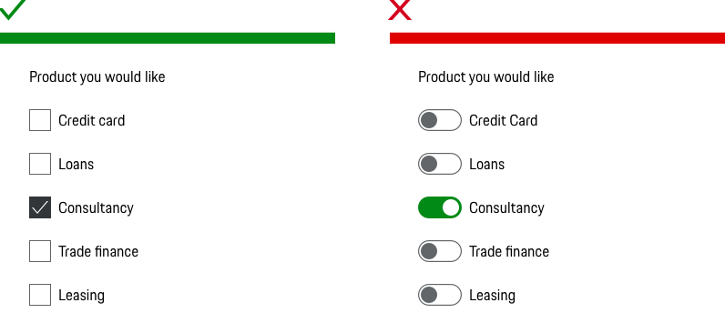
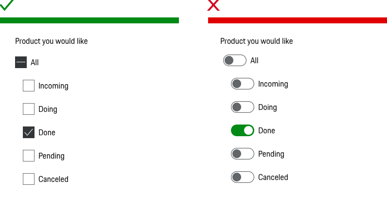
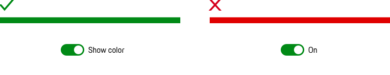

**# Switch**

**## When to use**

• Use a Switch if an instant response of applied settings is required without an explicit action.  
• Use a Switch for single cell options that can be turned on and off only.  
• Use a Switch to enable or disable a mode, feature, or function.  
• Use a Switch when User is toggling independent features or behaviors.

---

**## Types**

To ensure a seamless UX in all Porsche web applications it is recommended to use the Switch as follows

| Variant | Usage |

|----|----|

| XY | XY|

**## Behavior**

**### Label**

Remember that Switches are meant to be two mutually exclusive states. The Switch is accompanied by a straightforward and concise label (always in copytext). That microcopy is very important, as users should be able to see and understand the function behind the Switch. It’s better to avoid anything longer than two words, as you want that first glance to be all that’s needed to use the Switch. The Switch can be used also without a label but beware, only use this approach if the purpose of the control clearly made elsewhere. For example, if there is a group label or section header that allows the user to infer the description of the option.

**### Binary Options vs. Opposing Options**

Switches are for binary options, not opposing options. A binary option represents a single state that is either on or off — or in other words, true or false. Opposing options are two separate states that are opposite but related to different user tasks.

**## Do's & Don'ts**

**### Multiple choice**

Don’t use the slide Switch for multiple choice questions

**### Intermediate state**

Don’t use slide Switch when an intermediate state is required. [Use Checkbox instead!](#/components/checkbox-wrapper)

**### Label**

Don’t use only the label to describe the states of the Switch. A label next to the Switch must describe the affected property.

**## Related Components**

- [Checkbox](#/components/checkbox)
- [Radio Button](#/components/radiobutton)