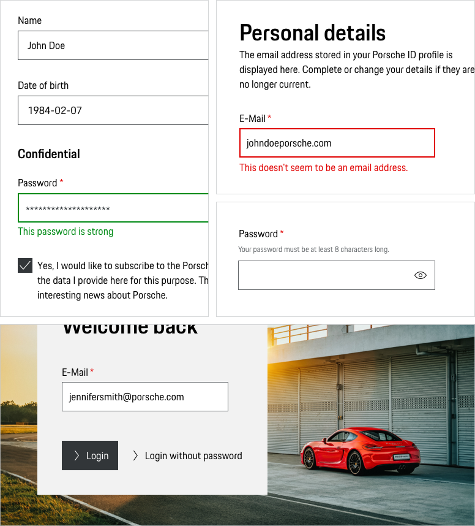
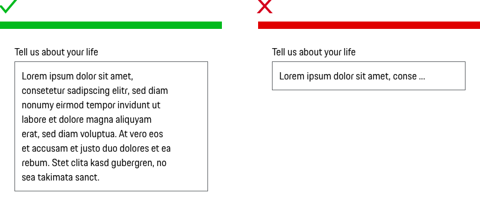
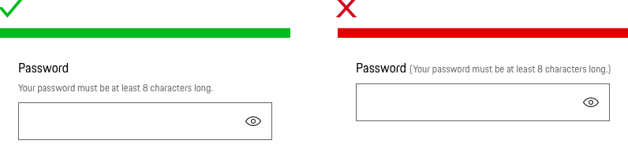

# Text Field

<TableOfContents></TableOfContents>

## When to use

  • Use the Text Field in forms to help users enter text.

---

## Types

To ensure a seamless UX in all Porsche web applications it is recommended to use the Text Field as follows

| Type | Usage |
|----|----|
| Default | You can choose between several input types for the basic Text Field _(Number, Email, Phone number, URL, Date, Time, Month & Week)_. Each one comes either with a formatting preset or with an automatic validation for the dedicated input type resulting in an error in case of a non-matching input.  |
| Placeholder | Placeholder text disappears when a user types in the input. If a user doesn’t enter a value and moves to another part of a form, the placeholder text reappears in the former text box. However, using placeholder text is not recommended since users can misinterpret it as already filled in content.  |
| Password | Password fields have the ability to hide/show the typed password.  |
| Search | Search fields have the ability to activate the search function.    |
| Pure | The Pure variant (without label) is only to be used if the context clearly describes the purpose of the Text Field and no further explanation is required.    |
| Description text | Sometimes it’s helpful for the user to get further information on the input. This can be done by providing a description text displayed openly and directly outside the form field. Please find more information in the [Form pattern guideline](patterns/forms).    |

## Behavior

### Label
The label text (always in copytext) gives the user an information about the option that can be selected. Try to keep the label short and descriptive (one  word or two).

### Validation and error
Validation text for a field is placed right below the field box in order to make it clear for the user which Text Field the validation belongs to.
Please find more information in the [Form pattern guideline](patterns/forms).

### Mandatory and optional fields
Mark required fields. Our tests (optional vs. required with an asterisk) showed that mark required fields with an red asterisk is an easy way to improve the usability of forms. Please find more information in the [Form pattern guideline](patterns/forms).

    <p-headline variant="headline-3" tag="h3" style="margin-bottom: 24px;">Examples</p-headline>
    

## Do's & Don'ts

### Long text inputs
Don't use the Text Field component if you need to allow users to enter longer text. In this case, you should use the Textarea component.

### Description text
Don't use instructional or description text for the label.

---

## Related Components

* [Textarea](components/textarea)
