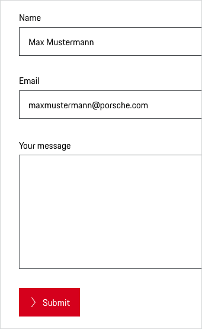

# Textarea

Use Textareas in forms when you need to let users enter and edit an amount of text that’s longer than a single line. 
Don't use a Textarea component if you want to allow users to enter shorter responses that are no longer than a single line, 
such as a phone number or name. In this case, you should use the Text Field component. 
Textareas should always be accompanied by labels, helping the user to understand the type of input that is required.

---

## Variants

### Pure (without label)

The component Pure (without label) is only used if the context clearly describes what the component Pure is to be used for and no further explanation is required.

<p-textarea-wrapper label="Some label" hide-label="true"><textarea name="some-name"></textarea></p-textarea-wrapper>

### Description text

Sometimes it’s helpful for the user to get further information on the input. This can be done by providing a description text displayed openly and directly outside the form field. Please find more information in the [Form pattern guideline](#/patterns/forms).

<p-textarea-wrapper label="Some label" description="Some description"><textarea name="some-name"></textarea></p-textarea-wrapper>

---

## States

All Textareas types are available in the following states:

* default
* disabled
* hover
* read only
* focus
* error
* success

---

## Styling

### Label
The label text (always in copytext) gives the user an information about the option that can be selected. Try to keep the label short and descriptive (one word or two).

### Input area
Enables users to enter a multiline text.

### Width and height
Textareas have no specific width. Depending on the layout you can set the width either depending on the length of the text or by adjusting it to the grid. 
We recommend a minimum height of 192 px (equals 7 text lines). Unless predefined characters are specified. 
In this case we recommend to adapt the Textarea to the content. Please find more information in the [Form pattern guideline](#/patterns/forms).

### Help text
Help text should be displayed openly and directly, also in order not to expect the user to make additional clicks. 
Please find more information in the [Form pattern guideline](#/patterns/forms).

### Validation and error
Validation text for a field is placed right below the field box in order to make it clear for the user which Textarea the validation belongs to.
Please find more information in the [Form pattern guideline](#/patterns/forms).

### Spacing
According to the "law of proximity" in Gestalt psychology ([Laws of UX](https://lawsofux.com/law-of-proximity)) objects that are near or proximate to each other tend to be grouped together.
Please find more information in the [Form pattern guideline](#/patterns/forms).

---

## Usage

### Mandatory and optional fields

Generally, it’s recommended to avoid optional fields in forms due to the fact that we should not give the user the feeling of having to give information that is not absolutely necessary. 
That being said, we would then have to label almost every (mandatory) form field with the well-known asterisk accompanied by a global explanation (“All fields marked with * ...“).
 n order to give the Porsche forms a more positive connotation and for the reason that users are more likely to provide voluntary information, we  recommend to mark only optional fields by adding “(optional)” next to the input label.

By doing so…
* … user feel less overwhelmed, as there are way less “(optional)” labels than there would be asterisks.
* … users do not have to read a global explanation (“All fields marked with * ...“).
* … the asterisk is obsolete or freely available for other purposes, e.g. footnotes.
* … forms not only seem to be more positive, but also look more cleaned up in general.

<p-text-field-wrapper label="Some label (optional)"><input type="text" name="some-name"></p-text-field-wrapper>

### Disabled state

All types of Textareas are available as disabled state. However, disabled states (e.g. read only) should be avoided whenever possible, as they always tend to disrupt the user and break the user flow. 
Keep in mind: “The best way [to] prevent user error is to make sure that the use cannot make errors in the first place (…).” (Donald A. Norman, 2002)

 

    <p-headline variant="headline-3" tag="h3" style="margin-bottom: 24px;">Examples</p-headline>
    

## Don'ts

### Number of Textareas
To ensure that we don't overwhelm users, there should be no more than two Textareas on a page.

---

## Related Components

* [Text Field](#/components/text-field)
