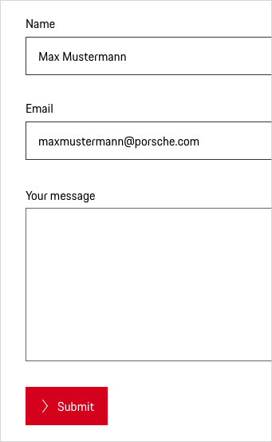
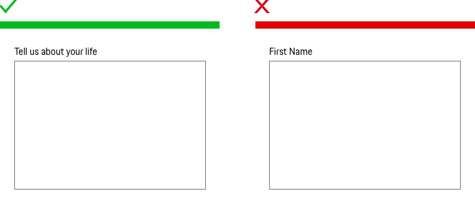

# Textarea

<TableOfContents></TableOfContents>

## When to use

  • Use Textareas in forms when you need to let users enter and edit an amount of text that’s longer than a single line.

---

## Types

To ensure a seamless UX in all Porsche web applications it is recommended to use the Textarea as follows

| Type | Usage |
|----|----|
| Default | The basic type contain a Label and this is the most way to create a Textarea inside of a form. |
| Without label | The variant without label (Pure) is only to be used if the context clearly describes the purpose of the Text Field and no further explanation is required.    |

## Behavior

### Label
The label text (always in copytext) gives the user an information about the option that can be selected. Try to keep the label short and descriptive (one word or two).

### Validation and error
Validation text for a field is placed right below the field box in order to make it clear for the user which Textarea the validation belongs to.
Please find more information in the [Form pattern guideline](patterns/forms).

### Height
We recommend a minimum height of 192 px (equals 7 text lines). Unless predefined characters are specified. 
In this case we recommend to adapt the Textarea to the content. Please find more information in the [Form pattern guideline](patterns/forms).

### Mandatory and optional fields
Mark required fields. Our tests (optional vs. required with an asterisk) showed that mark required fields with an red asterisk is an easy way to improve the usability of forms. Please find more information in the [Form pattern guideline](patterns/forms).

 

    <p-headline variant="headline-3" tag="h3" style="margin-bottom: 24px;">Examples</p-headline>
    

## Do's & Don'ts

### Short text inputs
Don't use a Text Area when text entry is expected to be short since it could confuse users. Use an input instead.

### Number of Textareas
To ensure that we don't overwhelm users, there should be no more than two Textareas on a page.

---

## Related Components

* [Text Field](components/text-field)
