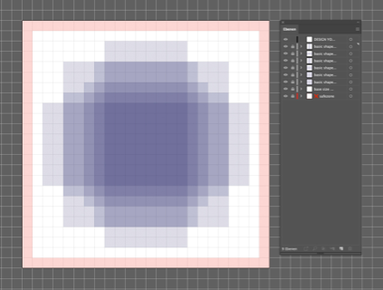
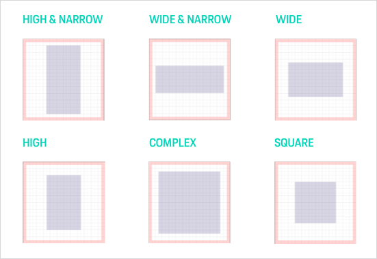
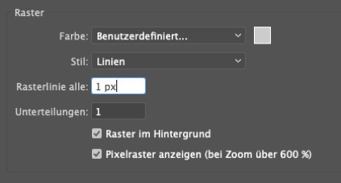
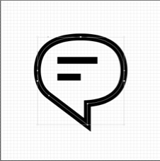
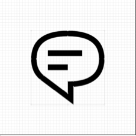
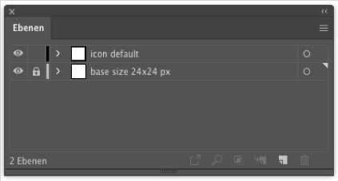
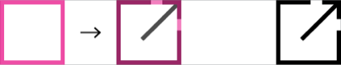
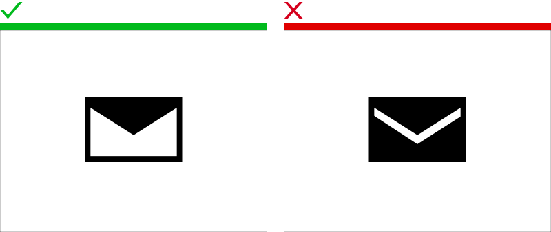

# Icon

Stick to the following process when designing icons for Porsche. Is the icon a mandatory used one in multiple teams and purpose? 
Feel free to contact us (also as a reviewer). If we also think that your icon is relevant for the basic library it will be published both as library symbols for design.
[Sketch basic library](https://designsystem.porsche.com/latest/#/start-designing/introduction) and SVGs for development. See [Porsche Icon overview](https://icons.porsche.com/#/)

---

## Processes overview

### Criteria check

### Passing user testing regarding

    **Findability**  
    Can people find the icon on the page?

    **Recognition**  
    Do people understand what the icon represents?

    **Information scent**  
    Can users correctly guess what will happen once they interact with the icon?

    **Attractiveness**  
    Is the icon aesthetically pleasing?

### Quality assurance
Go through all the points regarding quality assurance (Grid, Color, Pixel, Naming, metatags, export criteria) and feel free to meet the Porsche Design System Team as a reviewer.

### Export
Export your icon as svg and share it with the developers.

### Integration in the Porsche Basic Set
Is the integration into the official Basic Iconset necessary? Contact the Porsche Design System Team to discuss everything in detail.

---

## Concept

Create several designs for the possible icon and make sure that the user understands the meaning of the icons. Visually as well as functionally. Once you are ready, we recommend testing the icons in terms of recognition and information content.

## Design

Use the following template, in which you will find an artboard (24 x 24 px) on which all icons are to be designed (max. 3 icon drafts).

<p-link-pure href="https://designsystem.porsche.com/sketch/PAG_icon_template_24x24.ai" icon="download" download>Download Icon/Grid Template</p-link-pure>

**All artboards should be named according to the containing icons (e.g. "delete" or "edit") as this is crucial for the file name of the final SVG export.**

Within this artboard there are different basic shapes (in violet) you should stick to when defining the shapes and dimensions of your icon, no matter whether it expands more in height or width, for example. This ensures a harmonious visual balance between all icons. Never place any icon part on the safe zone (red). 

For the correct weighting of the icons the different shapes are created. Check which of the shapes is necessary for you to keep the visual weight in balance. 

**Illustrator presets**

Make sure to always design on the pixel grid. Therefore, set the Illustrator grid to 1 px:
Illustrator → Preferences → Guides & Grid. Via View → Pixel Preview you can automatically enforce pixel snapping if needed. 

**Design your icon**

1. **Start drawing your icon on a separate construction layer.**  
Name your layer: "icon default" (for outline style) or "icon filled" 
(or set up 2 layers if you're about to design both default and filled style).
Do not forget to rename your document to iconname-construction

1. **Start your first drawings.**  
- Always stick to the defined icon look & feel.
- Use open vector paths for strokes (path tool, line tool or vector forms) as far as possible to be able to edit it easily afterward (e. g. stroke width).
- Try to stick to the pixel grid in favor of a sharp visual appearance.
- Stick to the basic shapes (violet layers).

**Double-check**

Whilst designing your icon always make sure …
- … that all strokes and shapes are placed into the px grid to ensure sharpness.
- … that it's seamlessly scalable to 48 x 48 px without any qualitative loss.
- … that it goes well with text in copy size (font-size 16 px, line-height 24 px), as this is a common combination in web applications, see Link Pure.
- … that it stands in balanced optical relation to the remaining icons.

## Context

Integrate the icons into the layout and check which icon will be the final one (if not sure test them against each other). And finally test the icon to see if they help the user to find the right function.

## Launch

Once you have decided on a final icon you can export it in the right format for the developer.

### Export preparation

1. **Duplicate the construction layer.**  
Rename it to "export default" (for outline style) or "export filled". 

2. **Flat the icon shape.**  
Transform the vector forms in a full, coherent vector shape.
Turn paths into strokes (Object → Path → Outline stroke).
Use the pathfinder tool (shape mode "add to area") to combine objects.
The final 

3. **Save your file.**

### Set up separate export file

1. **Duplicate the …-construction.ai file**   
… and rename it to: …-export.ai.

2. **Delete all layers except "icon (default or filled)" and the "base size 24x24" layer**

3. **Your layer panel should look like this and consist only of two layers, when ready for export.**  
Make sure that both layers are turned visible so that the icons are exported in the correct base size 24x24 px (and not cut to icon edge).

---

## Look & Feel

**All icons are built in an outline version, which is also the default state. The filled version is additional and not intended for every icon.** Currently we recommended "only" default icons are available for use. Individual project teams that require filled variants are welcome to contact us at any time. If a filled version is needed, has to be decided individually for each icon, according to content and purpose.

### Squircle element and Porsche Next typeface

**Where and when to use the Squircle?** 

The squircle is an optical element, coming from the typography of the Porsche Next font. It should promote the recognition of Porsche and its corporate identity. So, the icon set will not look arbitrary and harmonize with the Porsche design. 

Well-known, natural round shapes, should not contain any of the squircle elements. If they do they will lose clarity and precision. The squircle-element hurts the recognizability of the learned icons.

### Examples

rectangle/square – no squircle shape due to poor visibility

circular shapes – no squircle shape due to poor visibility

oval shapes – should take (transform to) the squircle shape

For text and text characters in icons always use the Porsche Next Font

### Line width and positioning for outline icons

Use 1px for the outline shape of the icons when drawing on 24x24 and stick to the pixel grid so that icons are not blurred due to anti-aliasing of low-resolution displays. Icons with a centered vertical or horizontal 1px stroke must be placed 1px off to the left and/or top and please make sure corresponding icons have the same position. For example, the add and remove icon should have the same position because they will replace each other.

---

## Do’s & Don’ts

### Line width for filled icons

Use also 1px for the outline shape of filled icons, plus an additional "highlight" surface, like in the example below.

