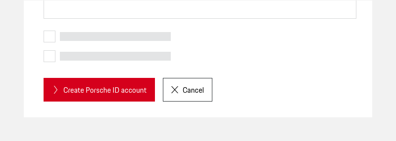
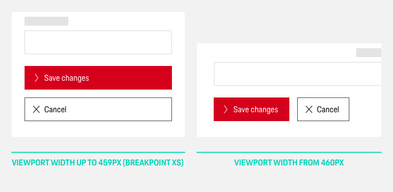
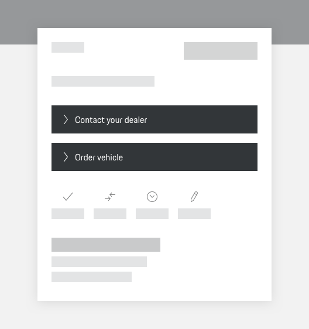
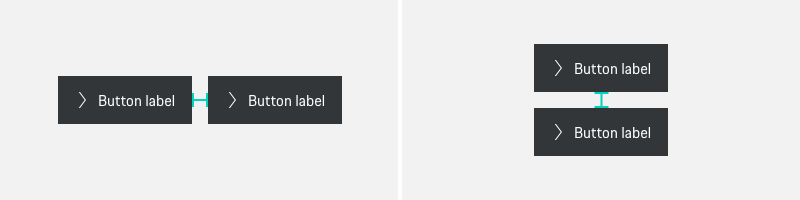
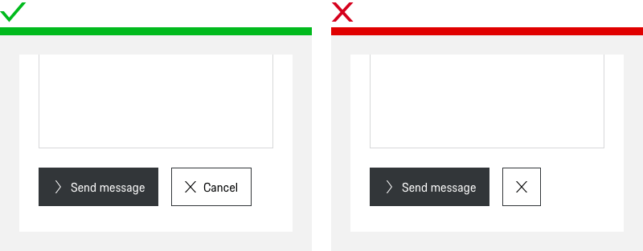
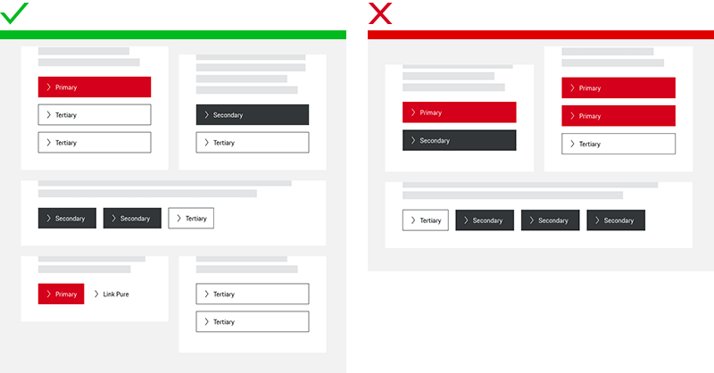

# Button Group

<TableOfContents></TableOfContents>

## When to use
  • Use a Button Group to consistently align two or more buttons at once.

---

## Usage

### Alignment

You can either order Buttons within a group horizontally or vertically. Our general recommendation is to place the buttons according to their priority - the most important button is the most left (horizontal) or on top (vertical).

#### **1. Horizontal alignment**

A group of Buttons can be aligned side-by-side in a row **whenever you want to** **emphasize the relationship between the different actions** and give the user an instant overview on the available options. A classical case for that would be a "cancel" / "submit" combination. This is **valid for all screens or screen areas with a width of 480 px or larger.**
  
  
 
Buttons that are placed in a horizontal row on larger screens are always to be stacked on mobile (breakpoint XS) or screen areas with a maximum width of 479 px, each of them occupying a separate line, and, as generally defined for mobile, spanning full-width. According to the F pattern the primary call-to-action button should always be placed on top of the button group ([UX Design](https://uxdesign.cc/buttons-placement-and-order-bb1c4abadfcb), 2019). 
  

#### **2. Vertical alignment**

In case you want the users to **focus on each action separately** you should opt for vertically stacked Buttons, giving the user more space for a careful consideration of the actions provided ([UX Movement](https://uxmovement.com/mobile/optimal-placement-for-mobile-call-to-action-buttons/), 2019).

In favor of visual harmony, stacked Buttons should always have the same width, aligned with the widest element of the stack (whose length depends on the text contained). 

### Limit the number of grouped Buttons.

When multiple actions are provided at once, it should be easy for the user to grasp. For "Icon and text" Buttons **we recommend to go for a maximum of 4 actions at once**, as we should set a limit and don't want to overwhelm the user. Also, too many buttons might make the user feel insecure about what to do next.

### Spacing in Button groups

No matter if Buttons are placed side by side or on top of each other, you should keep a minimum spacing of 16 px inbetween.

---

## Do's & Don'ts

### Only group Buttons that are related.

Though it is possible to mix up Buttons within a group, you should always make sure that the actions within a group are content-related.

### Avoid mixing different variants.

In favor of a seamless UX you should homogeneously **stick the Button types "Icon and Text" and "Icon only within a group** and avoid mixing them up.  
  

### Differ between Primary, Secondary and Tertiary actions.

Within a Button group, you have several options to provide a clear interactive hierarchy and user guidance:

- **Emphasized action(s):**  
Due to the general guidelines, one Button within a group can be set as "Primary" (depending on the rest of the Buttons used on the page). If no primary action is set, but you want to give Buttons  within the group a slightly higher priority, you can go for maximum two secondary actions.  

- **Actions with lower priority:**  
Buttons with lower priority that come alongside primary or secondary actions can either be set as tertiary actions (outlined Button) or as a Button or Link Pure, in case you want to reduce their priority even more. If this is the case for the whole group, you can also go for 100% tertiary Button or 100% Button/Link Pure groups.  

  