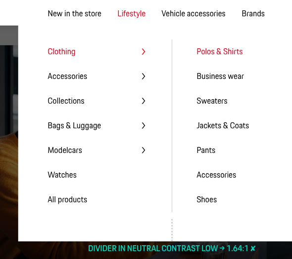
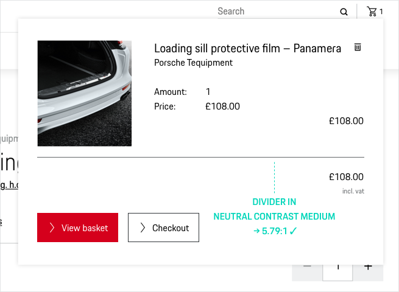

# Divider

<TableOfContents></TableOfContents>

## When to use
  • Use a Divider to create visual separation between related sections of content.   
  • Use a Divider as a single element or embedded in components like, for example, tables or accordions.

---

## Types

To ensure a seamless UX in all Porsche web applications it is recommended to use the Divider as follows

| Type | Usage |
|----|----|
| Horizontal divider | The horizontal dividers is preset with auto-width thus technically adapts to the width of surrounding elements per default. |
| Vertical divider | The vertical divider preset default height of 100%. |
| Responsiveness | Both variants provide a responsive behaviour, so it's also possible to switch between the variants responsively (e.g. when it's necessary to switch from a horizontal divider on desktop to a vertical divider on mobile screens). |

## Usage

### Color appearance

Dividers should generally **only be used in neutral colors**. Depending on the purpose the Porsche Design System provides three neutral scales for both Light and Dark Theme. Prefererably they should be used only on the themes' background colors (Background or Surface color).

#### Neutral Contrast Low
This subtle color version **should be used only for "nice to have" and merely decorative dividers** that have no immediate effect on the user's perception of the page content as the color "Neutral Contrast Low" is not accessibility-safe for neither Light nor Dark Theme. Or in other words: You can use a divider in Neutral Contrast Low whenever the answer to "Would the user safely find their way around without the divider?" would definitely be "Yes". In these examples the dividers are helpful, but without them the large spacing would do the job of making the separation between the text parts recognizable:

  
  

#### Neutral Contrast Medium / Neutral Contrast High

**Whenever it's crucial for the perception of the page content**, you should go for dividers in Neutral Contrast Medium or Neutral Contrast High. In this example a visual impaired user would hardly be able to recognize the divider as a relevant part for the price calculation if it wouldn't be displayed in a higher contrast color:

### Layout appearance

The dividers provided in the Porsche Design System can be used in different visual appearance depending on the layout purpose: 

#### Full-bleed divider

Full-bleed dividers **span the entire length of a module or page ("end to end")**. Therefore they can be used to separate page sections that require a clear and more distinct visual separation, for example to separate the header from the rest of the web page.

#### Inset divider

Inset dividers are **used with an offset that is often generated by preset grid margins, module paddings or by individually defined outer spacings**. They are appropriate for separating related content (like, for example, table rows or a list of contact items) and help users to scan content and perceive it as a related collection. 

---

## Do’s & Don’ts

### Avoid heavy use of dividers.
Dividers **should be used sparingly** within a page layout. This is especially relevant for dividers that are used as single elements (and therefore not necessarily occur multiple times as parts of a table, for example). A heavy use of dividers can lead to visual distraction and crowded interfaces, also taking up too much space especially on mobile screens.

### Don't use dividers only to structure content.

**Dividers are not the only way to create visual rhythm and hierarchy** on a web page. You should always consider other options for structuring content before using dividers, such as: 

* White space / spacings (think of general perception rules like the law of proximity)
* Sizings
* Color (e.g. emphasizing content by using lighter or darker colors)

Also sometimes the elements on a page already create a visual structure on their own (like an image grid, for example) and there might be no need for using extra separating elements like dividers.

### Keep decorative use to a minimum.

Dividers **should always be used to structure and therefore help the user perceiving the content** of a web page. A usage for a 100% decorative purpose is possible, but should be kept to an absolute minimum.

---

## Related components

* [Grid](components/grid)
* [Spacing](components/spacing)