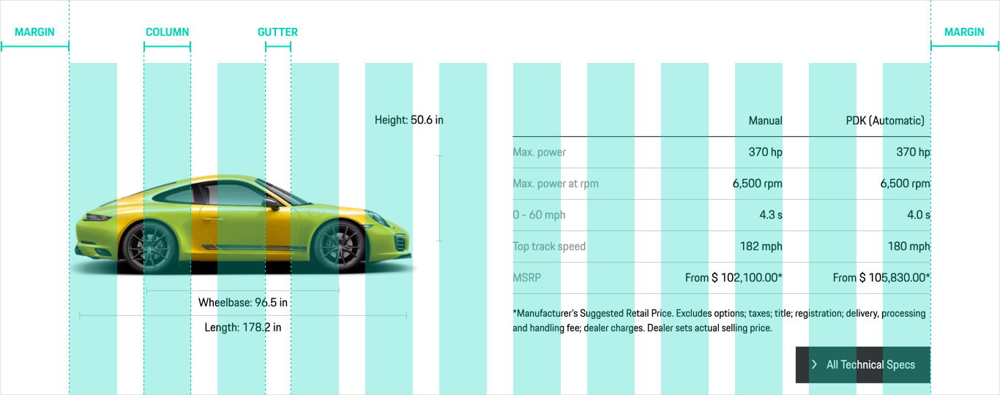
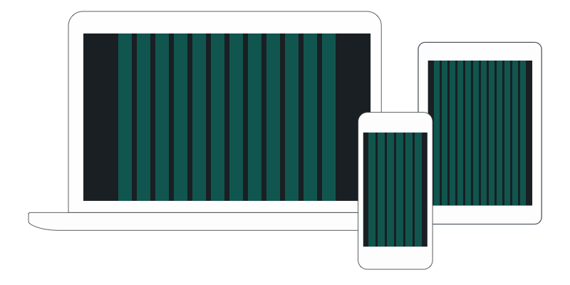
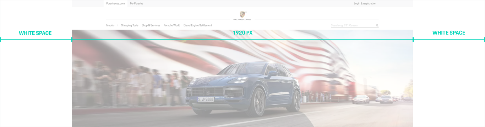
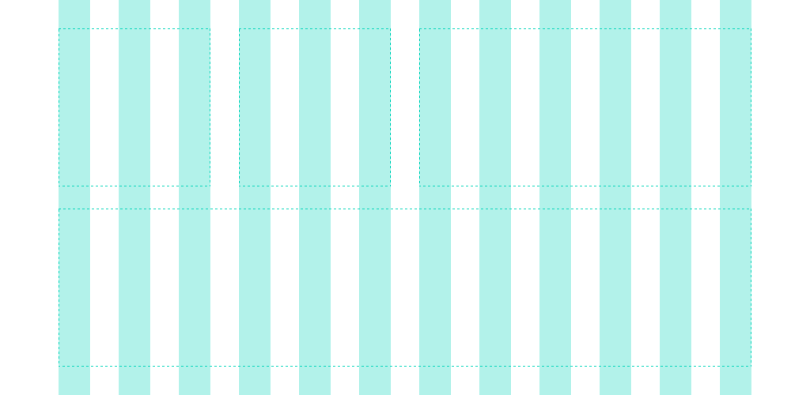
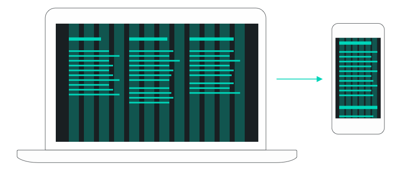
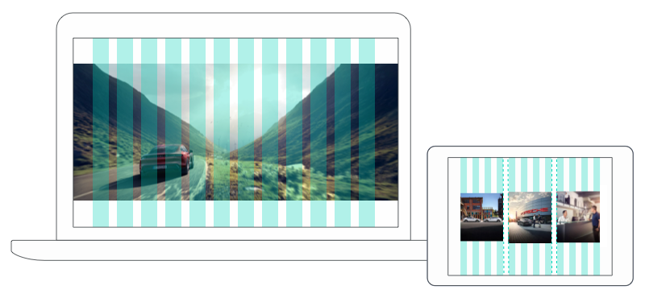

# Grid

<TableOfContents></TableOfContents>

## Architecture

- **The 12 grid columns** offer a high layout flexibility by
being dividable by 2, 3, 4 or 6. For layouting on mobile screens (widths < 759px), it is recommended to use a 6-column-grid to avoid too much small-scaling or even „cluttering“.
- **The grid gutter** separates the columns horizontally by in-between-spacings.
The gutter is defined with fixed pixel sizes and breakpoints to balance size
ratios between elements on the respective screen size. 
- **The grid width** is resulting from the total screen width minus gutter widths and minus defined margins resulting from the [Content Wrapper](components/content-wrapper) in use. The Grid component can only be combined with the "Basic" content width variant.

### Overview 

| Viewport | Range | Columns | Gutter | Margin (100% = full screen width) | 
| -------- | -------- | -------- | -------- | -------- | 
| **XS** | 320-759 px | 12 columns (Design only: 6 columns) |  16 px | 7% | 
| **S** | 760-999 px | 12 columns |  24 px | 7% | 
| **M** | 1000-1299 px | 12 columns | 36 px| 7% | 
| **L** | 1300-1759 px  |  12 columns | 36 px | 7% |  
| **XL** | 1760 px or larger |  12 columns | 36 px | 10% | 

## Grid breakpoints 
Breakpoints are predefined width points at which the layout can be changed to fit the corresponding screen size.
Within the layouts for Porsche web experiences we use the following main breakpoints, derived from statistical data on browser size usage: 

- 480px
- 760px
- 1000px 
- 1300px
- 1760px

It is highly recommended to stick to the defined breakpoints, especially for general elements like headers or footers. But not every individual offered breakpoint has to be used.

### Optimising for defined viewport sizes

Based on statistical use of specific devices all Porsche web layouts should be optimised for the following viewport sizes: 

- 320 / 375px
- 768px
- 1024px
- 1366px
- 1920px

The main breakpoints (see above) are deliberately chosen with some distance from the optimised device sizes due to a higher fault tolerance.

### Viewport range

To provide consistency throughout all Porsche web experiences, all layouts should be optimised for a viewport range from **320 px** to a maximum of **1920 px**. For viewport sizes from 1920 px onwards a growing white space outside the left and right edge should be used. This can be done by using the "extended" content width variant of the [Content Wrapper](components/content-wrapper) component.

### Layout template 
To make layouting from scratch as easy as possible, the optimized viewport sizes are provided by [Sketch artboard templates](https://designsystem.porsche.com/sketch/porsche-design-system-layout-template.sketch). They come with final layout settings (including the responsive grid) that can be turned visible via: View → Canvas → Show Layout.

## Tips for responsive layouting

### Use the grid purposefully

All content elements that should behave responsively should be placed horizontally within the grid, always starting in a column. The spacing between content elements is therefore defined by the grid gutter. 
In most cases, this should refer to modules or content boxes, while smaller spaces on a more or less "micro-level" (both vertical and horizontal) should be defined by using the [Spacing](components/spacing) component.

### Use the given possibilites wisely

When it comes to designing a component or module responsively, there are several screws that can be turned to adapt to different screen sizes, such as changing:

- the component’s grid column width and, therefore, its wrapping behaviour. Example: A 3-column text on desktop, each column using 4 grid columns, can be stacked on mobile using 12 grid columns.
- text sizes – commonly using smaller text on mobile, larger text on bigger screens.
- the general layout of the component by using different patterns on mobile and desktop. Example: Turning a multi-column teaser module on desktop into an accordion on mobile.

When designing responsive layouts, always aim to find the solution that works best for the specific case, keeping the user and the specific use context in mind.

### Don’t be afraid to think outside of the box

It is possible to place elements end-to-end, spanning from left to the right edge of the screen. This can be done by using the "fluid" content width variant of the [Content Wrapper](components/content-wrapper) component.
An example would be a full-width image that generates a more emotional and concise side entry. However, this should be a well-contemplated exception.

Also, for image groups, it is possible to break out of the grid in order to create a stronger visual coherence. The outer edges (left and right) of the image group should always be placed within the grid, whereas the edges between the single images can be placed exactly in the middle of the gutter.

