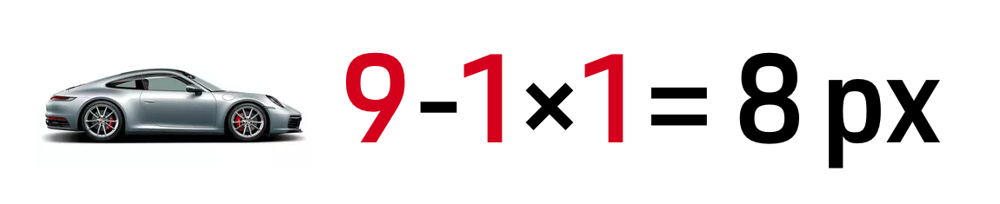
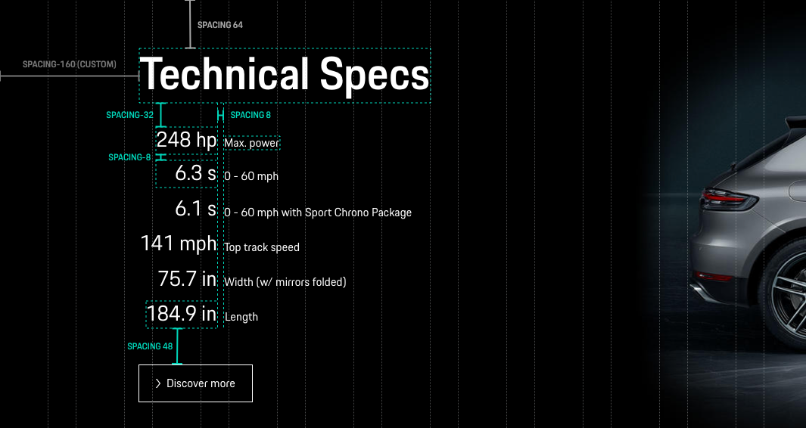
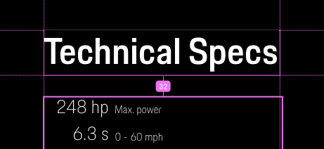
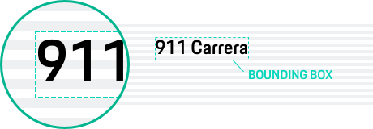
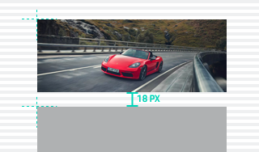

# Spacing
We use predefined spacings to position components vertically and horizontally within a layout. Reusing defined spacings provides a consistent user experience across all pages and makes development easier. For fluid layouts the spacings should be used in combination with the [Responsive Grid](components/grid).

### 8px spacing system - the Porsche formula

The Porsche spacing system is based on multiples of eight. The unit of 8px refers to the general base size of 16px (= 1em), that is also applied in the typography and other component sizes.

<TableOfContents></TableOfContents>

## Spacing system and layout spacings

For layouting we recommend to use the layout spacings that are available for developers as variables from x-small to xx-large.
Additional increments of the spacing system can be used for specific requirements as long as it is based on the 8px spacing system.

Example: Mixed use of the spacing system with layout and custom spacings.

## Working with space

Spacing is a powerful design element, an integral part of every layout, which can create relationships, hierarchy, and rhythm between components.

### Relationships

The space between components can determine if the elements
seem to have a meaningful connection. Closely placed elements relate to each
other. If more space is added between components, the relationship weakens. Using a consistent spacing pattern across elements can also create a quickly
intelligible relationship.

### Hierarchy

Leaving different spaces between elements or sections of
information will influence the reader to perceive them as having a different
relevance. Elements that have more space around them tend to be perceived as being
further up in the hierarchy. Creating hierarchy on the page guides viewers' eyes and helps
separate and organise elements in the design and guide users' attention to
certain elements.

### White space (also: negative space)

The empty space (also referred to as negative space) in a
design. Although called white space, the blank space can be filled with any color
as long as it’s free of elements like text, graphics or images, creating a
well-spaced and clear product. White space helps deliver a good experience by
giving elements space to breathe and letting the reader’s eye relax.

## Usage in Sketch

### Define the grid
The Porsche Design System works with 8px
increments, but it allows 4px values in a few cases, where greater flexibility is
needed. We recommend setting up the workspace with a 4px grid system. You can
change the Sketch grid settings via: View → Canvas → Grid Settings → Grid Block
Size: 4px. Or, when setting up a totally new UI design file, feel free to use
the [Porsche Design System layout template](https://designsystem.porsche.com/sketch/porsche-design-system-layout-template.sketch) with predefined settings.

### Snap to grid
Most design apps have the option to snap elements to the grid.
Using this feature will help position elements faster in the layout.

### Nudging
To make the UI design workflow as smooth as possible, it is helpful to adjust
the nudging (= increments an element moves when using keyboard arrows) to the
grid steps in use. We recommend the following settings, reachable via Sketch
settings → Canvas:

- Move objects **1px** using Arrow keys. 
- Move objects **8px** using Shift-Arrow keys.

## Design tools vs. web browser

### Translating Sketch spacings into variables 

When it comes to design-to-dev-handover, we should always keep in mind that the handling of
spacings is different: Whereas the designer sets the spacings manually in Sketch
layouts, the developer implements them by using pre-defined spacing variables
(e.g. spacing-8 or spacing-16) or the layout variables (e.g. layout-small or layout-medium). Therefore, we should always make sure that the
spacings in sketch are set as correctly as possible and that they the developer
can easily read them in Abstract's inspect mode - of course, a personal
conversation between designer and developer is always the best way to get
optimal results.

### Borders
While in Sketch the border isn't added to the shape size, browsers
consider borders as solid space around elements by default. We recommend to
ignore this fact while designing and to always set the focus on giving the developer
the right spacing sizes between or inside elements, even if this results in
slightly higher elements in implementation due to the additional border.

### Lines
Lines can be created using either a narrow rectangle or a path
with a stroke. For better readability of the space between elements, we
recommend using paths with a stroke.

### Text boxes
Developers measure the spacing of typography from the bounding box
of the text element. When working with typography, the bounding box should be
placed within the grid parameters, even if the baseline of the typography is not
on the grid line. It's best to always create texts using the text tool, not as a
box!

### How to handle uneven image heights
It is no rocket science setting the correct 8px spacing values when the element
heights correspond to the 4px grid themselves. But there is an exception, where
element heights don’t fit in perfectly: Images. They can be displayed in many
different aspect ratios (such as 16:9 or 4:3) and follow various rules for
handling responsiveness (like cropping or resizing). Depending on their width
and the screen size, their height will most likely not fit in the 4px grid. To
follow a consistent rule, we recommend to always place the upper part (X/Y
value) on the grid system, even if the bottom part doesn’t fit. The following
element underneath should then be placed on the grid line again. As for the
implementation of the spacing, the developer should use the spacing variable
with the value closest to it. For example, the following design case might lead
to an implemented spacing value of 16 px, as this the spacing variable the most
close to 18 px.

