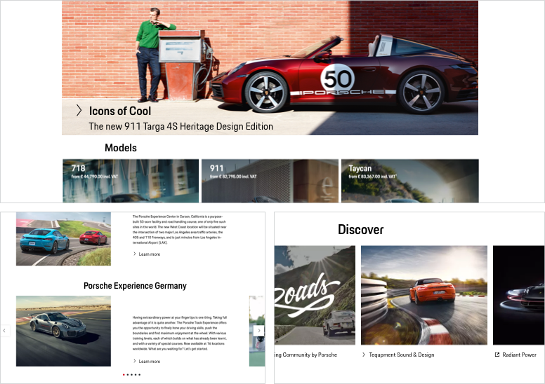

# Link Pure

Link Pure is a clickable icon-text-combination used to **navigate the user to another page**. It can be used as a more subtle call to action compared to the normal Porsche Design System Link. (In case you want the user to execute an action, you should select the [Button](components/button) or [Button Pure](components/button-pure) component instead.)

<TableOfContents></TableOfContents>

## Available sizes

Per default, the Link Pure is set in **copytext size**. If another size or hierarchy level is needed, the Link Pure is available in the following sizes, whereas the size of the icon changes accordingly. 

| Size | Example |
|------|------|------|
| X-Small | <p-link-pure size="x-small" href="https://designsystem.porsche.com">Link Pure</p-link-pure> |
| Small | <p-link-pure size="small" href="https://designsystem.porsche.com">Link Pure</p-link-pure> |
| Medium | <p-link-pure size="medium" href="https://designsystem.porsche.com">Link Pure</p-link-pure> |
| Large | <p-link-pure size="large" href="https://designsystem.porsche.com">Link Pure</p-link-pure> |
| X-Large | <p-link-pure size="x-large" href="https://designsystem.porsche.com">Link Pure</p-link-pure> |

---

## Available variants

### Icon and Text

<p-link-pure size="large" href="https://designsystem.porsche.com">Link Pure</p-link-pure>

This should be the variant of your choice whenever possible, as icons should preferably always be paired with text for better comprehensibility and accessibility.

### Icon only

<p-link-pure size="large" hide-label="true" href="https://designsystem.porsche.com">Link Pure</p-link-pure>

When it's enough to indicate an interaction with an icon only, the text label can be hidden but a minimum height of 40 px must be maintained. Yet, it's recommended to use this variant only in cases when the user is fully aware of the function due to an expressive and internationally comprehensible icon.

### Icon, Text and Subline  

<p-link-pure size="medium" href="https://www.porsche.com">Some label
Some Subline
</p-link-pure> <p-link-pure size="medium" weight="semibold" href="https://www.porsche.com">Some label
Some Subline
</p-link-pure>

This should be the variant of your choice if the Link Pure must be supplemented by a subline. 
However, we recommend that you only use this variant in cases where the user requires additional information. 

The standard variant will be used on a monochrome background, whereas the highlight variant should be used 
on a polychrome background (e.g. on images) for better comprehensibility and accessibility.

---

## States

The Link Pure covers the following states:

* Default
* Active
* Hover
* Focus

---

## Styling

### Icon
The default icon is an arrow right that can be replaced by any icon available in the Porsche web icon set. It should be changed only if it is ensured that another symbol is more appropriate to support the text content, making it easier for the user to understand the function quickly.  

### External and internal links
For internal links the arrow should be sufficient in most cases. External links can be displayed with the following icon: 

<p-link-pure icon="external" target="_blank" href="https://www.porsche.com">External link</p-link-pure>

### Text label
The text label within a link should always be short and descriptive.

---

## Usage

### Link Pure on images

A Link Pure can be placed on images, e.g. when using it as an additional link on image sliders or teaser images that are clickable themselves. In this case, the Link Pure can give the user an additional hint on the clickability of the whole image. 
To guarantee the readability on pictures we recommend the highlight variant.

### Link Pure groups

Multiple Links Pure can be combined to one Link Pure group that must be stacked left-aligned in order to guarantee scannability and legibility. It is recommended to not group more than 6 Links Pure in a row.

    <p-headline variant="headline-3" tag="h3" style="margin-bottom: 24px;">Examples</p-headline>
    

