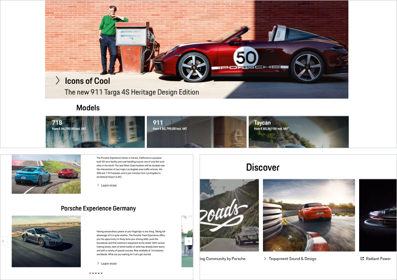

# Link Pure

<TableOfContents></TableOfContents>

## When to use
  • Use a Link Pure as a more subtle call to action compared to the normal Porsche Design System Link.   
  • Use a Link Pure to navigate the user to another page. 

--- 

## Types

To ensure a seamless UX in all Porsche web applications it is recommended to use the Button Pure as follows:

| Variant | Usage |
|----|----|
| Icon and text | This should be the variant of your choice whenever possible, as icons should preferably always be paired with text for better comprehensibility and accessibility. |
| Text only | The use of icons can be resigned, whenever it causes interference (e.g. in-text placement, no matching icon, complex lists or tables, alignment to elements). |
| Icon only| When it's enough to indicate an action with an icon only, the text label can be hidden but a minimum height of 40 px must be maintained. It's recommended to use this variant only in cases when the user is fully aware of the function due to an expressive and internationally comprehensible icon. |
| Icon, Text and Subline | This should be the variant of your choice if the Button Pure must be supplemented by a subline. However, we recommend that you only use this variant in cases where the user requires additional information. The standard variant will be used on a monochrome background, whereas the highlight variant should be used on a polychrome background (e.g. on images) for better comprehensibility and accessibility. |

# Icon alignment & stretch

To enable wider usage order and stretch are customizable. Please use under recommended circumstances:

| Variant | Usage |
|----|----|
| Icon left | This is the default state and should be used whenever possible. |
| Icon right | On special occasions, the icon can be placed on the right side of the label (e.g. step navigation). | 
| Stretch | It's recommended to use stretch only on small viewports or areas (e.g. mobile views or sidebars). Please consider that the greater the distance between icon and label, the less they will be perceived as a visual group. |

## Usage

### Standard icons
The default icon is an arrow right that can be replaced by any icon available in the Porsche web icon set. It should be changed only if it is ensured that another symbol is more appropriate to support the text content, making it easier for the user to understand the function quickly.  

### External and internal links
For internal links the arrow should be sufficient in most cases. External links can be displayed with the following icon: 

<p-link-pure icon="external" target="_blank" href="https://www.porsche.com">External link</p-link-pure>

### Text label
The text label within a link should always be short and descriptive.

### Link Pure on images

A Link Pure can be placed on images, e.g. when using it as an additional link on image sliders or teaser images that are clickable themselves. In this case, the Link Pure can give the user an additional hint on the clickability of the whole image. 
To guarantee the readability on pictures we recommend the highlight variant.

### Link Pure groups

Multiple Links Pure can be combined to one Link Pure group that must be stacked left-aligned in order to guarantee scannability and legibility. It is recommended to not group more than 6 Links Pure in a row.

    <p-headline variant="headline-3" tag="h3" style="margin-bottom: 24px;">Examples</p-headline>
    

