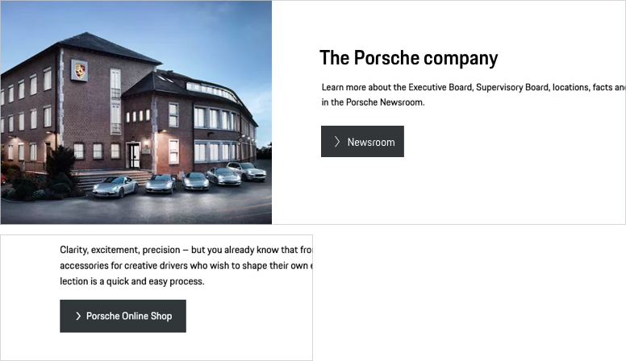

# Link

<TableOfContents></TableOfContents>

## When to use
  • Use a Link to navigate to another page.  
  • Use a Button to change the state of an application, which almost always happens on the same page. 

---

## Types

To ensure a seamless UX in all Porsche web applications it is recommended to use the Link as follows

| Type | Usage |
|----|----|
| Primary | Link filled with the Porsche brand color. This type is only to be used for one or two high-priority actions within a page in order to give the user optimal guidance. |
| Secondary | Default link with monochrome color fill. To be used for all other stand-alone Links that aren't high priority. |
| Tertiary | An "outline only" link version. In hierarchy it is always subordinated to the filled view and can be used in two different cases. 1. In combination with a filled link (primary or secondary), for example in popular pairings such as "submit" (primary or secondary) and "cancel" (tertiary). 2. Stand-alone, when the priority of the action is lower compared to all other link actions within this page. |

| Variant |   |
|----|----|
| Icon and text | This should be the option of your choice whenever possible, as icons should preferably always be paired with text for better comprehensibility and accessibility. The length of the link always adapts to the length of the text label.|
| Icon only| This variant contains an icon only with no further text information. It is highly recommended to use it only in cases where the user is fully aware of the link function. This can be ensured e.g. by using an expressive icon or by logical composition with other components. |

## Usage

### Default icon
The default icon is an arrow right that can be replaced by any icon available in the Porsche web icon set. It should be changed only if it is ensured that another symbol is more appropriate to support the text content, making it easier for the user to understand the function quickly.  

### Internal and external links
For internal links the arrow should be sufficient in most cases. External links can be displayed with the following icon:

<p-link href="https://www.porsche.com" icon="external" aria-label="Extern link">Some label</p-link>

### Link position

By default the link is to be positioned left-aligned within a module or a screen. In special cases, where it serves a better user guidance, the position can be changed.

### Link width

Even if there is no technical limit to the link width, you should always make sure that the link remains legible, even more so in multiline state. It is recommended to use max. 100 characters per line (equals approx. 700px link width).

### Multiline links

Though it's technically possible to use multiline text in links, it's recommended to keep the text label short and, therefore, avoid multiline links.

    <p-headline variant="headline-3" tag="h3" style="margin-bottom: 24px;">Examples</p-headline>
    

