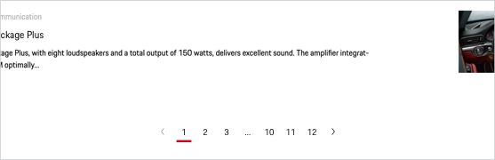

# Pagination

<TableOfContents></TableOfContents>

## When to use
  • Use a Pagination whenever a content (text, images, videos) is split into several pages. 
  • Use a Pagination to provide information on the existing amount of pages. 
  • Use a Pagination to show the current page position. 
  • Use a Pagination to allow the user to navigate between the single content pages.   

--- 

## Types

To ensure a seamless UX in all Porsche web applications it is recommended to use the Pagination as follows

| Variant | Usage |
|----|----|
| Icon and label| Due to better comprehensibility and accessibility, you should preferably go for this variant. The length of the link always adapts to the length of the label. As for the icon, you can either choose between one of the social platform icons provided in the Porsche icon set or also use a specific icon, whereas it must refer (which should be clear) to a social platform. |
| Icon only| This variant contains an icon only with no further text information. It should preferably be used e.g. for social sharing links, when the user is totally aware of the button functionality due to a clear context. |
| Group | The Link Social group contains the most used social icons that can be used as a group.

## Usage 

### Displaying 6 pages or 8 pages or more

If there are at least 6 or 8 pages, an ellipsis ("...") is shown for a dedicated range of pages that are located inbetween the visible pagination numbers. 

## Positioning and spacing

The pagination should always be placed centered beneath the related content, keeping a minimum top spacing of 32 px.
