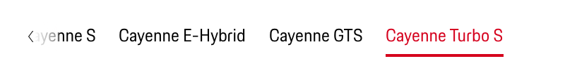

# Tabs Bar

## States

The link covers the following states:

* Default
* Active
* Hover
* Focus

---

## Usage

### Current tab

The current tab position is always marked by a red underline. By default, the current page item is not clickable.

### Overflow

When a set of Tabs cannot fit on screen the tab bar becomes horizontal swibeable and navigable with arrows.

- Scrolling horizontally
- Use the tab key to navigate back and forth 
- Click on the Tab Item witch then will center the clicked element

### Scalable

As Tabs can horizontally scroll, technically a UI could have as many tabs as needed.

### Weight

The standard variant (regular) will be used on a monochrome background, whereas the highlight variant (semibold) should be 
used on a polychrome background (e.g. on images) for better comprehensibility and accessibility.

### Content

Tab labels provide clear and concise explanations of the content within. Each tab's content is independently categorized and mutually exclusive of the content of other Tabs.

---

## Related Component
* [Tabs](#/components/tabs)