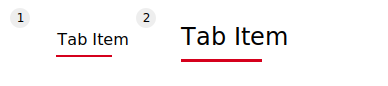
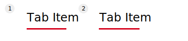
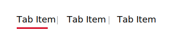
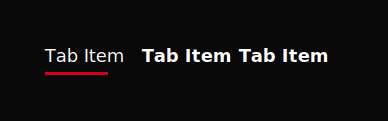
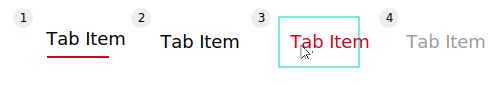
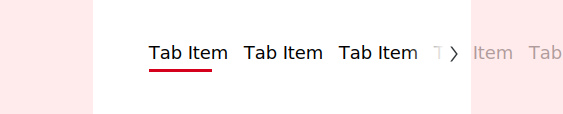

# Tabs

Tabs are an intuitive way to organize content and allow navigation between groups of content that are related and at the same level of hierarchy.

#### Jump to:

[<p-icon name="arrow-head-down" aria-label="Arrow head down icon"></p-icon>Styles](#styles)  
[<p-icon name="arrow-head-down" aria-label="Arrow head down icon"></p-icon>States](#states)  
[<p-icon name="arrow-head-down" aria-label="Arrow head down icon"></p-icon>Overflow](#overflow)

---

## Principles

**Scalable**  As tabs can horizontally scroll, technically a UI could have as many tabs as needed.

**Informative**  Tabs organize content into categories to help users easily find different types of information.

---

## Styles

Tabs come with two size and two weight modifiers. Each size or weight adjustmets will gradually effect the gap and the thickness of the active border.

### Sizes

1 | default (16px) 2 | large (24px)

---

### Weights

1 | regular  
2 | semibold

---

### Divider

---

### Dark Theme / Images

Dark backgrounds and images will limit the weight options to semibold. We do this due to prevent contrast problems you could run into.

---

## States

1 | active   2 | inactive   3 | hover + focus   4 | disabled

---

## Overflow

When a set of tabs cannot fit on screen the tab bar becomes horizontal scrollable and navigable with arrows.

- Scrolling horizontally
- Use the arrows to navigate back and forth
- Click on the Tab Item witch then will center the clicked element
- You can jump through tabs via the Tab key

---
