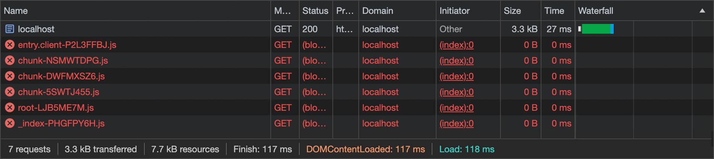
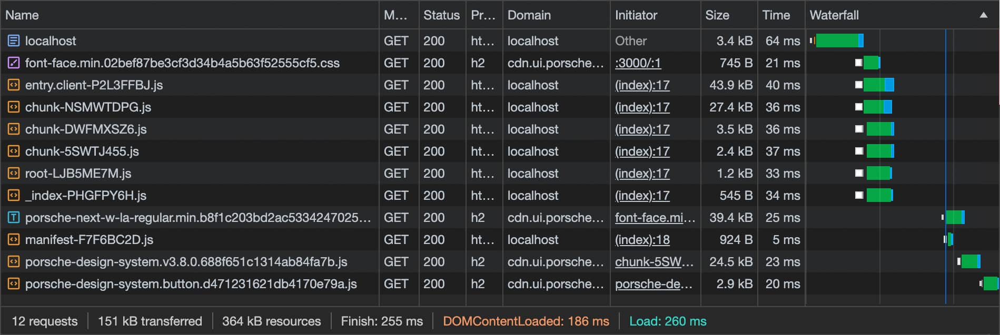

# Initialization

<TableOfContents></TableOfContents>

## Setup

The most basic [integration](developing/remix/getting-started#integration) of
`@porsche-design-system/components-react/ssr` looks like this.

<!-- prettier-ignore -->
```tsx
<PorscheDesignSystemProvider>
  ...
</PorscheDesignSystemProvider>
```

When investigating Remix we have to cover two different scenarios, the **server side** and the **client side**.

In the example from above we didn't render any component, yet, so let's render a single `PButton`.

```tsx
<PButton>Hello</PButton>
```

### Server Side

On the **server side** the components of the `@porsche-design-system/components-react/ssr` sub-package render static
markup for something called <a href="https://web.dev/declarative-shadow-dom" target="_blank">Declarative Shadow DOM</a>
which is converted into a real Shadow DOM by modern browsers without any JavaScript.

<Notification heading="Hint" heading-tag="h4" state="warning">
    Older browsers that don't <a href="https://caniuse.com/declarative-shadow-dom" target="_blank">support Declarative
    Shadow DOM</a> won't show anything.<br>
    To solve this, the <a href="partials/dsr-ponyfill">getDSRPonyfill()</a> partial needs to be applied.
</Notification>

To continue with the example, this is what the result that is returned by the server looks like.

```html
<p-button class="ssr">Hello</p-button>
```

As you can see, the `hydrated` class isn't there since the web component is still "dead" until it is really initialized.

To verify what is rendered by the server without any client side hydration (and potential re-renders), you can disable
JavaScript in your browser. In our scenario, this results in the following network traffic.



### Client Side

Now, we already have a `p-button` tag in the DOM from the server side.  
From here on the exact same things happen as described at
[Vanilla Js Preparation](must-know/initialization/vanilla-js#preparation) and
[Vanilla Js Connect Lifecycle](must-know/initialization/vanilla-js#connect-lifecycle).

Any further client side rendering behaves just like it does for the
[React integration](must-know/initialization/react#mounting).

---

## Optimization

Now that it is clear what is happening under the hood when a simple `PButton` is rendered, let's see how this looks from
the perspective of network requests and how to improve them if necessary.

### Status Quo

By default, the network traffic looks something like this.


- starts with the `index.html`
- then continues with several `*.js` bundles of the Remix app
- which then load the **core chunk**
- that injects both the **font-face.css** and the **component chunk**
- and last the **font file** after the styles within the component's Shadow DOM are applied

### Preloading font-face.css

By applying the [getFontFaceStylesheet()](partials/font-face-stylesheet) partial we can preload the **font-face.css**
asset.



As we can see, this happens in parallel with the `*.js` bundles.

### Preloading font files

By applying the [getFontLinks()](partials/font-links) partial we can preload the font assets. As a default, both
`regular` and `semi-bold` weights are preloaded since they are most commonly used but this can be customized.


As a result, both font files are additionally loaded in parallel, while earlier this happened not only in sequence but
even last and only when a style is present on the page that uses the `font-family` and that particular `font-weight`
which can lead to a phenomena called **Flash of Unstyled Text (FOUT)**.

### Preloading component chunks

The loading experience can be improved further by using the [getComponentChunkLinks()](partials/component-chunk-links)
partial. Without any configuration it simply preloads the **core chunk**.


Again, with this improvement, the asset is now being loaded in parallel, too.

For the next step, we also want to preload the **component chunk** by using the partial like

```ts
getComponentChunkLinks({ components: ['button'] });
```


Now, everything is preloaded in parallel while the Remix app chunks takes the longest and are executed last.

<Notification heading="Hint" heading-tag="h4" state="warning">
  Just preloading all component chunks on the page or even every chunk available should be avoided.<br>
  Instead, the most performant but also more complicated approach would be to only preload the component chunks
  (and fonts) that are located <strong>above the fold</strong> which means visible on page load without scrolling.
</Notification>

### Early initialization

This is where it may be interesting to apply the [getLoaderScript()](partials/loader-script) partial.


The loading behavior is essentially the same but the `load()` call happens way before the app chunks are even loaded.
This can result in better user experience depending on the use case because the gap until the app actually being ready
is bridged.
