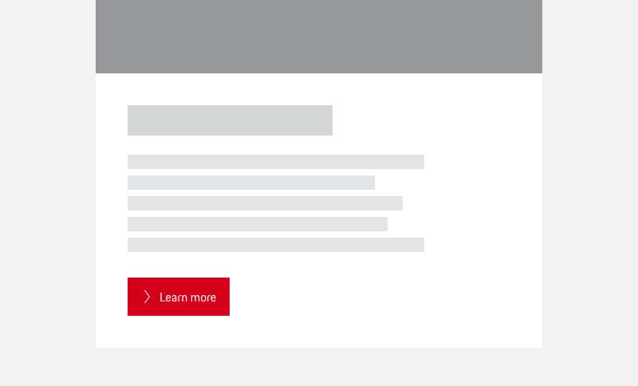
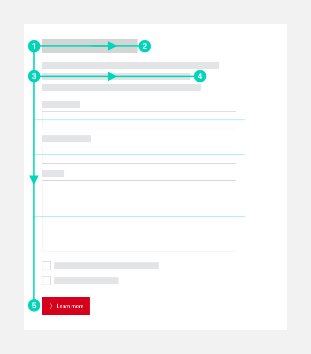
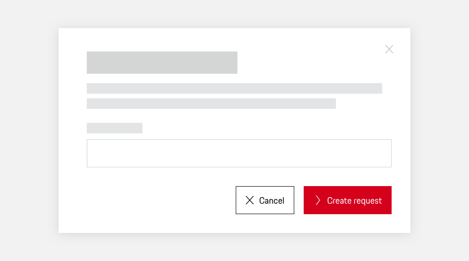
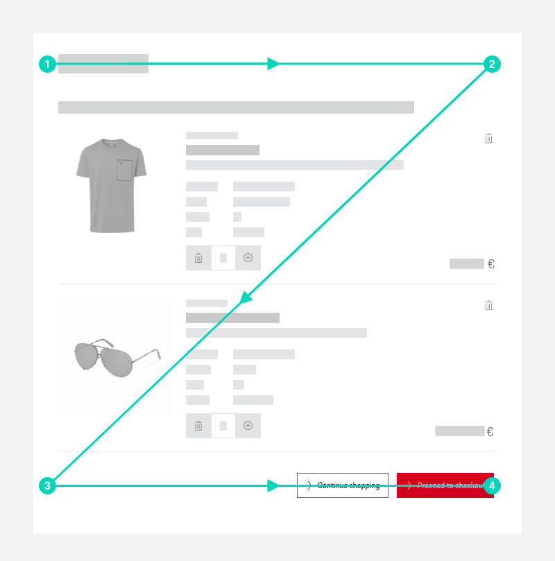
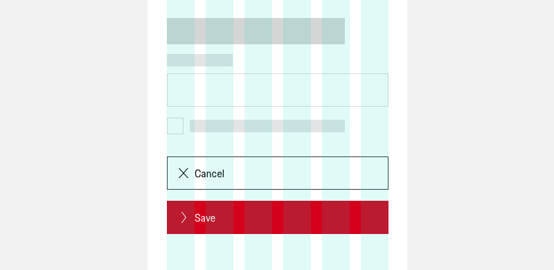
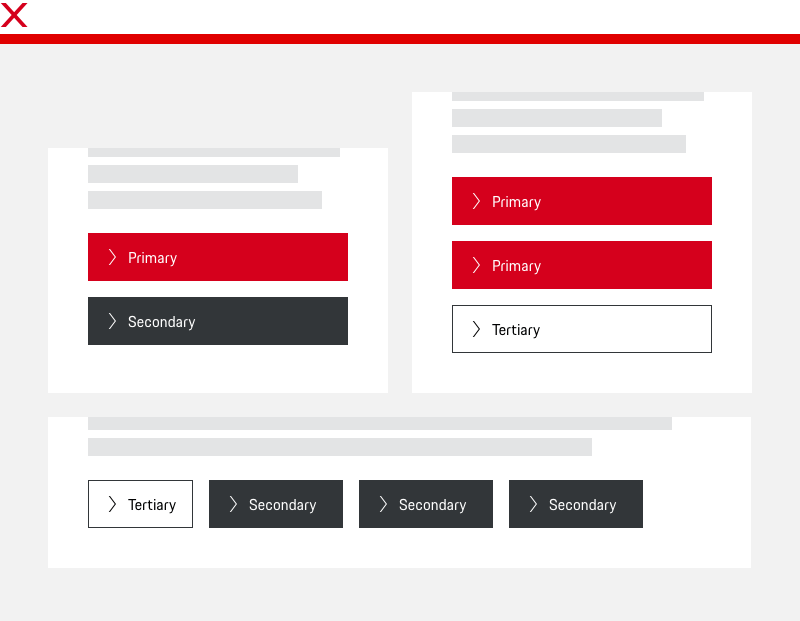

# Buttons    

**Buttons and Links** are an essential part of an interactive experience, enabling the user to execute an action or to navigate through a page. Occuring in different cases, they can usually either stand alone or are combined in a Button (or Link) group.

As there can be a lot of ways for grouping, positioning and aligning buttons (even more so when it comes to their responsive behaviour), we should strive for the same principles in Porsche web applications in order to provide the user with a consistent UX.

  <p-headline variant="headline-3" tag="h3"">Quick checklist <p-icon name="check" size="medium" aria-label="Check icon" style="margin-right:8px;"></p-icon></p-headline>
  <p-text style="margin-bottom: 24px;"><b>Whenever you use Buttons in your interface, make sure to …</b></p-text> 
  <p-text-list style="margin-bottom: 24px;">
    <p-text-list-item>… use either Buttons or Links (they look the same, but differ both semantically and functionally) from the Porsche Design System.</p-text-list-item>  
    <p-text-list-item>… define the horizontal alignment (left or right) of Buttons or whole Button groups depending on the use cases, as they come along with different reading patterns.</p-text-list-item>
    <p-text-list-item>… set Buttons on viewport XS in full-width.</p-text-list-item>
    <p-text-list-item>… define a clear Button (and general interaction) hierarchy within a page in favour of an optimal user guidance.</p-text-list-item>
    <p-text-list-item>… stick to only one Button variant ("Icon and Text" or "Icon only") within a Button group.</p-text-list-item>
    <p-text-list-item>… set the right prioritization within a Button group – use only one Primary Button or two Secondary Buttons combined with Tertiary Button(s).</p-text-list-item>
    <p-text-list-item>… define the alignment (horizontal or stacked) within a Button group depending on the available screen or container size.</p-text-list-item>
    <p-text-list-item>… keep a constant minimum spacing of 16 px inbetween Buttons.</p-text-list-item>
  </p-text-list>

---

## Buttons or Links?

Though we generally always speak of "Buttons" for the sake of simplicity (also within this guideline), you should be aware that, technically, you should **differ between Buttons and Links**. **This is crucial for providing the right functionality to the user** – therefore, you should be able to define the right component together in your product team. Both Buttons and Links appear visually the same and are provided with the same types and variants in the Porsche Design System:

<p-button variant="primary" style="margin-right:16px;">Primary</p-button><p-button style="margin-right:16px;">Secondary</p-button><p-button variant="tertiary">Tertiary</p-button>
  
 <p-button variant="primary" hide-label="true" style="margin-right:16px;">Some label</p-button><p-button hide-label="true" style="margin-right:16px;">Some label</p-button>
 <p-button variant="tertiary" hide-label="true">Some label</p-button>

Be careful when to use which, as they differ both semantically and functionally:

| Component | Primary use | Interaction target | Component guideline for further information |
|---------|------------|----------|------------|
| **Button** | Executing an action (e.g. "submit", "delete" or "edit") or changing the state of an application. | Same page (in most cases) | [Buttons](#/components/button) |
| **Link** | Navigation to another page. | Another page or information layer. | [Links](#/components/link) |

**Generally, you should always preferably provide the user with labelled Buttons or Links** ("Icon and text" variant). However, this guideline also includes "Icon only" variants, unless stated otherwise. 

---

## General Button principles

Stick to the following basic guidelines when using Buttons (or Links) – either stand-alone or as a group:

## Porsche Design System components

In order to maintain a homogeneous look and feel not only within your product but throughout all Porsche web applications you should **only use the components that are provided in the Porsche Design System** and follow the specific guidelines for [Buttons](#/components/button) or [Links](#/components/link).

## Placement

Depending on the usage of the Button(s) we differ **two types of alignment for viewports S and higher with a minimum screen width of 760 px**. You can use both types of placement within your application. However, you should ensure that both variants are used consistently depending on the specific requirements.

### Left alignment

Buttons **on standard pages or in on-page forms** are to be placed **left-justified**, supporting a direct user attention flow:  
  
  
  
This is based on the [F-shaped reading pattern](https://www.nngroup.com/articles/f-shaped-pattern-reading-web-content-discovered/) which is still followed by the majority of users on common web pages both on mobile and desktop ([Nielsen Norman](https://www.nngroup.com/articles/f-shaped-pattern-reading-web-content/), 2017) and has also been proven in a usability study on forms [by Luke Wroblewski](https://www.lukew.com/ff/entry.asp?571) (2007).  
  

### Right alignment

Buttons that are used **in dialogs or wizards** (multi-step flows like a checkout process, for example) are to be placed **right-justified**:  
  
  
  
This supports the Z-shaped reading pattern ([UX Planet](https://uxplanet.org/z-shaped-pattern-for-reading-web-content-ce1135f92f1c), 2017). Here, users end on the bottom right where they are provided an interaction leading to another / the next step. Also, as this is also common practice in Windows and MacOS, users should be familiar with that ([UX Collective](https://uxdesign.cc/buttons-placement-and-order-bb1c4abadfcb), 2019)  
  

### Alignment on viewport XS (max. width 759 px)

On viewport XS Buttons in "Icon and text" variant are always to be set full-width (12 grid columns), independent from their text length. This makes it easier for the user to tap due to a larger visible touch area and also allows to give primary actions more visibility. "Icon only" Buttons keep their fix size on all viewports.

## Hierarchy

Within a web page you should be careful to provide an optimal user guidance, supporting not only the general user experience but also a higher conversion rate. **Therefore, you should focus on a clear Button hierarchy**, always considering all Buttons on the same page, no matter if they are far apart from each other or used in visually different parts or modules.

- The main or high-priority action should be set as **Primary Button** in Porsche Brand color. This type should preferably be used **only once per page**.  
    
  <p-button variant="primary" style="margin-right:16px;">Primary</p-button><p-button variant="primary" hide-label="true">Some label</p-button>
 

- A **Secondary Button** with monochrome fill can be used for all other actions that aren't super high priority.  
  
  <p-button variant="secondary" style="margin-right:16px;">Secondary</p-button><p-button hide-label="true">Some label</p-button>

- For all other actions or links with *even* lower priority a **Tertiary Button** is to be used – either standing alone or in combination with a Primary or Secondary type.  
  
  <p-button variant="tertiary" style="margin-right:16px;">Tertiary</p-button><p-button variant="tertiary" hide-label="true">Some label</p-button>

### Other interaction components

For providing interactive elements (and, by doing so, a clear interaction hierarchy) on your page, there are – for sure – more options to choose from than a Button or Link, just think of:

- [Button Pure](#/components/button-pure) / [Link Pure](#/components/link-pure)
- [Text links](#/components/typography) (stand-alone or within copy text)
- Navigational elements like [Paginations](#/components/pagination) or Tabs
- Interactive areas like Galleries or Image Sliders
- … and many more!

**When defining the interaction hierarchy you should always include all types of interaction the user can execute on this page.**

---

## Button groups

Sometimes it makes sense to offer two or more actions at once. This can be realized by providing a Button group. When doing so, make sure to follow these principles:

#### Avoid mixing different variants.

Both Buttons and Links are available as "Icon and Text" and "Icon only" variants in the Porsche Design System. In favor of a seamless UX you should homogeneously **stick to one of these types within a group** and avoid mixing them up.  
  

#### Only group Buttons that are related.

Though it is possible to mix up Buttons within a group (see above for detailed information on functionality), you should always make sure that the actions within a group are content-related.

#### Limit the number of grouped Buttons.

When multiple actions are provided at once, it should be easy for the user to grasp. For "Icon and text" Buttons **we recommend to go for a maximum of 4 actions at once**, as we should set a limit and don't want to overwhelm the user. Also, too many buttons might make the user feel insecure about what to do next.

#### Differ between Primary, Secondary and Tertiary actions.

Within a Button group, you have several options to provide a clear interactive hierarchy and user guidance:

- **Emphasized action(s):**  
Due to the general guidelines, one Button within a group can be set as "Primary" (depending on the rest of the Buttons used on the page). If no primary action is set, but you want to give Buttons  within the group a slightly higher priority, you can go for maximum two secondary actions.  

- **Actions with lower priority:**  
Buttons with lower priority that come alongside primary or secondary actions can either be set as tertiary actions (outlined Button) or as a Button or Link Pure, in case you want to reduce their priority even more. If this is the case for the whole group, you can also go for 100% tertiary Button or 100% Button/Link Pure groups.  
  
  
  
  
  
### Ordering Buttons within a group

You can either order Buttons within a group horizontally or vertically. In both cases, you should have an extra eye on the placement of the primary call-to-action – here, consistency is king ([Nielsen Norman Group,](https://www.nngroup.com/articles/ok-cancel-or-cancel-ok/) 2008) and should be kept for all Button groups with the same alignment. 

#### Horizontal alignment

A group of Buttons can be aligned side-by-side in a row **whenever you want to** **emphasize the relationship between the different actions** and give the user an instant overview on the available options. A classical case for that would be a "cancel" / "submit" combination. This is **valid for all screens or screen areas with a minimum width of 760 px.**

**Hierarchical order**

The primary call-to-action within a horizontal-aligned group is always to be placed on the right, following the reading direction as well as iOS and recent Android app standards most of our users should be familiar with.  
  
  
 
**Responsive behaviour**

Buttons that are placed in a horizontal row on larger screens are always to be stacked on mobile (viewport XS) or screen areas with a maximum width of 759 px, each of them occupying a separate line, and, as generally defined for mobile, spanning full-width. According to the [Gutenberg Principle](http://people.sunyit.edu/~lepres/thesis/principles/119_pdfsam_POD.pdf) the next best action should then always go to bottom, following the user's scanning direction from upper left to bottom right. ([UX Movement](https://uxmovement.com/mobile/optimal-placement-for-mobile-call-to-action-buttons/), 2019)  

### Vertical stacking

In case you want the users to **focus on each action separately** you should opt for vertically stacked Buttons, giving the user more space for a careful consideration of the actions provided ([UX Movement](https://uxmovement.com/mobile/optimal-placement-for-mobile-call-to-action-buttons/), 2019).

**Button width**

In favor of visual harmony, stacked Buttons should always have the same width, aligned with the widest element of the stack (whose length depends on the text contained). 

**Hierarchical order**

On viewport S upwards or in screen areas with a minimum width of 760 px the primary call-to-action should always be placed first.

**Responsive behaviour**

See horizontal alignment: Buttons on viewport XS or in screen areas with a maximum width of 759 px are also stacked and set in full width, whilst the next best action is to be placed on the bottom.  
  

### Spacing in Button groups

No matter if Buttons are placed side by side or on top of each other, you should keep a minimum spacing of 16 px inbetween.

---

## Related components

* [Buttons](#/components/button)
* [Links](#/components/link)