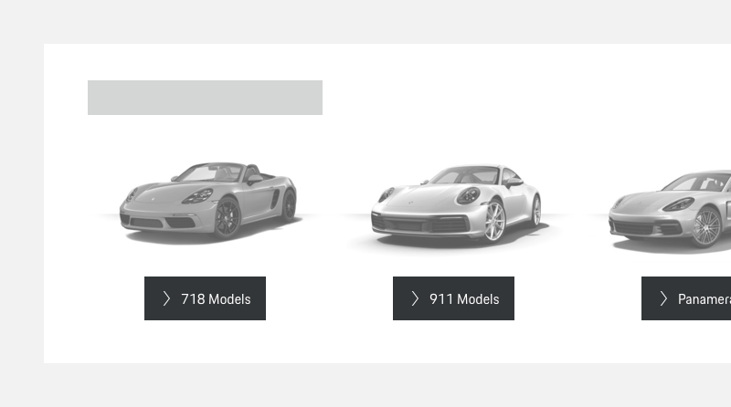
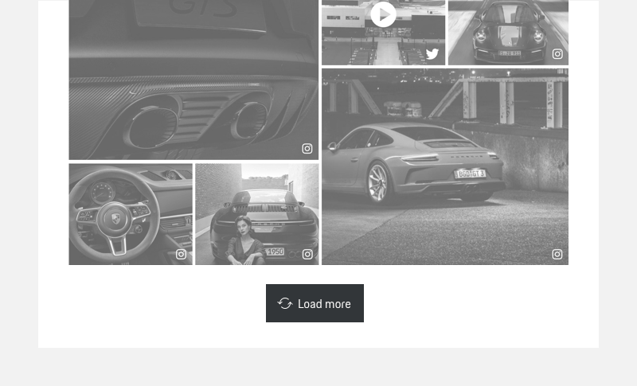
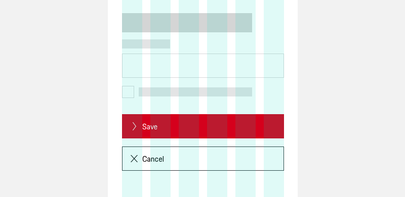
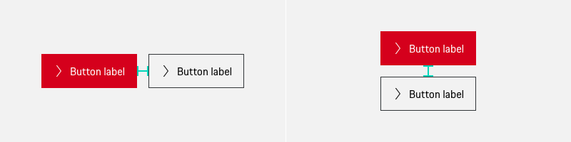
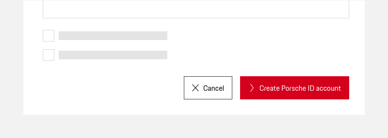
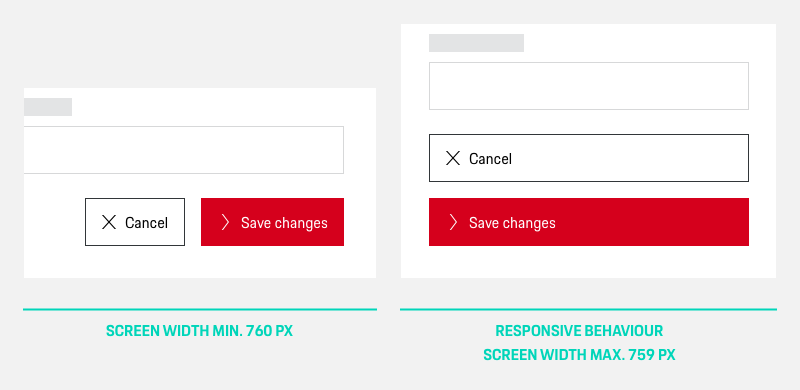
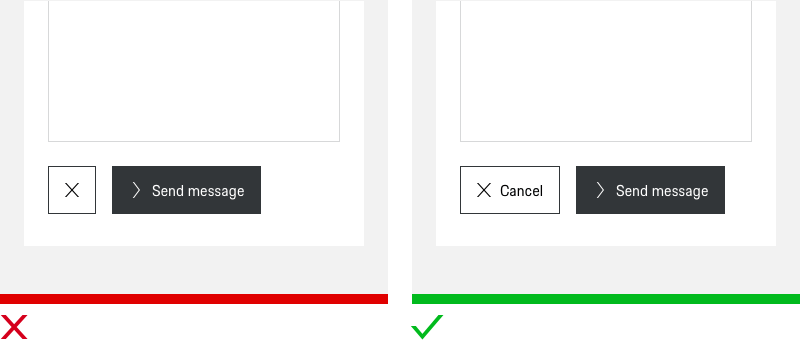
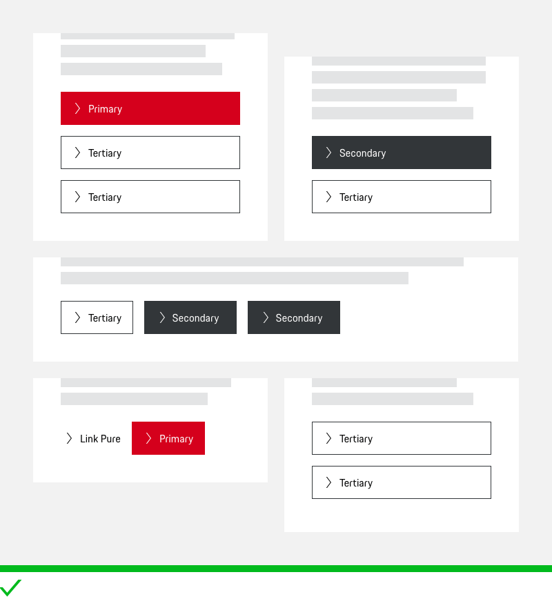

# Buttons    

**Buttons and Links** are an essential part of an interactive experience, enabling the user to execute an action or to navigate through a page. Occuring in different cases, they can usually either stand alone or are combined in a Button (or Link) group.

Though we generally always speak of "Buttons" for the sake of simplicity (also within this guideline), you should be aware that, technically, you should **differ between Buttons and Links**.

  <p-headline variant="headline-3" tag="h3"">Quick checklist <p-icon name="check" size="medium" aria-label="Check icon" style="margin-right:8px;"></p-icon></p-headline>
  <p-text style="margin-bottom: 24px;"><b>Whenever you use Buttons in your interface, make sure to</b></p-text> 
  <p-text-list style="margin-bottom: 24px;">
    <p-text-list-item>use either Buttons or Links (they look the same, but differ both semantically and functionally). </p-text-list-item>   
    <p-text-list-item>align Buttons to the left within a page or module.</p-text-list-item> 
    <p-text-list-item>place the primary call-to-action within a horizontal-aligned group on the left.</p-text-list-item> 
    <p-text-list-item>set Buttons on viewport XS in full-width.</p-text-list-item> 
    <p-text-list-item>keep a constant minimum spacing of 16 px inbetween Buttons.</p-text-list-item> 
    <p-text-list-item>define a clear Button hierarchy within a page and use only one Primary Button or two Secondary Buttons combined with Tertiary Button(s).</p-text-list-item> 
    <p-text-list-item>stick to only one Button variant (“Icon and Text” or “Icon only”) within a Button group.</p-text-list-item> 
    <p-text-list-item>define the alignment (horizontal or stacked) within a Button group depending on the available screen or container size.</p-text-list-item> 
  </p-text-list>

---

## General Button principles

In order to maintain a homogeneous look and feel not only within your product but throughout all Porsche web applications you should **only use the components that are provided in the Porsche Design System** and follow the specific guidelines for [Buttons](#/components/button) or [Links](#/components/link).

---

## Alignment

To ensure general consistency across all user flows, we recommend aligning the buttons to the left. The CTA should also always be placed on the left. 

### Left alignment (F-shaped reading pattern)

Buttons **on standard pages or in on-page forms** are recommended to be placed **left-justified**, supporting a direct user attention flow:  
  
This is based on the [F-shaped reading pattern](https://www.nngroup.com/articles/f-shaped-pattern-reading-web-content-discovered/) which is still followed by the majority of users on common web pages both on mobile and desktop ([Nielsen Norman](https://www.nngroup.com/articles/f-shaped-pattern-reading-web-content/), 2017) and has also been proven in a usability study on forms [by Luke Wroblewski](https://www.lukew.com/ff/entry.asp?571) (2007). 
  

### Centered 

**In exceptional cases** it's even possible to place Buttons **centered** to their related content: 

- If the Button centring contributes to a more aesthetically pleasing look and feel, like, for example, in an image slider where the Buttons should be placed centered to the images:
  
  
- If the Button relates to a larger part or even the whole page, e.g. a "Load more" Button:
  
  

### Alignment on smaller viewports 

On smaller viewports up to 479 px screen width Buttons are always to be placed stacked and full-width. This makes it easier for the user to tap due to a larger visible touch area and also allows to give primary actions more visibility. "Icon only" Buttons keep their fix size on all viewports.

---

## Button groups

Sometimes it makes sense to offer two or more actions at once. This can be realized by providing a Button group. When doing so, make sure to follow these principles:

### Spacing in Button groups

No matter if Buttons are placed side by side or on top of each other, you should keep a minimum spacing of 16 px inbetween.

### Ordering Buttons within a group

You can either order Buttons within a group horizontally or vertically. In both cases, you should have an extra eye on the placement of the primary call-to-action – here, consistency is king ([Nielsen Norman Group,](https://www.nngroup.com/articles/ok-cancel-or-cancel-ok/) 2008). Our general recommendation is to place the CTA on the left.

#### Horizontal alignment

A group of Buttons can be aligned side-by-side in a row **whenever you want to** **emphasize the relationship between the different actions** and give the user an instant overview on the available options. A classical case for that would be a "cancel" / "submit" combination. This is **valid for all screens or screen areas with a width of 480 px or larger.**

**Hierarchical order**

The primary call-to-action within a horizontal-aligned group is always to be placed on the left.
  
  
 
**Responsive behaviour**

Buttons that are placed in a horizontal row on larger screens are always to be stacked on mobile (viewport XS) or screen areas with a maximum width of 479 px, each of them occupying a separate line, and, as generally defined for mobile, spanning full-width. According to the F pattern the primary call-to-action button should always be placed on top of the button group ([UX Design](https://uxdesign.cc/buttons-placement-and-order-bb1c4abadfcb), 2019). 
  

### Vertical stacking

In case you want the users to **focus on each action separately** you should opt for vertically stacked Buttons, giving the user more space for a careful consideration of the actions provided ([UX Movement](https://uxmovement.com/mobile/optimal-placement-for-mobile-call-to-action-buttons/), 2019).

**Button width**

In favor of visual harmony, stacked Buttons should always have the same width, aligned with the widest element of the stack (whose length depends on the text contained). 

**Hierarchical order**

On viewport S upwards or in screen areas with a minimum width of 760 px the primary call-to-action should always be placed first.

#### Avoid mixing different variants.

Both Buttons and Links are available as "Icon and Text" and "Icon only" variants in the Porsche Design System. In favor of a seamless UX you should homogeneously **stick to one of these types within a group** and avoid mixing them up.  
  

#### Only group Buttons that are related.

Though it is possible to mix up Buttons within a group (see above for detailed information on functionality), you should always make sure that the actions within a group are content-related.

#### Limit the number of grouped Buttons.

When multiple actions are provided at once, it should be easy for the user to grasp. For "Icon and text" Buttons **we recommend to go for a maximum of 4 actions at once**, as we should set a limit and don't want to overwhelm the user. Also, too many buttons might make the user feel insecure about what to do next.

#### Differ between Primary, Secondary and Tertiary actions.

Within a Button group, you have several options to provide a clear interactive hierarchy and user guidance:

- **Emphasized action(s):**  
Due to the general guidelines, one Button within a group can be set as "Primary" (depending on the rest of the Buttons used on the page). If no primary action is set, but you want to give Buttons  within the group a slightly higher priority, you can go for maximum two secondary actions.  

- **Actions with lower priority:**  
Buttons with lower priority that come alongside primary or secondary actions can either be set as tertiary actions (outlined Button) or as a Button or Link Pure, in case you want to reduce their priority even more. If this is the case for the whole group, you can also go for 100% tertiary Button or 100% Button/Link Pure groups.  

  

  
---

## Related components

* [Buttons](#/components/button)
* [Links](#/components/link)