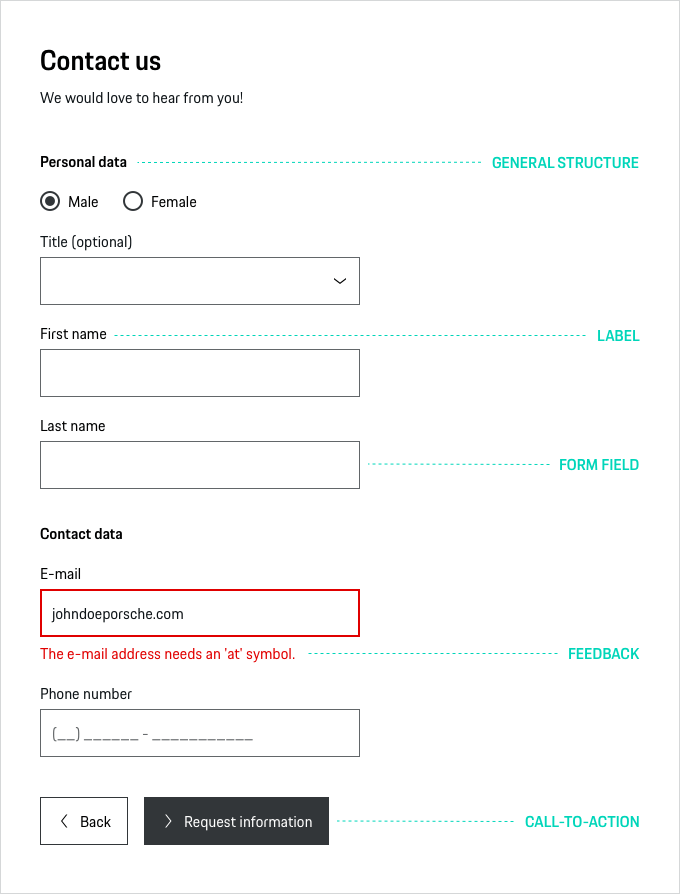
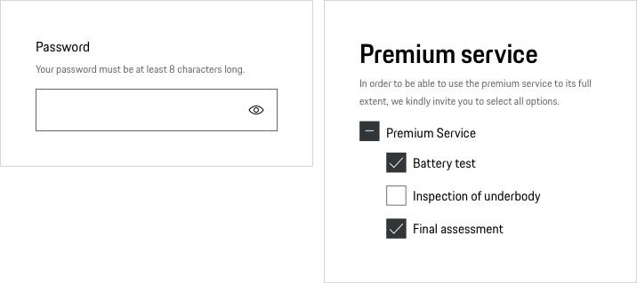
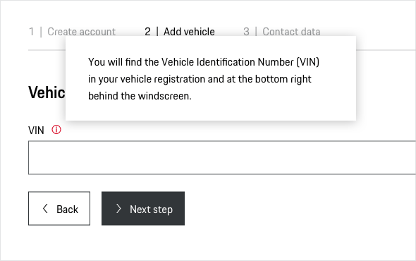
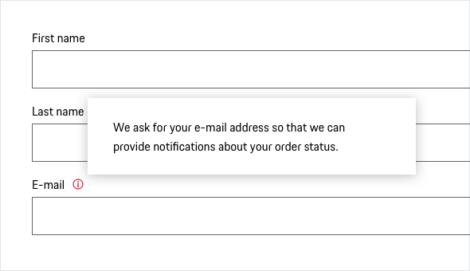
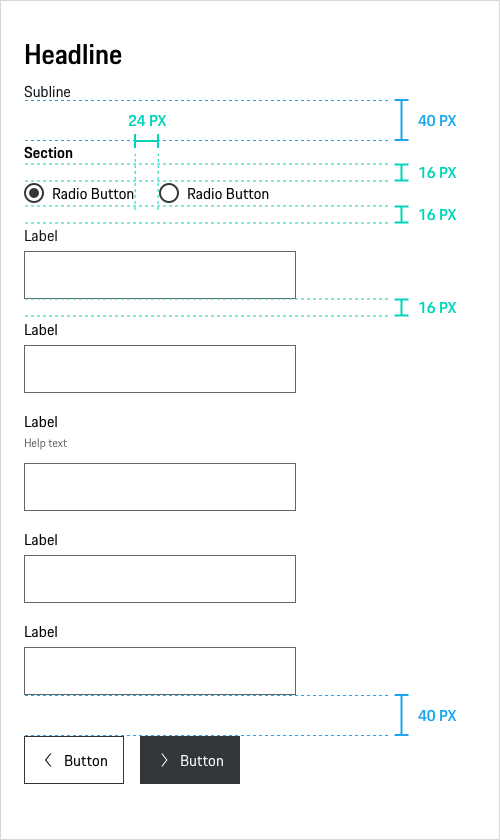
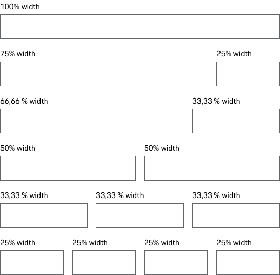
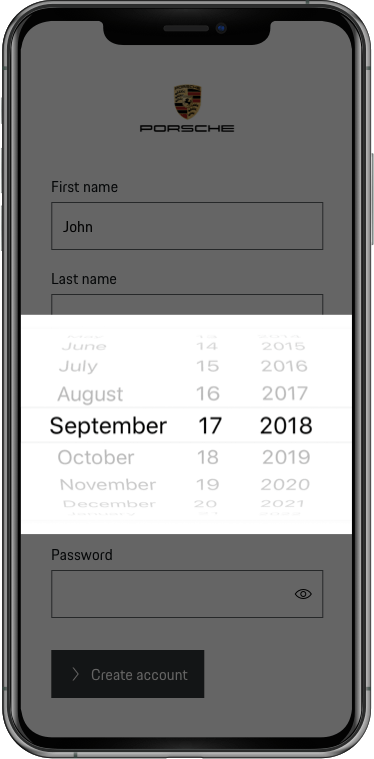
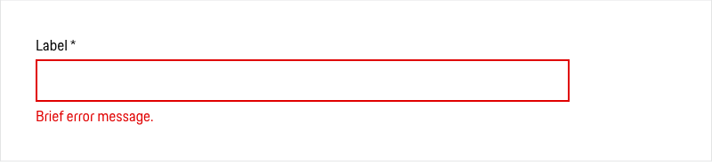
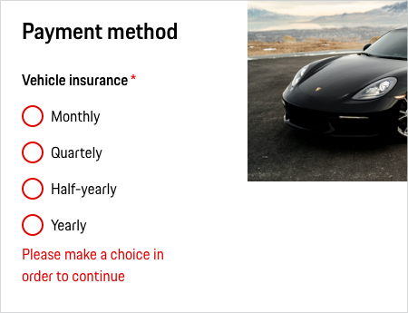

# Forms

The digital world cannot be imagined without forms. **Whenever we need information from the user that is to be processed by the application or when we want to enable the user to configure options**, forms are best to be used.

**Well-designed forms are a crucial part of a good UX** and also a flagship for the brand experience in general: Users perceive well-designed forms as evidence for helpfulness, professionality, technical expertise and simply enjoy working with it. However, designing forms well is always a question of the perfect combination of structure, sequence, form elements, labels, help and feedback. If this fits perfectly together (and makes users happy), chances are high to increase conversions.

**Common cases for form use are for example:**

* Account login or registration process
* Contact forms
* Checkout process
* Setting configuration
* Surveys

**Download patterns as Sketch file**  

In order to make designing forms as easy as possible we provide you with a Sketch file containing **templates for the most common form types for both desktop and mobile**, easily adaptable to your requirements:

<p-link-pure href="https://designsystem.porsche.com/sketch/porsche-design-system-form-templates.sketch" icon="download" download>Download Sketch form templates</p-link-pure>

---

<TableOfContents></TableOfContents>

## Form DNA

A typical form in Porsche web applications is made up of five basic elements:

1. **The general structure**  
  … is defined by how the form is being layed out within the specific page, involving column layout, logical sections as well as proper spacings helping the user to capture the form at first sight.  
  
2. **Form fields**  
  … provide all input options the user needs to fill out the form, whether it's commonly used free-form text input (Text Fields, Text Areas) or specific data inputs (such as Checkboxes, Radio Buttons, Select). They can have different states and variants that are described in the specific component guidelines.  
  
3. **Labels**  
  … accompany the form fields, helping the user to understand the type of input that is required. They should always be short and descriptive (optimal: 1-3 words), stating the required input. Always start labels capitalized. In all Porsche Design System components, labels are placed top-aligned to support scannability and speed up form completion.  
  
4. **Good feedback**  
  … is crucial to give the user both a feeling of success when completing the form fields correctly as well as providing valuable support in case of wrong entry.  
  
5. **Call-to-actions**  
  … are needed to initiate further processing, for example submitting, sending or cancelling a form input. Most forms come with two call-to-actions. The successive (and therefore most important) button should be emphasized. As red is a very sensitive color in forms (due to error notifications) we highly recommend to go for a [Secondary Button](components/button) in grey, accompanied by a Tertiary Button for the cancelling / least important option. Button labels have an effect on the conversion rate and should always be short and descriptive, informing the user about what to expect. Something like "submit" is not clear enough. Good examples are "Get a free demo", "Create account" or "Subscribe now".  

  
 

---

## User-centric form design

Follow these basic tips to design forms for Porsche web applications that make users happy:

### Go for relevance

**Only ask for information that is really needed from the user.**  
  Not only will the user be more likely to fill out the form, but you also preserve the user from the cognitive load (especially on mobile devices). The shorter the form, the better the completion time – and the better the conversion rate.  

**Start with fields that are easy to fill in.**  
  Keep the hurdle for the user low to fill out the complete form by providing easy-to-fill-out fields first. Good example: Start with name and e-mail before asking for the credit card number.  

**Pre-fill or auto-detect as much as possible.**  
  We already know some information about the user, like name, country or e-mail address, for example? Perfect! Pre-fill the form with this information in order to make it easier for the user to fill in the form.

### Your form should be intuitive

**Keep the form in a logical, intuitive order.**  
For example first name prior to the last name. Don't forget to take international formatting into account, as the order of form fields is often market-dependent.  

**Auto-focus the first field (or the needed one) by default.**  
This allows users to step in quickly and tab through the form elements in a logical way. The form elements provided in the Porsche Design System are already equipped with an on-board focus state.  
  
**Provide the correct input type.**  
In the best case, the correct input format (for example e-mail address, URL, phone number) should be technically preset to make the input easier for the user.  

**Avoid placeholder text.**  
Placeholder text tends to be disadvantageous in several respects: Once the form field is in focus or filled in, the placeholder is gone or overwritten and it's hard for the user to remember what the placeholder was all about – in the worst case, the user is forced to delete the input text to re-reveal the placeholder. Also, placeholders make it hard for the user to quickly scan the form and see what fields have already been filled out. When you want to give the user some information about the input format, go for information text outside the form field instead ([Nielsen Norman Group, 2014](https://www.nngroup.com/articles/form-design-placeholders/)).  

**Explain all options for action to the user.**  
The user should always be aware of all possibilities. Therefore, form fields that are not touch- or clickable (yet) should be clearly distinguishable from active form fields. Go for disabled form states when needed which you will find in the Porsche Design System form components.

### Support scannability

You should make it easy as possible for the user to perceive a form quickly:

**Avoid visual hurdles.**   
The more fluid a form is perceived, the better the conversion rate. "From our research studies, we've learned that even the slightest moment of hesitation when completing a form can significantly hurt the form’s response rate (that is, the number of people who complete the form)." ([Nielsen Norman Group, 2013](https://www.nngroup.com/articles/form-design-white-space/)).  

**Work with spacings.**  
Cluster the form in logical, coherent parts (see "Form layout" below).  

**Split long processes.**  
Go for multi-step forms in case of a long process (see below) in order to prevent cognitive overload – forms should always be kept manageable for the user**.**
Always provide a progress bar (% or the number of steps) to give the user a hint on what’s already finished.

### Provide help

**… only when help is truly required!**  
Otherwise, the user might feel overwhelmed or, in the worst case, patronized. 
 
**Always provide status information.**  
Give the user a hint on the progress state, success or error states or the completion of a form. 
 
**Provide extra information, when needed.**  
Sometimes it's helpful for the user to get further information, for example on the input format or on why the information is needed. It depends on the length and quality of the information on how it should be displayed:

* **Short and/or very important information** that's essential for the completion of the form should be displayed directly outside the form field, so that users are not forced to make further clicks. At Porsche, we always place description text on top of the form fields (as the bottom space is reserved for validation messages) in Copytext x-small in order to distinguish it from label text. You'll find detailed information on the correct placement of the description text in the specific form component guidelines.  
    
    

* **Longer and/or less important information** (even more so if it's optional to read) should be hidden in an "information" icon that is placed directly (spacing 4 px) after the field label and reveals an explanation in a tooltip on hover (desktop) or on click (tablet/mobile). As soon as the user continues filling out the form, the tooltip should disappear. This way, we keep the form short and prevent the user from extra scrolling. But be aware to use tooltips sparingly.  
    
  

### Handle with care: Sensitive and personal data

Many users are afraid of spam or hackers and especially do not like to enter their personal data in forms. In order to prevent users from cancelling their form input:  
  

**Ask for as little information as possible.**  
Users shouldn't get the feeling that they are being asked for irrelevant or unnecessary information or even that information is only collected for the purpose of data collection.  

**Give deeper information on a specific input.**  
Sometimes it's helpful to give some more information on the "why" of a required input, in order to remove any doubt from the user, even more, when it comes to very specific data the user is not used to fill in or when the further processing of information is not clear enough. In this case, a tooltip with an "information" icon (right behind the input label) is the best way to go.

  
  
**Respect GDPR and other legal regulations.**  
The user should be asked to enter only information that is absolutely necessary.

---

## Form layout

### Example of the anatomy of a form

1. **Headline and subline**  
   A clear title gives the user some information on what to expect when filling out the form.  
   
2. **Sections including form elements**  
   The longer a form, the more crucial it is to split it into content-related sub-areas in order to increase scannability.  
   Thus form fields that require similar information should be grouped together to create a logical order. This can be set as a coding property "fieldset". 
   Each fieldset should be initiated by a title that gives the user short information on what data is required in this section.
   
   | Viewport | Range                  | Headline    | Subline     | Section Headline | Section    |
   | -------- | ---------------------- | ----------- | ----------- | ---------------- | ---------- |
   | **XS-S** | 320-999 px             | Headline  1 | Text Small  | Headline 4       | Headline 5 |
   | **M-XL** | 1000-1760 px or larger | Headline  1 | Text Medium | Headline 4       | Headline 5 |

3. **Call-to-actions**  
   Call-to-actions are needed to submit or cancel the form input and should always be placed left-aligned.
   

### Single-column layout

Even though today's displays offer a lot of space: **Good forms are always single-column!** This is even more important when it comes to mobile view or longer forms, especially multi-step forms. A research study revealed that single-column forms could be completed 15.4 sec faster than a comparable multi-column form and at a 95% confidence level ([CXL Institute, 2018](https://cxl.com/research-study/form-field-usability/)).  

This is why:

- Single-column forms make it easier for the user to scan a form fluently and with less distraction.
- The common reading direction is zigzag ("Z"). This makes it harder to perceive a multi-column form.

### Form layout spacings

According to the ["law of proximity" in Gestalt psychology](https://lawsofux.com/law-of-proximity) objects that are near or proximate to each other tend to be grouped together. So in order to make it easy for the user to scan the form you should cluster the form in logical, coherent parts by working with spacings. We differ the following spacings (according to the **Porsche Design System spacing system**): 
Depending on the viewport you're designing for you should stick to slightly different spacings for your form:

| Viewport | Range             | Total max. width of the form | Min. form top / bottom spacing (A) | Section spacing (B) | Min. vertical/horizontal form field spacing (C) |
| -------- | ----------------- | ---------------------------- | ---------------------------------- | ------------------- | ----------------------------------------------- |
| **XS**   | 320-759 px        | 12 grid columns              | 48/64 px                           | 40 px               | 16 px                                           |
| **S**    | 760-999 px        | 10 grid columns              | 48/64 px                           | 40 px               | 16 px                                           |
| **M**    | 1000-1299 px      | 8 grid columns               | 64/80 px                           | 48 px               | 16 px                                           |
| **L**    | 1300-1759 px      | 6 grid columns               | 64/80 px                           | 48 px               | 16 px                                           |
| **XL**   | 1760 px or larger | 6 grid columns               | 64/80 px                           | 48 px               | 16 px                                           |

As for the smallest grouped element within a form – label and form field – we recommend using 4 px spacing. This is also predefined in the Porsche Design System form elements.
  

### Form field widths 

It's commonly recommended to set the form field width to the estimated length of the required input. As we design for international markets at Porsche it's often quite hard to predict the estimated length depending on the language. Also, this might lead to a quite unbalanced and "fluttering" look and feel of the form in general. 
Thus, we recommend to go the "golden middle way" in order to cover both the reflection of the intended content length, but also visual pleasure:

**Form fields should be set to full form width (100 %) by default** to keep the fluttering effect low.
However, we recommend to break out of that rule and **go for estimated form field lengths in the following cases** (even if this doesn't mean 100 % in total for that row) as this supports the user's perception:

- When setting form elements in a row (one or more) that _aren't_ Text Fields, for example Selects or Radio Button Groups.
- When setting multiple form fields in a row (only when it makes sense, e.g. in case of ZIP code and city input).
- In case of very short forms (up to 3 fields).

### Form Grid

When setting field widths to the estimated length you should stick to the following standard values to support a common overall look and feel for Porsche forms.
The % values always refer to the full maximum width of the form (see table above):  
  
**25 % / 33.33 % / 50 % / 66.66 % / 75 % / 100 %**

--- 

## Designing forms for mobile

In favor of a better conversion rate, it's highly recommended to put an extra eye on the mobile version – not only for your website in general but especially for the forms provided on your website. Instead of copy-and-paste-ing the desktop view (as this might lead to problems with readability and perception), optimize your forms on smaller viewports for a mobile-friendly experience and focus especially on the following aspects:

### Provide state information

Set the visual focus to the current form field to give orientation and enable the user to perceive information quickly. Also, you should always give the user information about the **current progress status** by providing a progress bar (% or "step 1 of 3"). This is not only relevant for longer or multi-step forms in general, but especially on mobile viewports, where the user has no clear overview of the length of the complete form. 

### Use native components

Users are familiar with device-specific UI patterns (for example the iOS date picker). So the first choice for a good mobile UX should be to go for native elements instead of individual UI patterns.

### Provide correct input types

Whenever possible, the required input type should be technically preset, so that users are provided automatically with the correct UI controls. This helps fill out the form much faster.

### Automate actions (when possible)

Make it easy for users by providing autocorrect (meaning the form automatically corrects e.g. spelling errors) and autocomplete (specific fields are automatically completed such as filling in the user's ZIP code based on the location).

### Use input contraints

When it makes sense you should set input constraints to your Text Fields and Textareas to limit the input length, as some users tend to over-explain and therefore spend much time filling out the form, which might lead to frustrating and bad ratings in the end.

---

# Form validation

Good forms provide **valuable support** – both **for success**, when the user completes form fields correctly, and **for error cases**, when the user makes a wrong entry. However, there's a direct correlation between *how* and *when* users are presented with form validation errors and the pace and effort with which they are able to resolve them.

_Example input field with error | 1. Asterisk, 2. Border highlight, 3. Error message_

### Client-side validation

**In the best case, you should always give direct feedback**. This is why we recommend validating the user’s data before submitting the form (called client-side validation). This type of inline validation should be done at the moment after the input field is out of focus. This will help quickly identify the elements that need to be corrected and help users get through forms better and faster.

**Common reasons for errors**

- input incorrectly formatting data
- leaving a mandatory field blank
- leaving a mandatory field incomplete

**Form validation guideline**

- **Mark required fields.** Our tests (optional vs. required with an asterisk) showed that mark required fields with an red asterisk is an easy way to improve the usability of forms.

- **Display of the error message.** Inline validation feedback should always be displayed in the direct context of the action, ideally below the respective form field 

- **Validate input fields directly.** Validation should happen at the moment after the input field is out of focus.

- **Scroll to first error.** When the user tries to send a form that includes an error, the user should automatically be scroll to the first error field and set the focus on the input.

- **Error summary.** Additional to the error message beneath the input fields, you can include an error summary at the top of the form to summarise the mistakes a user has made.
It might also make sense if you don't want to show which field has an error, f.e. login or have a required group of fields rather than a specific one.

- **Radio Button and Checkbox group.** To avoid providing each Radio Button and each Checkbox with its own error message within a group, we recommend marking the fieldset required. The error message will then be displayed for the entire group at the last item.

---

# Error messages

### Tonality and content

Error messages explain clearly and simply what the problem is. Avoid the word "error" and technical terms or abbreviations.

You should offer a solution so that users can repeat a step to complete a task or try another route to proceed their action.

Keep in my mind that experiencing an error is frustrating for the user and ask yourself what you can do or say to absorb frustration and improve the experience. For example, with a bit of humor. But don’t go overboard. And do not neglect the clarity within your copy.

**Error messages should be**

- brief
- written out
- describe the solution
- displayed below the form field
- visible immediately after lost focus
- removed after successfully corrected input

**The following questions should be answered to create a good error message**
1.	What did the user try to do when the error message appeared?
2.	Why was the error message displayed?
3.	How can the user continue and complete the process?
4.	If there is no immediate solution, can we offer the user alternatives? E.g. a search input field or a contact of the support team

---

### **Writing examples** 

### Credit card number is incorrect

**Instead of saying**  
*Invalid input*

**Describe the problem**  
*Numbers are missing in your credit card number.*

**Offer a solution**  
*Numbers are missing in your credit card number. Please check your input.*

**Add a human touch**  
*Is the card number complete? Please check your input.*

---

### Mandatory free text input field is not filled

**Instead of saying**  
*This field is obligatory.*

**Describe the problem**  
*Please enter your message.*

**Add a human touch**  
*What would you like to tell us?*

---

### Server error on website

**Instead of saying**  
Service not available. The server is temporarily busy. Please try again later.

**Describe the problem**  
*Unfortunately, we can’t load the site because of a problem with our server.*

**Offer a solution**  
*Unfortunately, we can’t load the site because of a problem with our server. Try again later or visit another site:*
- Porsche Website
- My Porsche
- Porsche Shop

**Add a human touch**  
*Not our claim to performance.
Unfortunately, we can’t load the site because of a problem with our server. Try again later or visit another site, while we’re working on a solution:*
- Porsche Website
- My Porsche
- Porsche Shop

---
### **Prevent errors** 

Your microcopy might even help in preventing errors, e.g. by telling a user as clear as possible what format and input is required for a certain input field. E.g. List the necessary characters that a password must contain. 

---

## Accessibility

Always stick to the defined [Accessibility criteria](accessibility/introduction) (WCAG level AA) when designing web applications for Porsche. For form design you should consider in particular the following aspects:

* Forms should **provide 100% keyboard navigation**, which means: Users should be able to jump through the whole form using the tab key.
* Always **provide focus states** to show the user both the starting and when proceeding the current position. The Porsche Design System form components are provided with a focus state on board.
* **Never use color as a single indicator for a type of use or state**. In form layout, this means that for error or success notifications and for highlighting incorrect form fields it's highly recommended to work with further formatting, e.g. a larger border width. This is also already predefined in the Porsche Design System form components.
* **Provide a sufficient click/touch area** for each component. [Apple’s Human Interface Guidelines](https://developer.apple.com/design/human-interface-guidelines/ios/visual-design/adaptivity-and-layout/) suggest providing a tappable area of 44 x 44 px for all controls. As this "safe zone" might result in large spacings between components (just think of a stacked checkbox list) or overlapping of the tappable areas, we'd recommend defining the tappable area component-based, as the size of the tappable area is also a matter of the general height *and* width of a component. You'll find detailed information in the respective component guidelines.

---

## Related components

* [Text Field](components/text-field)
* [Textarea](components/textarea)
* [Checkbox](components/checkbox)
* [Radio Button](components/radio-button)
* [Select](components/select)